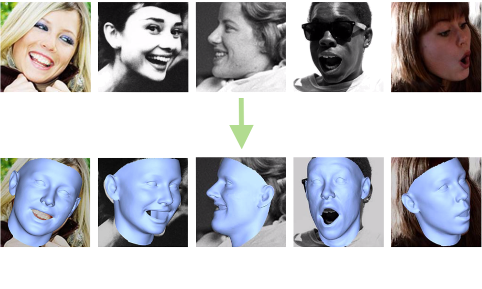
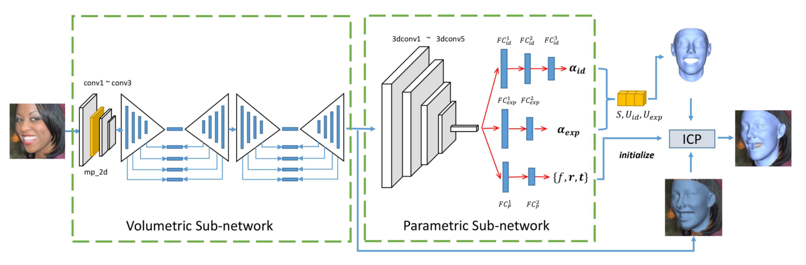
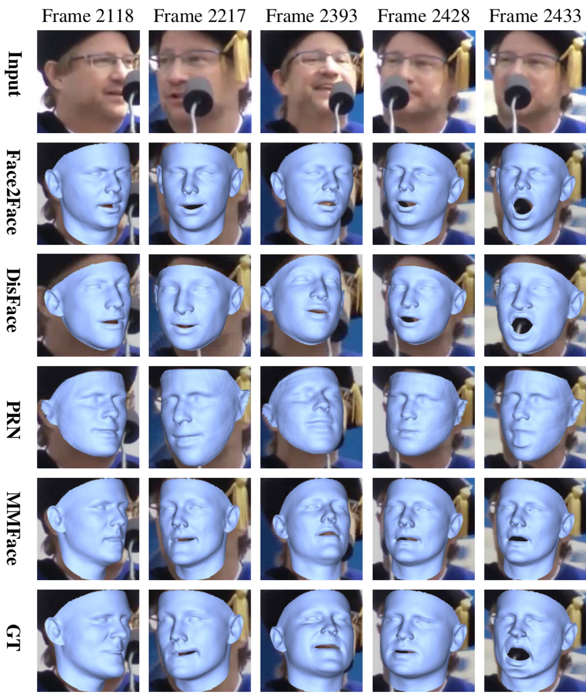
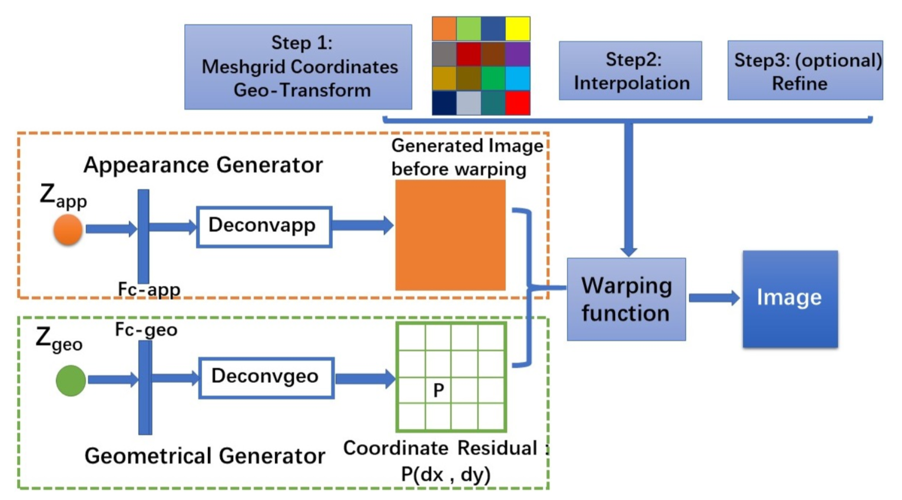
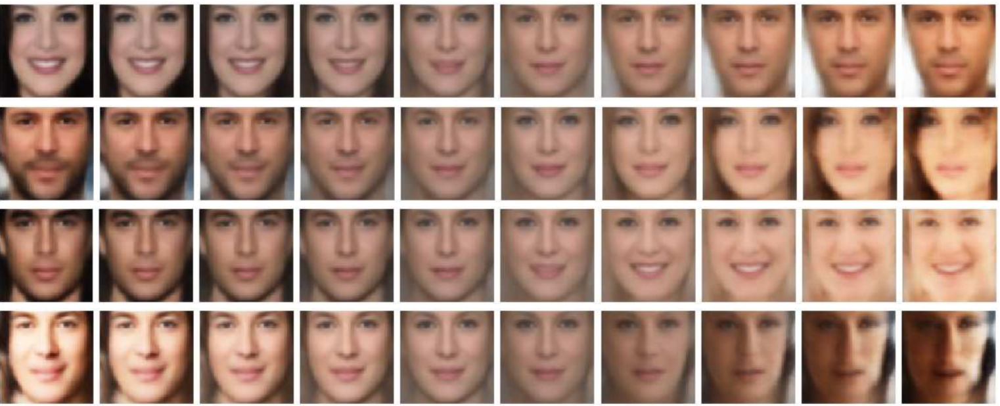
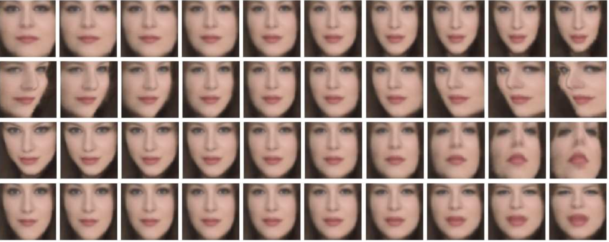
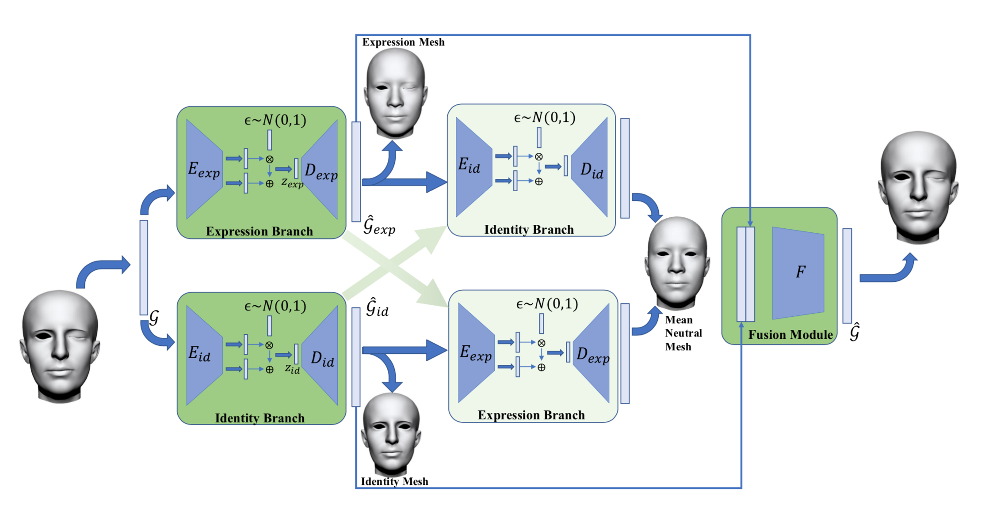
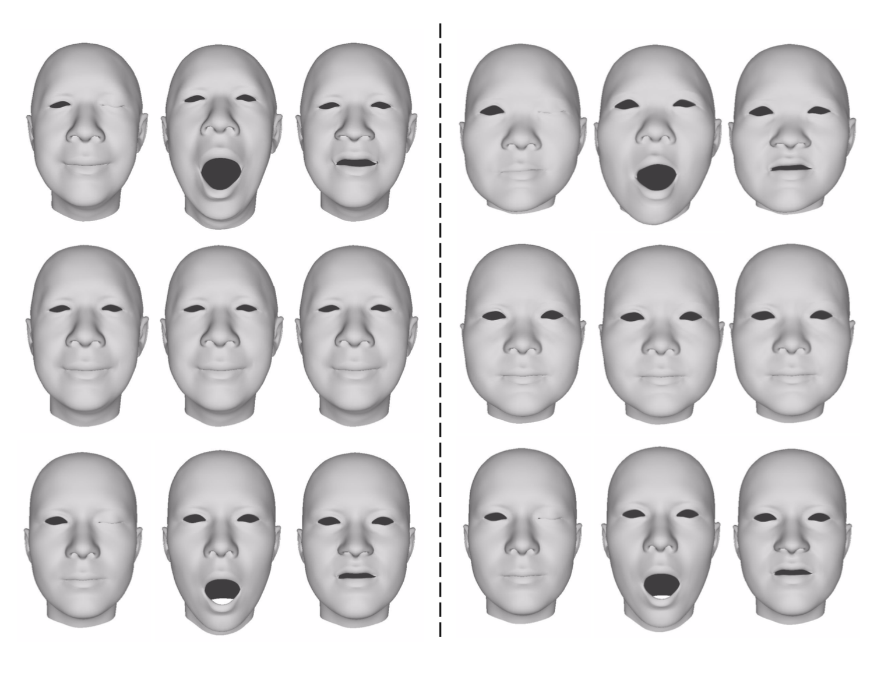
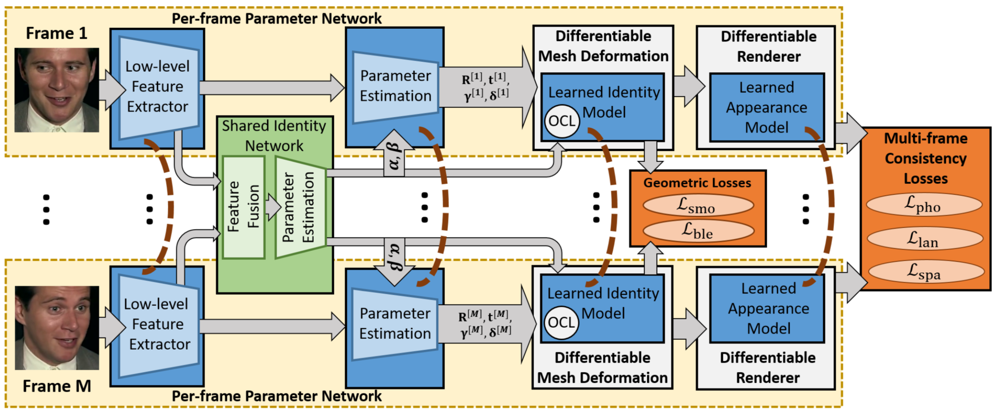

layout: true

name: lts5-canvas

 

 

---

layout: true
name: lts5-question
background-image: url(../Common/question-mark.jpg)
background-position: center
background-size: 300px

 

 

---

name: title

class: center, middle

template: lts5-canvas

# CVPR 2019 - Overview

Christophe Ecabert

LTS5, EPFL

July 17st, 2019

---

template: lts5-canvas

# Content

- Papers Overview
  - MMFace: A Multi-Metric Regression Network for Unconstrained Face Reconstruction [1]
  - Unsupervised Disentangling of Appearance and Geometry by Deformable Generator Network [2]
  - Disentangled Representation Learning for 3D Face Shape [3]
  - FML: Face Model Learning from Videos [4]
---

template: lts5-canvas

# MMFace

- Proposed method
  - 3D Surface alignment
  - Face alignment

---

template: lts5-canvas

# MMFace - II

- Key idea

- Volumetric surface parameterization
  - Morphable model coefficient prediction
  - Pose prediction
- ICP Alignment for final refinement

---

template: lts5-canvas

# MMFace - Training

- Volumetric
`$$
E_{\mathbb{V}} = \sum_w \sum_h \sum_d \left[\hat{\mathbb{V}}_{whd} log\left( \mathbb{V}_{whd} \right) + (1 - \hat{\mathbb{V}}_{whd}) log\left(1 - \mathbb{V}_{whd}\right )\right]
$$`
- Identity
`$$
E_{id} = \left|\left| \boldsymbol{S}\left(\alpha_{id}, \hat{\alpha}_{exp} \right) - \boldsymbol{S}\left(\hat{\alpha}_{id}, \hat{\alpha}_{exp} \right) \right|\right|_2^2 
$$`
- Expression
`$$
E_{exp} = \left|\left| \boldsymbol{S}\left(\hat{\alpha}_{id}, \alpha_{exp} \right) - \boldsymbol{S}\left(\hat{\alpha}_{id}, \hat{\alpha}_{exp} \right) \right|\right|_2^2 
$$`
- Pose
`$$
E_P = \frac{1}{|\mathcal{F}|} \sum_{f_i \in \mathcal{F}} || proj\left(\boldsymbol{S} \left(\hat{\alpha}_{id}, \hat{\alpha}_{exp} \right)\right) - proj^*\left(\boldsymbol{S} \left(\hat{\alpha}_{id}, \hat{\alpha}_{exp} \right)\right) ||_2^2 
$$`
- Combined
`$$
E = \lambda_{\mathbb{V}}E_{\mathbb{V}} + E_{id} + \lambda_{exp}E_{exp} + \lambda_{P}E_{P}
$$`

---

template: lts5-canvas

# MMFace - Results

---

template: lts5-canvas

#  Deformable Generator Network - DGN

- Image Generator
  - Geometry
  - Appearance

---

template: lts5-canvas

# DGN - Training

- Differentiable Warping function
  - Bilinear interpolation
- Cost function: Maximum Likelihood function
  - Expectation Maximization
  - Expectation approximation using Langevin dynamics on the posterior distribution coupled with Monte Carlo framework
     - Step1: Infer latent vector
     - Step2: Learn network parameters

---

template: lts5-canvas

# DGN - Results 

- Appearance latent space

- Geometry latent space

---

template: lts5-canvas

# Disentangled Representation Learning

 

???

- G = Displacement Features attached to each node (i.e vertex)
- Graph Convolutional Network
- Given shape, extract expression/identity component

---

template: lts5-canvas

#DRL - Training

- Training phase
  - Train each encoder separately with standard VAE loss (*i.e. Data + KL*)
  - Train fusion network
  - End-to-end fine-tuning
- Disentangling constraint

`$$
L_{dis} = || D_{exp}\left( E_{exp}\left( \hat{\mathcal{G}}_{id} \right) \right) - \bar{\mathcal{G}} || + || D_{id}\left( E_{id}\left( \hat{\mathcal{G}}_{exp} \right) \right) - \bar{\mathcal{G}} ||
$$`

---
template: lts5-canvas
# DRL - Results

 

---
template: lts5-canvas
# FML

  

---

template: lts5-canvas

# FML - Training

- End-to-end training
  - Learn parameters regression + morphable model at once
  - Expression basis are **NOT** learned
  - Multi-frame constraints
     - Photometric
     - Landmarks
     - Expression regularizer
  - Global constrains 
     - Geometry smoothness
     - Appearance sparsity

???

- Expression regularizer: **Eigenvalues** of PCA model
- Linearized membrane energy -> First order geometric smoothness prior on displacement

---

template: lts5-canvas

# FML - Results

  

---

template: lts5-canvas

# References

.text-small[

[1] MMFace: A Multi-Metric Regression Network for Unconstrained Face Reconstruction, Yi et al.

[2] Unsupervised Disentangling of Appearance and Geometry by Deformable Generator Network, Xing et al.

[3] Disentangled Representation Learning for 3D Face Shape, Jiang et al

[4] FML: Face Model Learning from Videos, Tewari et al

]

