layout: true

name: lts5-canvas

 

 

---

name: title

class: center, middle

# Model-based 3D Face Reconstruction for Low Resolution Facial Image Analysis

Christophe Ecabert

LTS5, EPFL

April 27th, 2018

---

# Content

- Problem statement
- State of the art
  - Optimisation-based
  - Deep learning-based
- State of my research
  - Multi-view reconstruction
     - Shape model / Texture warping
  - Single-view reconstruction
     - Shape / Texture / Illumination model
- Research plan
  - Tasks
  - Schedule
- Summary

???

What's on the agenda

---

# Problem Statement

- Facial analysis challenges
  - Pose
  - Occlusions
  - Illumination
  - Image resolution

- Approaches to tackle them
  - Algorithm adaptation
  - Face normalisation 
     - Image warping
     - Genenerate 3D face

???

- Facial analysis in general does not cope well with large head pose variation, illumination, resolution, occlusions
- Two approaches, handles the ***perturbation*** in the algorithm, or synthesised a face instance without perturbation with explicit perturbation's model.
  - Frontalisation in 2d -> problem with out of plane rotation
  - Reconstruct the face in 3d -> any viewpoint can be generated
    - lighting / occlusions

---

# State of the art - Basel Face Model

- Statistical models
  - *Geometry* and *appearance* learned on observed data with PCA
- Basel Face Model
  - Parameters recovered with *analysis-by-synthesis* framework
     - Model + rendering parameters
     - Illumination based on *Phong* model
  - Limitation
     - Illumination parameters has to be **known**

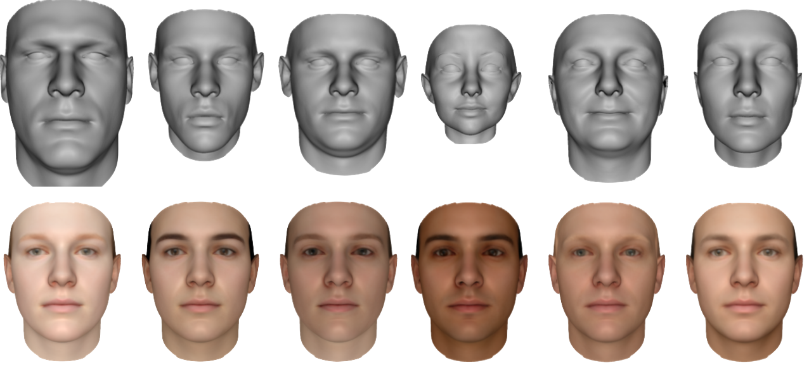

.cite-article[[1] 1999, Blanz and Vetter]

???

- Face reconstruction from monocular image is an illposed problem 
  - Rely on strong prior information to end up with possible solution
  - Generative model -> Statistical Model -> Learned on observed data
  - Extension of *Active Appearance Model*
- First 3D model introduce by Blanz & Vetter -> *Basel Face Model*
  - Statistical model for **shape/texture**
     - Geometry -> Neutral expression
     - Appearance -> No illumination
  - **Illumination free** appearance
  - Illumination model **assumed known** parameters (light position, ...)
- Later on **extended** to include
  - Multi-feature constraints
  - Shape only -> sparse landmarks

---

# Regression-based

- Regresses pose/expression coefficients from the image
  - Two-level cascaded random fern regressors
- Refine *constant* parameters on selected keyframes
  - Camera parameters
  - Identity coefficients
- Limitations
  - No appearance
  - Sensitive to light

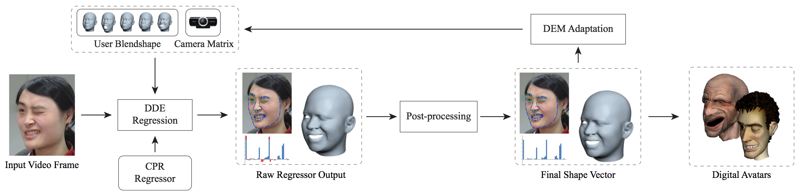

.cite-article[[2] 2014, Cao et al.]

???

- Regress changing parameters directly from the image
  - Expression coefficients 
  - Pose **R** and **T**
- Post-process
  - Take time constraint into account
  - Constraint the parameters to be not too far from previous estimation
  - Constraint expression coefficient to be in proper range [0, 1]
- Adaptation
  - Update camera transform + identity 
  - Keyframe selection
- Limitations
  - Lighting -> features is **pixel's intensity difference**

- Extension
  - Learn **user-specific** blendshape
  - **Expression-specific** appearance 
  - Texture blending based on 
    - Expression similarity (from previous frame)
    - Vertex visibilty (from previous frame)

---

# Deep learning-based - 3DDFA

.left-column50[

- Cascaded regressors
  - CNNs
  - Embbed 3D data in texture
- Limitations
  - Shape only
  - Occlusions / Resolution

]

.right-column50[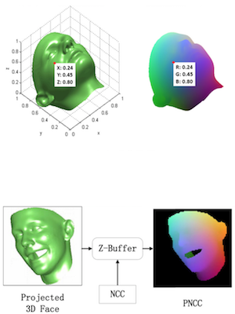]

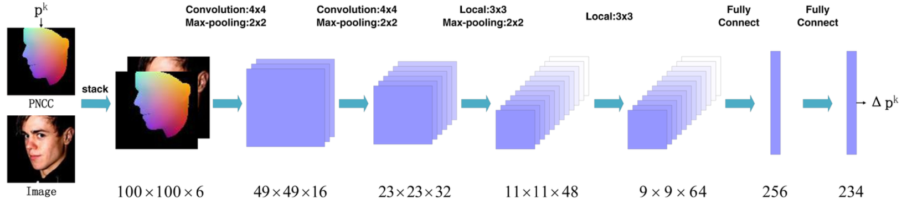

.cite-article[[3] 2015, Zhu et al.]

???

- Uses **Basel Face Model** augmented to include expressions
- Normalise Coordinate Code
  - Normalise meanshape to be in range [0, 1]
- Projected Normalise Coordinate Code
  - Render an instance with the correct pose, color it according to the NCC 
  - ZBuffering for occlusion handling
     - Color depth with the NCC

---

# Deep learning-based - Tran et al.

- Render free framework
  - Predict model coefficients directly from the image 
- Training
  - Ground truth computed using standard frameworks
  - Fuse parameters of the same subject with pooling scheme
  - Assymetric Euclidean loss
- Limitations
   - No expressions
   - Occlusions / Illumination / Resolution

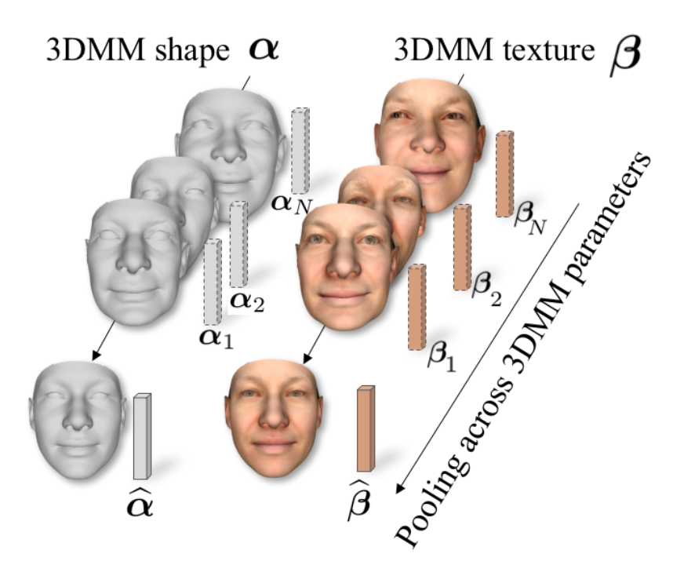

.cite-article[[4] 2016, Tran et al.]

???

- Work of **Tran et al.**
- First render free framework
  - Combine GT coeffcients with pooling scheme based on tracking quality
  - Assymetric Euclidean loss function to counter bias toward meanshape (*i.e. coefficient with **0***)
     - ***Element-wise operator***
     - Left: overestimate
     - Right: underestimate

---

# Deep learning-based - MoFA

- Architecture based on Autoencoder
  - Model-based decoder
  - Unsupervised training
- Code vector is directly related to the parameters
  - Rendering parameters 
  - Geometry / Texture parameters
- Limitations
  - Occlusions / Resolution

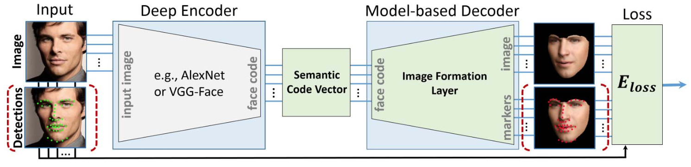

.cite-article[[5] 2017, Tewari et al.]

???

- Work of **Tewari et al.**

- Autoencoder structure

  - Encoder fine tuned to predict model coefficients -> AlexNet
  - Decoder ***hand-crafted*** to generate model instance and render it, using standard rendering pipeline
    - Fully differentiable

- Works extended to ***augment*** the model with ***corrective basis*** for geometry and appearance

  - Trainable corrective basis added in the decoder part 
     - Regularisation in order to limit the added deformations and stick to the span of proper solution
  - Texture/Shape corrective fields
     - Can learn to model occluders as well which is not necessarily wanted

---

# State of my research

- Quasi realtime multi-view face reconstruction system
  - Identity and expression shape model
  - Appearance warped on the reconstructed surface
     - Increase occlusion robustness using multiple cameras

- Single-view reconstruction
  - *Geometry* and *appearance* model for increased robustness
     - Identity and expression are part of the model
  - Illumination approximation
   - Offline iterative system
     - 3D ground truth generator

???

- Multi-view
  - Car environment -> hardware limitations
  - Only shape model -> **No texture**
  - Texture added after reconstruction -> *warping*
  - Therefore multi-camera in order to be robust against self occlusion
- Single-view
  - Based on work of **J.Booth et al.**
  - Add texture information -> *Basel Face Model*
    - augmented with expression basis
  - Add illumination as spherical harmonics 
  - **Purpose:** Ground truth generation for training regressor

---

# Multi-view - Fitting

- Bilinear generative face model `$\quad \boldsymbol{\hat{f}} = \mathscr{F}_m \times_2 \boldsymbol{\alpha}_{id}^\top \times_3 \boldsymbol{\alpha}_{exp}^\top$`
- Shape reconstruction constrained with sparse set of landmarks [6] `$\quad \boldsymbol{l}_i$`
- Information from multiple views [7] `$$\quad E_{data}\left(\boldsymbol{\alpha}_{id}, \boldsymbol{\alpha}_{exp} \right) = \frac{1}{N} \sum_{i=1}^{N} \left|\left| \boldsymbol{P}_i \boldsymbol{\hat{f}} - \boldsymbol{l}_i \right|\right|_{2}^{2} + \lambda_{id} \left|\left| \boldsymbol{\alpha}_{id} \right|\right|_{2}^{2} + \lambda_{exp} \left|\left| \boldsymbol{\alpha}_{exp} \right|\right|_{2}^{2}$$`
- Working with continuous data stream
  - Temporal constraint `$$E_{smooth} = \left|\left| \boldsymbol{\alpha}^{t-2}_{id/exp} -2 \boldsymbol{\alpha}^{t-1}_{id/exp} + \boldsymbol{\alpha}_{id/exp} \right|\right|_{2}^{2}$$`
  - Identity accumulation over history [8] `$$E\left(\boldsymbol{\alpha}_{id} \right) = \sum_{j=1}^{t} \frac{\gamma^{t-j}}{\sum_{j=1}^t \gamma^{t-j}} E_{data}^j \left(\boldsymbol{\alpha}_{id} \right)$$`

.cite-article[[6] 2004, Blanz et al. [7] 2008, Faggian et al., [8] 2013, Bouaziz et al.]

???

- Bilinear model learned using Higher-Order SVD
- Reconstruction **constraints**
  - Direct correspondance between 3D-2D
  - Only subset of points are needs -> sparse measurements
     - Landmarks provided by external tracker -> quality reconstruction rely on the quality of the tracking
- Optimisation done in an *coordinate-descent* manner over iterations
  - Projection operator update with previous estimation
- Temporal aspect
  - new parameters should not be too far from previous estimation -> smooth transitions
  - Identity should be estimated on all available images -> aggregation scheme ***Bouaziz et al.***

---

# Multi-view - Appearance

- Texture map generated on the fly
  - Input images warped into texture space [9].
- Fusion driven by vertices visibility
  - Vertex visibility defined with surface's normal and camera axis
  - Pixel weight estimated by interpolation
  - Final texture defined by blending each contribution 

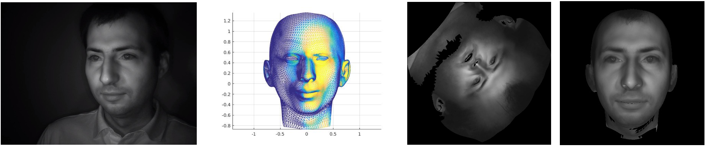

.cite-article[[9] 2016, Cao et al.]

???

- Adapted from work of **Cao et al.**
- Mechanism
  - Warp input image into texture space
  - Compute vertex weight based on its visibility -> If aligned with line of sight strong contribution
     - Color altered when to far from the optical axis -> Example side of cube parallel to axis, appeared black
  - Propage vertex weight to pixel level by interpolating with RBF
  - Normalise weight to have unit norm

---
exclude: false
#Multi-view - Sample

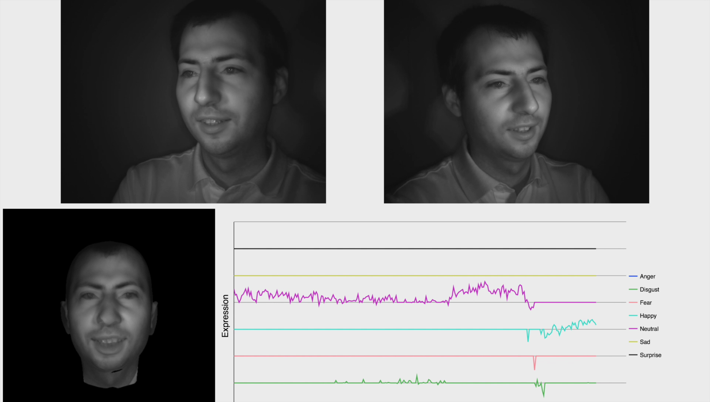

???

- Complete pipeline example

---

# Single-view - Fitting

- Basel Face Model augmented with expression basis [10]. `$$ \mathcal{S}\left(\boldsymbol{\alpha}\right) \equiv \boldsymbol{\bar{s}} + \boldsymbol{U}_{id} \boldsymbol{\alpha}_{id} + \boldsymbol{U}_{exp} \boldsymbol{\alpha}_{exp} = \boldsymbol{\bar{s}} + \left[ \boldsymbol{U}_{id}, \boldsymbol{U}_{exp} \right] \boldsymbol{\alpha} $$`
- Illumination approximated
  - Observed appearance modulated by the light `$\quad \boldsymbol{c}_{ij} = \boldsymbol{r}_{ij} \circ \boldsymbol{s}_{ij}$`
  - Spherical harmonic approximation
  - Texture model `$$ \mathcal{T}\left(\boldsymbol{\beta}, \boldsymbol{y} \right) = \left(\boldsymbol{\bar{t}} + \boldsymbol{U}_t \boldsymbol{\beta} \right) \circ \Phi \boldsymbol{y} $$`
- Joint optimisation of the parameters [11]
  - Analysis-by-synthesis framework
  - Iterative Gauss-Newton solver 

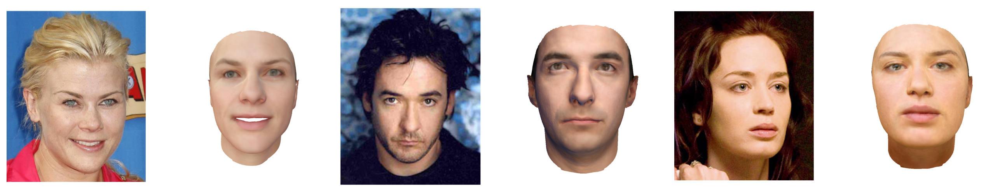

.cite-article[[10] 2007, Sumner et al., [11] 2017, Booth et al.]

???

- Augmentation of the Basel Face Model -> Add expression based on deformation transfer **Sumner et al.**
- Texture model is illumination free -> need model for illimunation
  - Approximation with SH
     - Low frequency lighting
     - Environmental light

---

# Research Plan

- Limitations identified of the current systems to be addressed in this thesis
  - Occlusions
  - Texture details
  - Illumination / Shadowing
  - Image resolution
- Other aspects 
  - Temporal constraint
  - Multi-view reconstruction
- Planification
  - Schedule

???

- Identified limitations
  - Occlusions
  - Illumination is yet not quite solved -> shadows are tricky
  - Details -> wrinkles not backed into texture models
  - Resolution -> some approach needs landmarks to be initialised 
- Aspect
  - Room for improvement, not so frequently investigated (in reconstruction -> image based)

- Divided into task

---

# Occlusions

- Face reconstruction is sensitive to occlusions
  - Glasses / Facial hair / Clothes
  - Try to match color that is not explained by the model

- **Planned work**
  - Sampling scheme
     - Compute error on parts of the face
     - Select relevant features
  - Multi-task network
     - Reconstruction
     - Segmentation

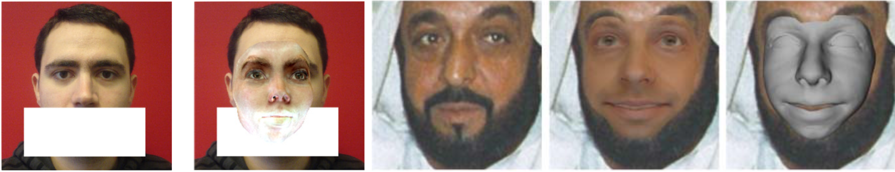

.cite-article[[12] 2017, Egger et al., [5] 2017, Tewari et al.]

???

- Appearance to far from the model -> drift/biais during optimisation
  - For instance beard!
- Compute differences only on region explained by the model
  - Segmentation step -> skin segmentation might be a starting point / works of **Egger et al** later on.
  - Extract regions of features map
  - Filter regularisation -> **Osherov el al.**
    - Simulate occlusion by regularisation without occluded data

---

# Fine Details

- Morphable Model should preserve facial expressions
  - Wrinkles carry important visual expression cues
  - Common texture model does not include such details
     - Expression-free model (*i.e. neutral expression*)

- **Planned work**
  - Geometry deformation + shading scheme
     - Mid-frequency details included into normal maps
     - Parametric model for normal maps

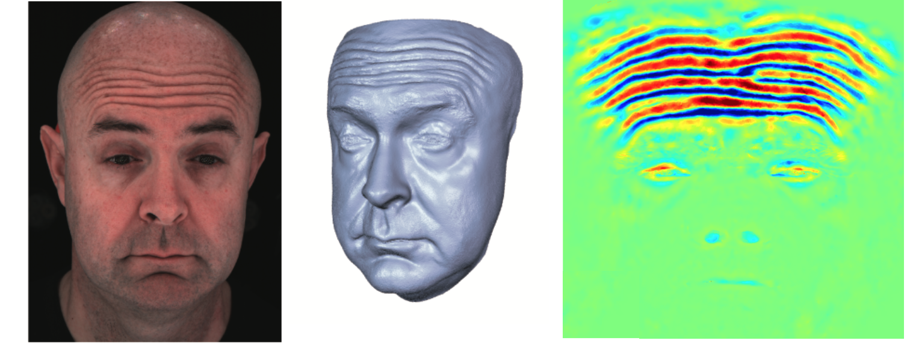

.cite-article[[13] 2015,  Cao et al.]

???

- Mid-frequency shape details are not present in texture model
  - Only neutral expression
- Augmentation
  - Corrective fields -> Low frequencey 
  - Add details in the shape model (**Inspired by animation industry**)
    - parameterise the normal map

---

# Illuminations  / Shadowing

- Spherical harmonics approximation
  - Global illumination
  - **Not** working with shadows

- **Planned work**
  - Investigate the lighting operator of [14]
     - Supports self-shadow
     - Model light interaction at vertex level
  - Integrate into network-based framework

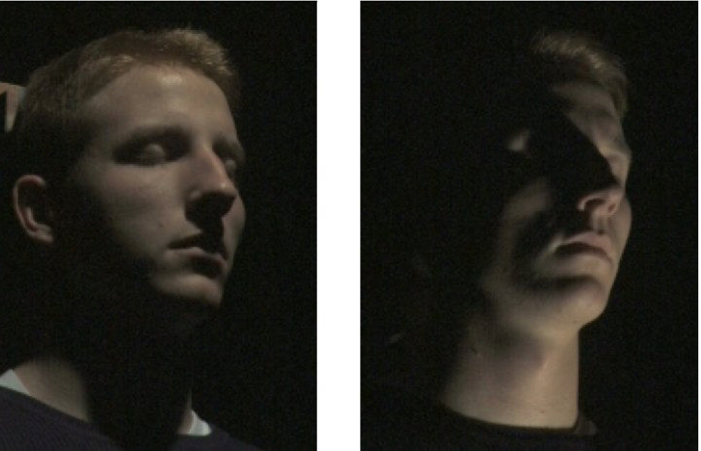

.cite-article[[14] 2017, Schneider et al., [15] 2006, Ramamoorthi et al.]

???

- Light models based on prior knowledge -> Phong model -> required ***known*** parameters 
- Spherical harmonics works great,
  - Cheap to compute
  - however work only for global illumination
- Schneider works present self-shadowing operators working at pixel level
  - Regressed from shape coefficients
  - Integration of similar approach into deep learning-based framework ?
    - Offline learning

---

# Low Resolution

- Low/High resolution image pairs required
  - Generated by downsampling high resolution image
     - Not representative of the real life [16]

- **Planned work**
  - Generative Adversarial Networks generate realistic images
     - Popular for super-resolution task
     - Use it to generate realistic low resolution images
  - Integrate the generator into the reconstruction pipline
     - Combine training: Generator + Reconstruction

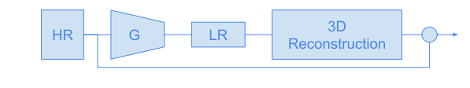

.cite-article[[16] 2013, Efrat et al.]

???

- Super-resolution fields usually generate samples using **bicubic interpolation** 
  - Not realistic -> paper
  - Blur kernel is not constant / Correct
- Generate realistic samples
  - Having data, possible to find some
  - Sort of domain adaptation -> cycle-gan ?
- Closed-loop face reconstruction from low res images
  - jointly trained ??

---

# Temporal Constraint - Tracking

- Most of the image-based reconstruction systems work frame wise
  - Consider each images independently
  - No video ground truth available

  - **Planned work**
      - Recurrent Neural Networks have shown strong capabilities at modelling temporal dependencies
      - Increase the robustness of the system 
      - Low resolution configuration, only few pixels available 

???

- **IMAGE BASED** Deep learning-based video reconstruction performed on **frame independently** 
  - RGBD tracking work with temporal aspect
  - Temporal dependencies can by used as constraint
- Predict model coefficients using standard CNNs
  - Use RNN on **top** to adapt temporally the coefficients
  - *Ground truth might be an issue*

---

# Multiple-View Reconstruction 

- Few reconstruction systems are based on multiple views
  - Not designed for low resolution images
  - Other computer vision problems have shown improved results by combining views

- **Planned work**
  - Use redundancy across views in low resolution setup
     - Increase the robustness of the system
  - Investigate different architectures 
     - Indenpent processing streams with late fusion
     - Multi-stream processing with shared topology

???

- Almost no mview reconstruction pipeline
  - Definitely not in LR
  - Super-res have shown mview approach
- Use redundancy across views 
  - Constraining reconstruction to match the views
- Architecture
  - Independent CNNs for coefficients predictions + fustion of common parameters (ID; expression)
     - Weighted fusion
     - Attention mechanism
  - Multi-stream (consider each-view as a stream) with shared topology across the different views
     - Each viewpoint consider as an indenpendent stream
- Previously discussed point might be drop in the first pass and added later on for simplification purpose
  - For instance wrinkles recovery 

---

# Schedule

- Tentative schedule

| Start         | End           | Task                                            |
| :------------ | :------------ | :---------------------------------------------- |
| May 2018      | October 2018  | Occlusion-aware face reconstruction             |
| November 2018 | April 2019    | Fine details model / Illumination / Self-shadow |
| May 2019      | October 2019  | Realistic high/low resolution sample generator  |
| November 2019 | April 2020    | Reconstruction from low resolution images       |
| May 2020      | December 2020 | Temporal / Multi-view reconstruction            |
| January 2021  | April 2021    | Thesis writing                                  |

???

- rough estimation

---

# Summary

- Indentify limitations with current systems
  - Occlusions / Fine details / Illumination / Image resolution

- System developed for synthesising frontal images
  - Quasi realtime multi-view reconstruction
     - Limitations on texture
  - Single view reconstruction
     - Including illumination approximation

- Future work
  - Reconstruction system robust against occlusion
  - Model augmentation, add fine details for expression completeness 
  - Integration of illumination / shadowing into the reconstruction pipeline
  - Reconstruction in low resolution configuration
  - Reconstruction pipeline with temporal constraints
  - Multi-view reconstruction pipeline

---

# Questions

---

# References

.text-small[

[1] A Morphable Model for the Synthesis of 3D Faces, Blanz and Vetter, 1999

[2] Displaced Dynamic Expression Regression for Real-time Facial Tracking and Animation, Cao et al., 2014

[3] Face Alignment Across Large Poses: A 3D Solution, Zhu et al., 2015

[4] Regressing robust and discriminative 3D morphable models with a very deep neural network, Tran et al., 2016

[5] MoFA: Model-based Deep Convolutional Face Autoencoder for Unsupervised Monocular Reconstruction, Tewari et al., 2017

[6] A statistical method for robust 3D surface reconstruction from sparse data, Blanz et al., 2004

[7] 3D Morphable Model fitting from multiple views, Faggian et al., 2008

[8] Online modeling for realtime facial animation, Bouaziz et al., 2013

[9] Real-time facial animation with image-based dynamic avatars, Cao et al., 2016 

[10] Deformation transfer for triangle meshes, Sumner and Popovic, 2004

[11] 3D Face Morphable Models" In-the-Wild", Booth et al., 2017

[12] Probabilistic Morphable Models, Egger et al., 2017

[13] Real-time High-fidelity Facial Performance Capture, Cao et al., 2015

[14] Efficient Global Illumination for Morphable Models, Schneider et al., 2017

[15] Modeling illumination variation with spherical harmonics, Ramamoorthi, 2006

[16] Accurate blur models vs. image priors in single image super-resolution, Efrat et al., 2013

]

---

exclude: true

# Problem Statement

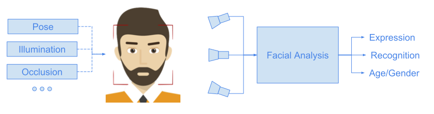

---

exclude: true

# BFM - Extension / Adaptation

.left-column50[

- Improve reconstruction using multiple constraints
  - Regulariser
  - Edges / Contours
  - Specular highlights
- Increase speed by dropping texture model
  - Fitting with a sparse set of landmarks
  - Regulariser

]

.right-column50[
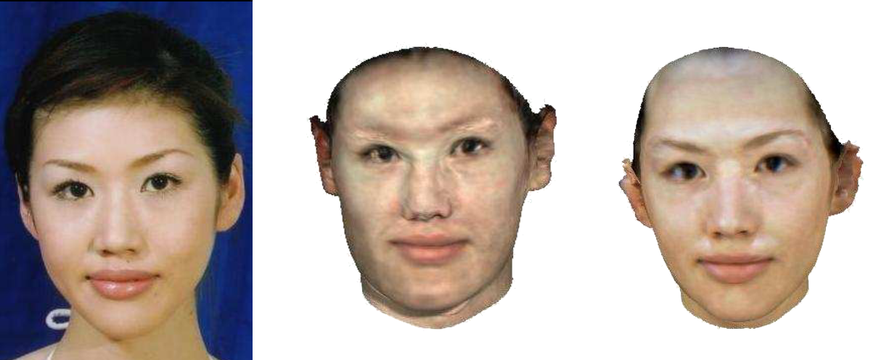
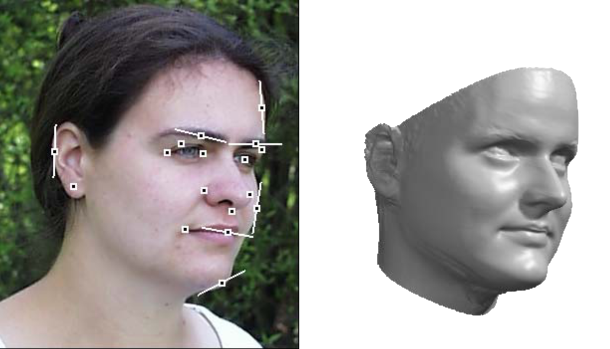
]

???

- Multi-features fitting
  - Center -> First approach
  - Right -> MFF
    - Better geometry -> Chin
    - Better texture+illumination approx

