layout: true

name: lts5-canvas

 

 

---

name: title

class: center, middle

# Model-based 3D Face Reconstruction for Low-Resolution Facial Images Analysis

Christophe Ecabert

LTS5, EPFL

April 27th, 2018

---

# Content

- Problem statement
- State-of-the-art
  - Optimisation-based
  - Deep learning-based
- State-of-research
  - Multi-view reconstruction
     - Shape model / Texture warping
  - Single-view reconstruction
     - Shape / Texture / Illumination model
- Research plan
  - Tasks
  - Schedule

???

What's on the agenda

---

# Problem Statement

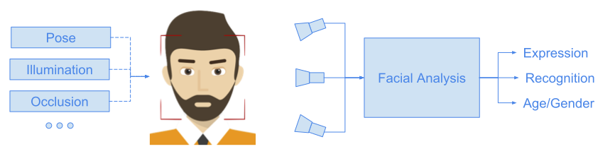

???

- Facial analysis in general does not cope well with large head pose variation, illumination, resolution, occlusions
- Two approaches, handles the ***perturbation*** in the algorithm, or synthesised a face instance without perturbation with explicit perturbation's model.

---

# State of the art - Basel Face Model

- Monocular 3D face reconstruction is an ill-posed problem
  - Require strong prior
- Statistical models
  - *Geometry* and *appearance* learned on observed data with PCA 	`$\quad \boldsymbol{s} = \boldsymbol{\bar{s}} + \boldsymbol{U}_s \boldsymbol{\alpha}$` and `$\quad \boldsymbol{t} = \boldsymbol{\bar{t}} + \boldsymbol{U}_t \boldsymbol{\beta}$`
- Basel Face Model
  - Parameter recovery using *analysis-by-synthesis* framework
     - Image formation model - rendering
     - Illumination based on *Phong* model
  - Objective function defined as `$$E_I \left( \boldsymbol{\alpha}, \boldsymbol{\beta} \right) = \sum_{x,y} \left|\left| \boldsymbol{I}\left( x,y \right) - \boldsymbol{I}_{model}\left( x,y \right) \right|\right|^2 $$`

???

- Face reconstruction from monocular image is an illposed problem 
  - Rely on strong prior information to end up with possible solution
  - Generative model -> Statistical Model -> Learned on observed data
  - Extension of *Active Appearance Model*
- First 3D model introduce by Blanz & Vetter -> *Basel Face Model*
  - Statistical model for **shape/texture**
     - Geometry -> Neutral expression
     - Appearance -> No illumination
  - **Illumination free** appearance
  - Illumination model **assumed known** parameters (light position, ...)

---

exclude: true

# BFM - Extension / Adaptation

.left-column50[

- Improve reconstruction using multiple constraints
  - Regularizer
  - Edges / Contours
  - Specular highlights
- Increase speed by dropping texture model
  - Fitting with a sparse set of landmarks
  - Regulariser

]

.right-column50[
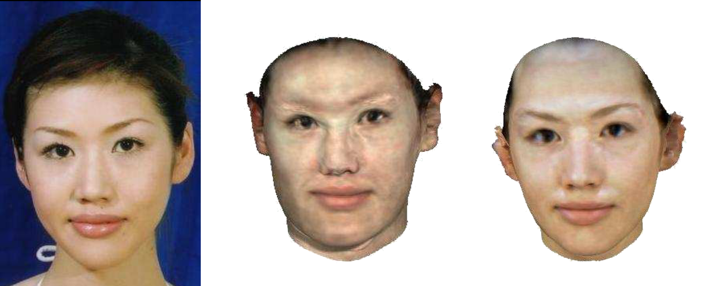

]

???

- Multi-features fitting
  - Center -> First approach
  - Right -> MFF
     - Better geometry -> Chin
     - Better texture+illumination approx

---

# Regression-based - Cao et al.

- Regress pose/expression coefficients directly from the image
  - Two-level cascaded random fern regressors
     - Difference of pixel intensity as features
- Refine *constant* parameters on selected keyframe
  - Camera parameters
  - Identity coefficients
- Extended to add appearance
  - Offline learning stage

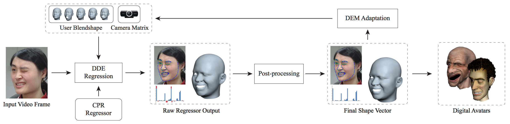

???

- Work of **Cao et al.**
- Face alignment framework in a tracking setup
  - Uses **video**
- Regress changing parameters directly from the image
  - Expression coefficients 
  - Pose **R** and **T**
- Post-process
  - Take time constraint into account
  - Constraint the parameters to be not too far from previous estimation
  - Constraint expression coefficient to be in proper range [0, 1]
- Adaptation
  - Update camera transform + identity 
  - Keyframe selection
- Extension
  - Learn **user-specific** blendshape
  - **Expression-specific** appearance 
  - Texture blending based on 
     - Expression similarity (from previous frame)
     - Vertex visibilty (from previous frame)

---

# Deep learning-based - 3DDFA

.left-column50[

- Cascaded regressors
  - CNNs
  - Embbed 3D data in texture
- Objective function
  - *Weighted* */* *Unweighted* parameters errors
  - Point-to-point 3D error

]

.right-column50[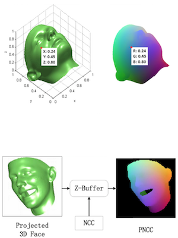]

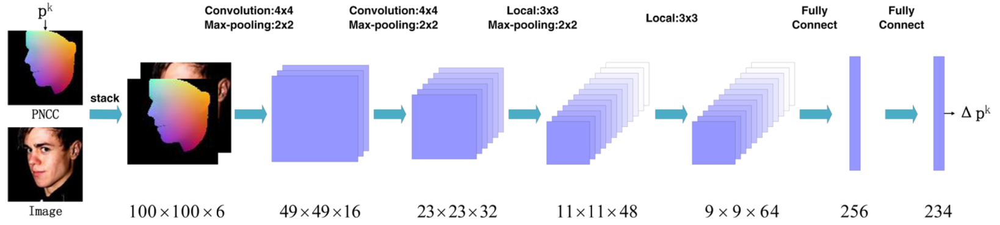

???

- Work of **Zhu et al.**
- Uses **Basel Face Model** augmented to include expressions
- Normalize Coordinate Code
  - Normalize meanshape to be in range [0, 1]
- Projected Normalize Coordinate Code
  - Render an instance with the correct pose, color it according to the NCC 
  - ZBuffering for occlusion handling
     - Color depth with the NCC

---

# Deep learning-based - Tran et al.

- Render free framework
  - Predict model coefficients directly from the image 
- Training
  - Ground truth computed using standard analysis-by-synthesis frameworks
  - Fuse parameter of the same subject with pooling scheme `$\hat{\boldsymbol{\gamma}} = \sum_{i=1}^N w_i\boldsymbol{\gamma}_i \quad$` and `$\quad \sum_{i=1}^N w_i = 1$`
  - Assymetric Euclidean loss  `$$ \mathcal{L}\left(\hat{\boldsymbol{\gamma}}, \boldsymbol{\gamma}_p \right) = \lambda_1 \left|\left| \hat{\boldsymbol{\gamma}}^+ - \boldsymbol{\gamma}_{max} \right|\right|_{2}^{2} + \lambda_2 \left|\left| \boldsymbol{\gamma}_p^{+}- \boldsymbol{\gamma}_{max} \right|\right|_{2}^{2}$$`
  		with ` $\quad\boldsymbol{\gamma}^+ = sign\left(\boldsymbol{\gamma}\right) \cdot \boldsymbol{\gamma} $ ` and `$\quad \boldsymbol{\gamma}_{max} = max\left(\boldsymbol{\gamma}^+, \boldsymbol{\gamma}_p^+ \right)$`
.left-column50[
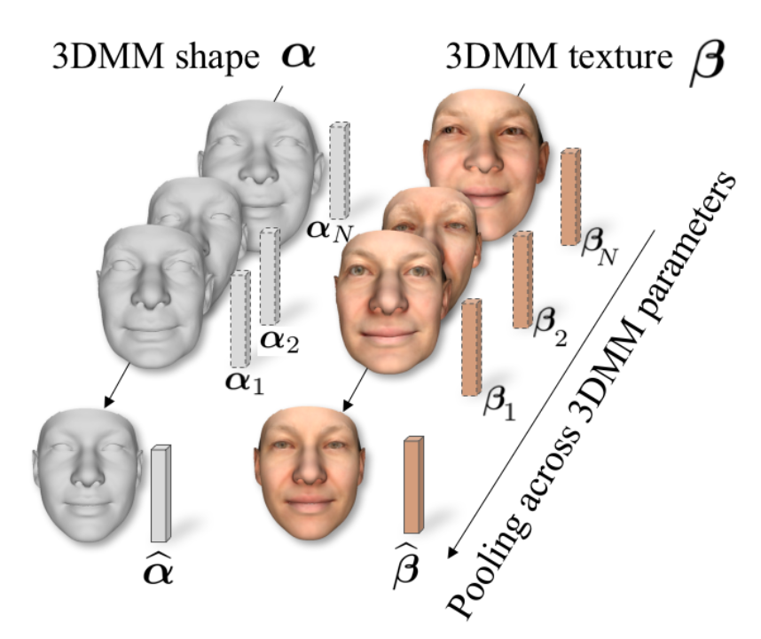
]

.right-column50[

]

???

- Work of **Tran et al.**
- First render free framework
  - Combine GT coeffcients with pooling scheme based on tracking quality
  - Assymetric Euclidean loss function to counter bias toward meanshape (*i.e. coefficient with **0***)
     - ***Element-wise operator***
     - Left: overestimate
     - Right: underestimate

---

# Deep learning-based - MoFA

- Architecture based on Autoencoder
  - Generative model-based decoder
  - Unsupervised training
     - No 3D ground truth required / Optionnal facial landmarks
     - Similar to the analysis-by-synthesis framework
- Code vector has semantic
  - Rendering parameters 
  - Geometry / Texture parameters
- Extended to learn corrective basis for shape and texture

???

- Work of **Tewari et al.**

- Autoencoder structure

  - Encoder fine tuned to predict model coefficients -> AlexNet
  - Decoder ***hand-crafted*** to generate model instance and render it, using standard rendering pipeline
    - Fully differentiable

- Works extended to ***augment*** the model with ***corrective basis*** for geometry and appearance

  - Trainable corrective basis added in the decoder part 
     - Regularisation in order to limit the added deformations and stick to the span of proper solution
  - Texture/Shape corrective fields
     - Can learn to model occluders as well which is not necessarily wanted

---

# State of research

- Multi-view reconstruction
  - Develop for realtime video facial expression analysis in car environment 
  - Bilinear face model for *identity* and *expression* variations
  - Appearance warpped on the reconstructed surface
- Single-view reconstruction
  - Integrate *geometry* and *appearance* model for increased robustness
  - Environmental lighting approximated 
  - 3D ground truth generator 

???

- Multi-view
  - Only shape model -> **No texture**
  - Texture added after reconstruction -> *warping*
  - Therefore multi-camera in order to be robust against self occlusion
- Single-view
  - Based on work of **J.Booth et al.**
  - Add texture information -> *Basel Face Model*
    - augmented with expression basis
  - Add illumination as spherical harmonics 
  - **Purpose:** Ground truth generation for training regressor

---

# Multi-view - Fitting

- Bilinear generative face model `$\boldsymbol{\hat{f}} = \mathscr{F}_m \times_2 \boldsymbol{\alpha}_{id}^\top \times_3 \boldsymbol{\alpha}_{exp}^\top$`
- Shape reconstruction constrained with sparse set of landmarks `$\quad \boldsymbol{l}_i = \boldsymbol{P}_i \boldsymbol{\hat{f}} \qquad \boldsymbol{P}_i: \mathbb{R}^{3n} \rightarrow \mathbb{R}^{2f}$`
- Using information from multiple views `$$\quad E_{data}\left(\boldsymbol{\alpha}_{id}, \boldsymbol{\alpha}_{exp} \right) = \frac{1}{N} \sum_{i=1}^{N} \left|\left| \boldsymbol{P}_i \boldsymbol{\hat{f}} - \boldsymbol{l}_i \right|\right|_{2}^{2} + \lambda_{id} \left|\left| \boldsymbol{\alpha}_{id} \right|\right|_{2}^{2} + \lambda_{exp} \left|\left| \boldsymbol{\alpha}_{exp} \right|\right|_{2}^{2}$$`
- Working with continues data stream
  - Temporal constraint `$$E_{smooth} = \left|\left| \boldsymbol{\alpha}^{t-2}_{id/exp} -2 \boldsymbol{\alpha}^{t-1}_{id/exp} + \boldsymbol{\alpha}_{id/exp} \right|\right|_{2}^{2}$$`
  - Identity accumulation over history `$$E\left(\boldsymbol{\alpha}_{id} \right) = \sum_{j=1}^{t} \frac{\gamma^{t-j}}{\sum_{j=1}^t \gamma^{t-j}} E_{data}^j \left(\boldsymbol{\alpha}_{id} \right)$$`

???

- Bilinear model learned using Higher-Order SVD
- Reconstruction **constraints**
  - Direct correspondance between 3D-2D
  - Only subset of points are needs -> sparse measurements
     - Landmarks provided by external tracker -> quality reconstruction rely on the quality of the tracking
- Optimisation done in an *coordinate-descent* manner over iterations
  - Projection operator update with previous estimation
- Temporal aspect
  - new parameters should not be too far from previous estimation -> smooth transitions
  - Identity should be estimated on all available images -> aggregation scheme ***Bouaziz et al.***

---

# Multi-view - Appearance

- Texture map generated on the fly
  - Input images warped into texture space similar to *Cao et al*.
- Fusing driven by visibility weighting
  - Vertex visibility define with surface normal and camera axis `$$w(\boldsymbol{v}^k_i) = e^{-\omega_n \left(1 - \boldsymbol{n}_k \boldsymbol{n}_i^{cam} \right)}$$`
  - Pixel weight estimated by Radial Basis Function interpolation `$$ w_i^p = \sum_k e^{-\omega_u \left|\left| \boldsymbol{u}_p - \boldsymbol{u}_k \right|\right|^2} \beta_k  w(\boldsymbol{v}^k_i) $$`
  - Final texture defined by combining each contribution `$$ \boldsymbol{I}^t = \sum_i w_i^p \boldsymbol{I}_i^{warp}$$`

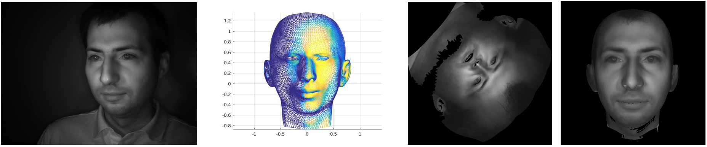

???

- Adapted from work of **Cao et al.**
- Mechanism
  - Warp input image into texture space
  - Compute vertex weight based on its visibility -> If aligned with line of sight strong contribution
     - Color altered when to far from the optical axis -> Example side of cube parallel to axis, appeared black
  - Propage vertex weight to pixel level by interpolating with RBF
  - Normalise weight to have unit norm

---
exclude: false
#Multi-view - Sample

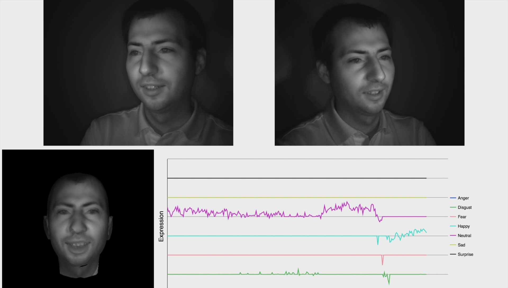

???

- Complete pipeline example

---

# Single-view - Fitting

- Basel Face Model augmented with expression basis using *Sumner et al*. `$$ \mathcal{S}\left(\boldsymbol{\alpha}\right) \equiv \boldsymbol{\bar{s}} + \boldsymbol{U}_{id} \boldsymbol{\alpha}_{id} + \boldsymbol{U}_{exp} \boldsymbol{\alpha}_{exp} = \boldsymbol{\bar{s}} + \left[ \boldsymbol{U}_{id}, \boldsymbol{U}_{exp} \right] \boldsymbol{\alpha} $$`
- Illumination approximated
  - Observed appearance modulated by the light `$\quad \boldsymbol{c}_{ij} = \boldsymbol{r}_{ij} \circ \boldsymbol{s}_{ij}$`
  - Spherical harmonic model `$$ \boldsymbol{s}_{ij} = \phi(\boldsymbol{n}_{ij}) \boldsymbol{y} \quad \text{and} \quad \phi(\boldsymbol{n}) = \left[1,n_x,n_y,n_z,n_xn_y,n_xn_z,n_yn_z,n^2_x + n^2_y,3n^2_z - 1 \right] $$`
  - Apperance model `$$ \mathcal{T}\left(\boldsymbol{\beta}, \boldsymbol{y} \right) = \left(\boldsymbol{\bar{t}} + \boldsymbol{U}_t \boldsymbol{\beta} \right) \circ \Phi \boldsymbol{y} $$`
- Joint optimisation of the parameters
  - Iterative Gauss-Newton solver 
  - Additive manner `$\boldsymbol{x} \leftarrow \boldsymbol{x} + \boldsymbol{\Delta x}$`
  - Linearized with Taylor-expansion
  - Cost function `$$ E = \left|\left| \mathcal{W}\left(\boldsymbol{\alpha}, \boldsymbol{c} \right) + \boldsymbol{J}_{\mathcal{W}, \boldsymbol{\alpha}}\boldsymbol{\Delta\alpha} + \boldsymbol{J}_{\mathcal{W}, \boldsymbol{c}}\boldsymbol{\Delta c} - \mathcal{T}\left(\boldsymbol{\beta}, \boldsymbol{y} \right) - \boldsymbol{J}_{\mathcal{T}, \boldsymbol{\beta}} \boldsymbol{\Delta\beta} - \boldsymbol{J}_{\mathcal{T}, \boldsymbol{y}} \boldsymbol{\Delta y} \right|\right|^2 + \lambda E_{reg} $$`

???

- Augmentation of the Basel Face Model -> Add expression based on deformation transfer **Sumner et al.**
- Texture model is illumination free -> need model for illimunation
  - Approximation with SH
     - Low frequency lighting
     - Environmental light

---

# Single-view - Samples

---

exclude: true

# Research Plan

- Various limitations identified
  - Occlusions
  - Illumination / Shadowing
  - Texture details
  - Resolutions

???

- Identified limitations
  - Occlusions
  - Illumination / Shadowing
  - Details -> wrinkles not backed into texture models
  - Resolution -> some approach needs landmarks to be initialised 

- Divided into task

---

# Occlusions

- Analysis-by-synthesis is sensitive to occluders
  - Occlusions of various type
  - Try to match appearance that is not part of the model
- Sampling scheme
  - Sample error where face is carefully define/explained by the model
  - Selection of appropriate region of features map (*networks*)
  - Parallel task for segmentation face region segmentation (*i.e. Foreground / Background*)

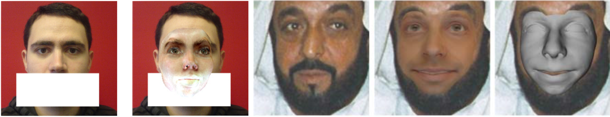

.cite-article[(1) Egger et al, (2)Tewari et al]

???

- Appearance to far from the model -> drift/biais during optimisation
  - For instance beard!
- Compute differences only on region explained by the model
  - Segmentation step -> skin segmentation might be a starting point / works of **Egger et al** later on.
  - Filter regularisation -> **Osherov el al.**
    - Simulate occlusion by regularisation without occluded data

---

# Illuminations / Self-shadows

- Approximation by spherical harmonics
  - Low frequency
  - Global illumination
  - Does not work with self-shadows
- *Schneider et al*. introduce operator at vertex level to model surface-light interaction
  - Support self-shadow
  - Is it integrable into deep learning-based reconstruction framework ?

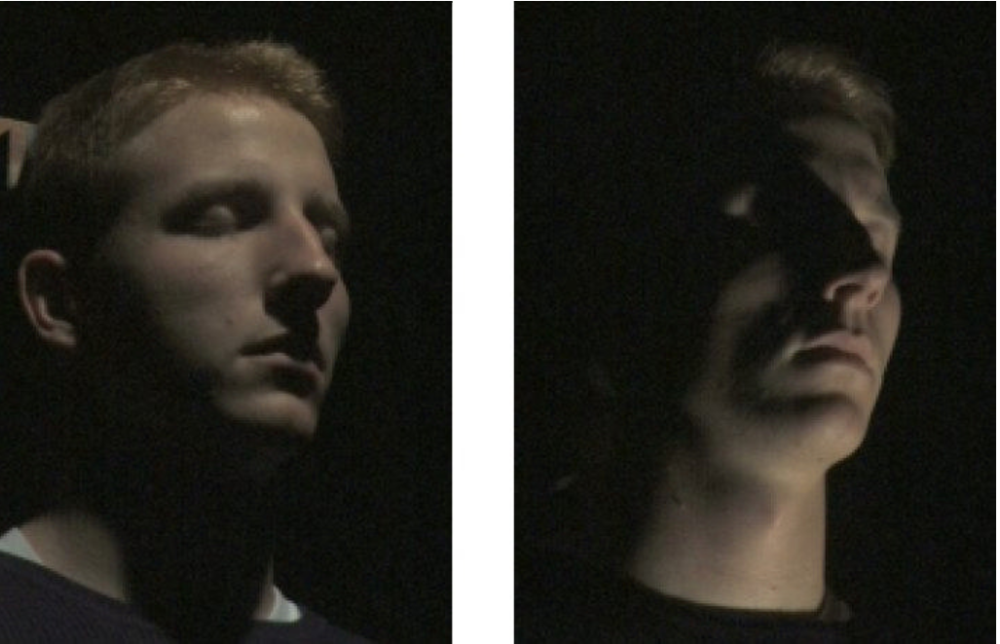

???

- Light models based on prior knowledge -> Phong model -> required ***known*** parameters 
- Spherical harmonics works great,
  - Cheap to compute
  - however work only for global illumination
- Schneider works present self-shadowing operators working at pixel level
  - Regressed from shape coefficients
  - Integration of similar approach into deep learning-based framework ?
    - Offline learning

---

# Fine Details

- Morphable Model should preserve facial expressions
  - Wrinkles carry large visual expression cues
  - Common texture model does not bake such details
     - Expressions-free model (*i.e. neutral expression*)
- Model augmentation
  - Corrective fields for appearance model
  - Geometry deformation + shading scheme
     - Mid-frequency details baked into normal maps
     - Generative model for normal maps

.cite-article[(1) Cao et al.]

???

- Mid-frequency shape details are not present in texture model
  - Only neutral expression
- Augmentation
  - Corrective fields -> Low frequencey 
  - Add details in the shape model (**Inspired by animation industry**)
    - parameterise the normal map

---

# Low Resolution Fitting

- Low/High resolution image pairs required
  - Usually generated by downsampling high resolution image
     - Not representative of the real life (1)
- Generative Adversarial Network have shown huge capability of generating realistic images
  - Popular for super-resolution task
  - Can it be used in the other way around ?
- Model the formation of low resolution image (*PSF*) (2)
  - Part of the optimisation stage
  - Generator in the reconstruction pipeline at training

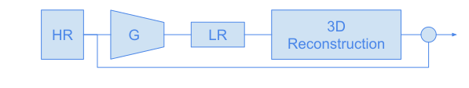

.cite-article[(1) Efrat et al., (2) Mortazavian et al.]

???

- Super-resolution fields usually generate samples using **bicubic interpolation** 
  - Not realistic -> paper
  - Blur kernel is not constant / Correct
- Generate realistic samples
  - Having data, possible to find some
  - Sort of domain adaptation -> cycle-gan ?
- Closed-loop face reconstruction from low res images
  - jointly trained ??

---

# Temporal Constraint - Tracking

- Facial analysis is performed on video stream
  - Temporal information is befinicial 
- Most of modern reconstruction system work frame wise
  - Consider each images independently
  - No video ground truth available
- Recurrent Neural Networks have shown strong capabilities at modelling temporal dependencies
  - Increase the robustness of the system 
  - Low resolution configuration, only few pixels available 
  - Combined with CNNs for feature extraction

???

- Usually facial analysis performed on **video** data
- Deep learning-based video reconstruction performed on **frame independently** 
  - Temporal dependencies can by used as constraint
- Predict model coefficients using standard CNNs
  - Use RNN on **top** to adapt temporally the coefficients
  - *Ground truth might be an issue*

---

# Multiple-View Constraint 

- Low resolution video sequences
  - Very sparse set of pixels belong to the face
  - Single view reconstruction might fail due to occlusions / large head pose
- Having different viewpoint of the same object increase the robustness
  - Uses redundancy across images
  - More cameras, more pixels available, better model estimation
- Different architectures available 
  - Indenpent processing streams with late fusion
  - Multi-stream processing with shared topology

???

- Issues in low resolution configuration
  - Few pixels available 
  - self-occlusions / large head pose
- Reduce the limitations by having multiple views of the same objects (*face*)
  - One view could be occluded but the others 
  - Increase the number of pixels -> more camera, more pixels, the better the model estimation should be.
- Architecture
  - Independent CNNs for coefficients predictions + fustion of common parameters (ID; expression)
     - Weighted fusion
     - Attention mechanism
  - Multi-stream (consider each-view as a stream) with shared topology across the different views
     - Each viewpoint consider as an indenpendent stream
- Previously discussed point might be drop in the first pass and added later on for simplification purpose
  - For instance wrinkles recovery 

---

# Schedule

- Tentative schedule

| Start         | End           | Task                                                |
| :------------ | :------------ | :-------------------------------------------------- |
| May 2018      | October 2018  | Occlusion-aware face reconstruction                 |
| November 2018 | April 2019    | Illumination / Self-shadow / Fine details modelling |
| May 2019      | October 2019  | Realistic high/low resolution sample generator      |
| November 2019 | April 2020    | Reconstruction from low resolution images           |
| May 2020      | December 2020 | Temporal / Multi-view reconstruction                |
| January 2021  | April 2021    | Thesis writing                                      |

???

- rough estimation