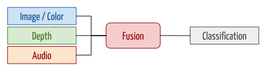
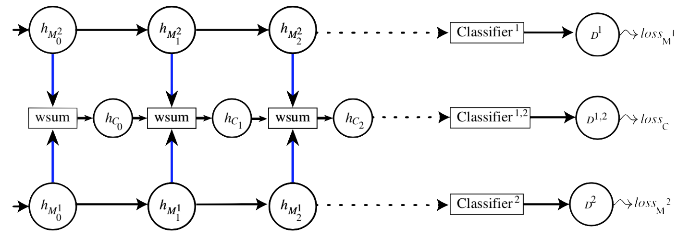
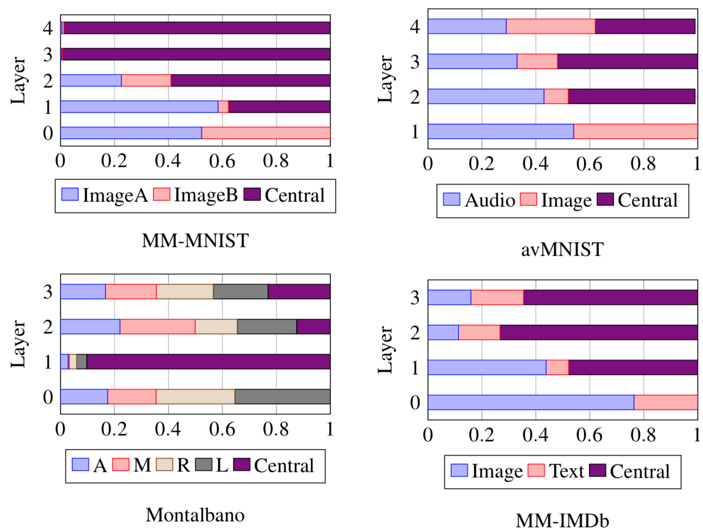
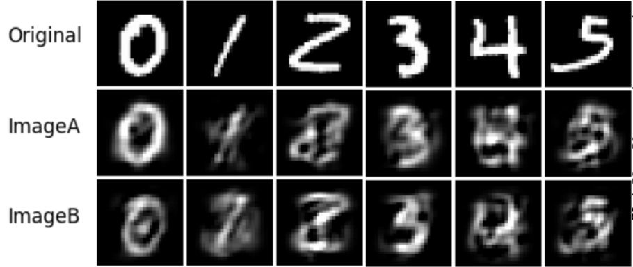
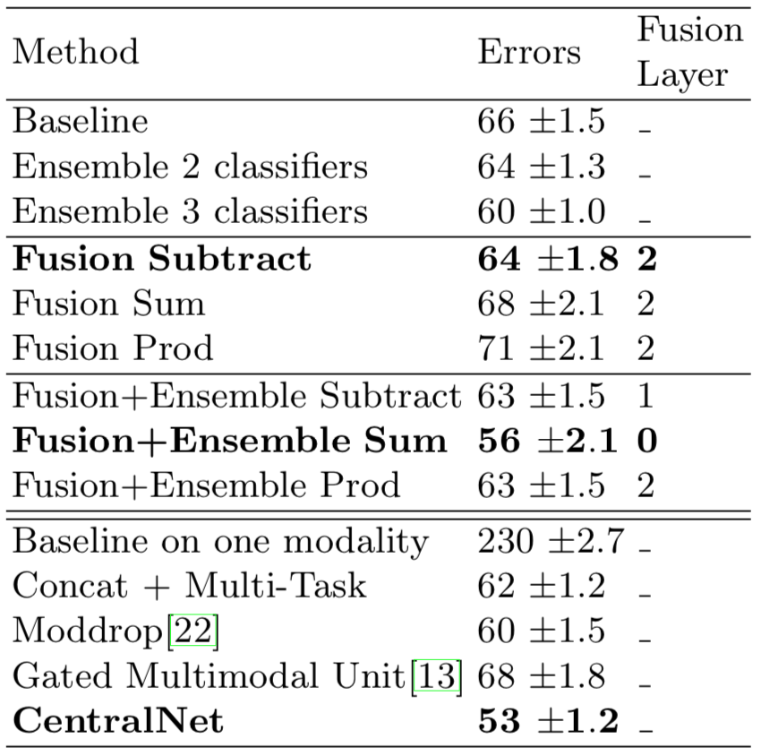
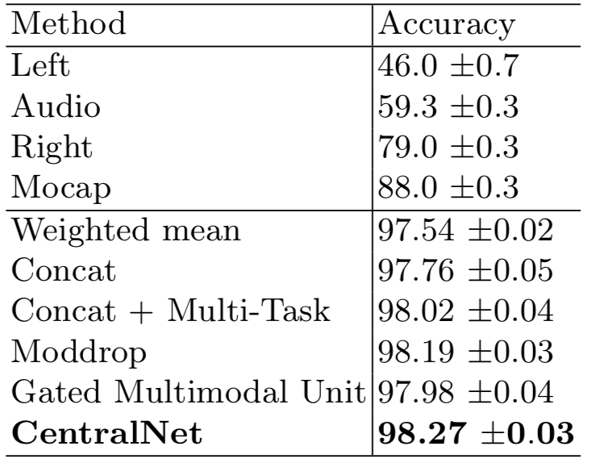
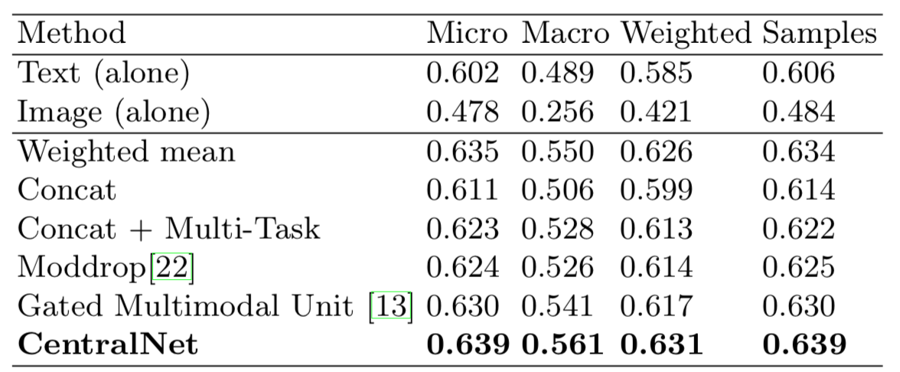

layout: true
name: lts5-question
background-image: url(../Common/question-mark.jpg)
background-position: center
background-size: 300px

 

 

---

layout: true

name: lts5-canvas

 

 

---

name: title

class: center, middle

# CentralNet: a Multilayer Approach for Multimodal Fusion 

Christophe Ecabert

LTS5, EPFL

December 6th, 2018

---

class: center, middle

# Reference

Vielzeuf *et al. **CentralNet: a Multilayer Approach for Multimodal Fusion*** European Conference on Computer Vision Workshops: Multimodal Learning and Applications 2018

---

# Content

- Problem statement
- CentralNet architecture
  - Architecture
  - Training
  - Performance
- Question / Discussion

---

# Problem Statement

- Multimodal fusion

  - Heuristic
  - Early / Late fusion
  - Projection into multimodal subspace

 

???

- Different data **types**, **dimensions** 
- Heuristic = Rules
- Combine early / late features
- Projection: multimodel subspace (Concatenation, element-wise, ...)

---

# CentralNet - Architecture

- Assume having ***one neural network per modality*** capable of inferring decision from this modalities 
- Fused representation is a combination of
  - Weighted sum of unimodal features
  - Central hidden features
- Which is defined as

`$$h_{C_{i+1}} = \alpha_{C_i}h_{C_{i}} + \sum_{k}^{n} \alpha_{M_{i}^k} h_{M_{i}^k} $$`

 

---

# CentralNet - Training

- The whole system trained *end-to-end*

  - All weights (*unimodel + central net*)
  - Fusion parameters `$\alpha_{M_{i}^{k}}$`
  - Stochastic Gradient Descent with *Adam* optimizer

- Cost function defined as

  `$$loss = loss_C + \sum_{k} \beta_k loss_{M^k}$$`

- Unimodal loss function act as a *regularizer* 

???

- Important to constraint the individual network to learn proper discriment features
- `$\beta_k$` are cross validated (set to 1 in practice, all modalities have the same weight)

---

# CentralNet - Performance

- Architecture applied on 4 different tasks
  - Multimodal *MNIST*
     - Synthetic samples generated with PCA
     - Digit classification
  - Audiovisual *MNIST*
     - Images + Spectrogram of spoken digits
     - Digit classification
  - *Montalbano*
     - Kinect: Skeleton, Audio, Color, Depth
     - Gesture recognition
  - *MM-IMDb* 
     - Image + Text
     - Genre classification

---

# CentralNet - Performance - Modalities insight

- The weights `$\alpha_i$` provide insights on the learned fusion strategy

 

???

- MM-MNIST => **LeNet5** (Conv + Conv + Dense + prediction)
- Audiovisual MNIST
  - Img: **LeNet5**
  -  Audio: **6layers-CNN** (Add 2 conv layers from lenet)
- Montalbano
  - 3layer **MLP**
- MM-IMBD 
  - Image: VGG-16 
  - Word2Vec (fine tuned)
  - 3layers **MLP**

---

# MM-MNIST 

.left-column50[

- Unimodal network
  - *LeNet5*
- Synthetic modalities

 

]

.right-column50[

  

]

???

- Fusion+Ensemble
  - Each modality make a prediction, as well as the fusion method, giving an ensemble of 3 classifiers 

---

# Audiovisual MNIST

- Unimodal network
  - Image: *LeNet5*
  - Audio: *6layers CNN* (*Spectrogram*)

 

???

- **Weighted mean** is the weighted average of single modality scores (learned)
- **Concat** consists in concatenating the unimodal scores and 1 inferring the final score with a single-layer linear perceptron. 

---

# Montalbano

- Unimodal network
  - Features for each modalities are provided
     - Use zero padding to match dimensions
  - 3 layer *MLP*
- Modalities
  - Audio
  - Left / Right hand depth
  - Skeleton

---

# MM-IMDB

- Unimodal networks
  - Image features: *VGG-16*
  - Text features: *Word2Vec* (*fine tuned*)
  - 3 layer *MLP*

 

???

- Micro
  - Calculate metrics globally by counting the total true positives, false negatives and false positives.
- Macro
  - Calculate metrics for each label, and find their unweighted mean. This does not take label imbalance into account.
- Weighted
  - Calculate metrics for each label, and find their average weighted by support (the number of true instances for each label)
- Samples
  - Calculate metrics for each instance, and find their average 

---

template: lts5-question

# Questions

