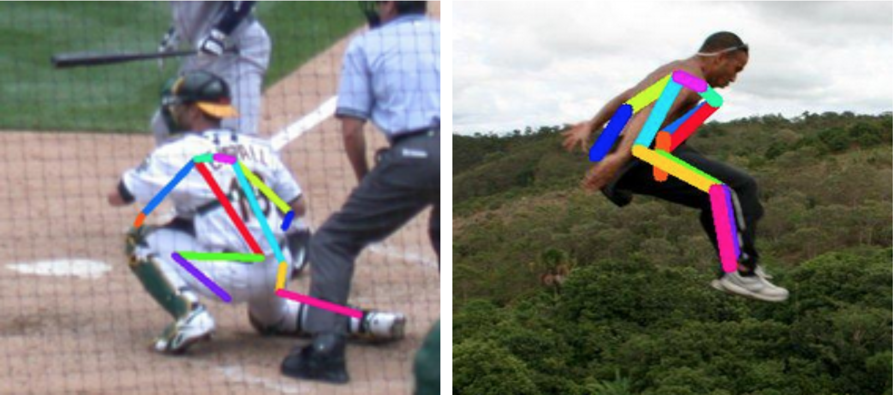
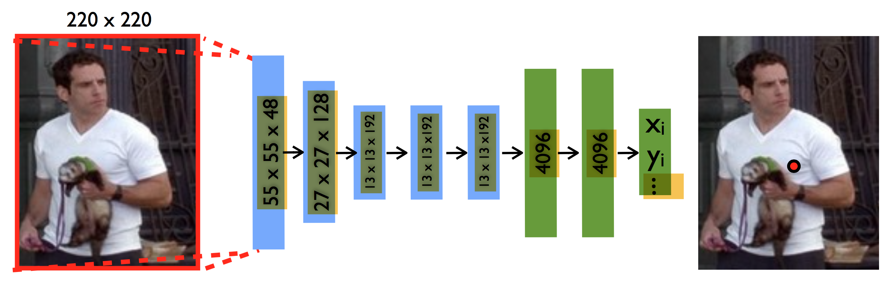
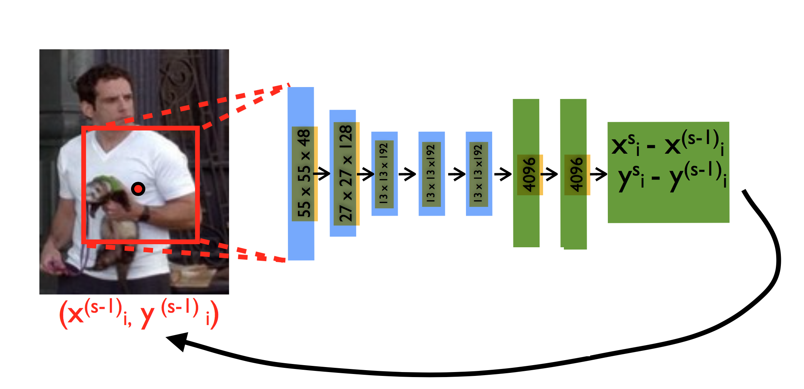
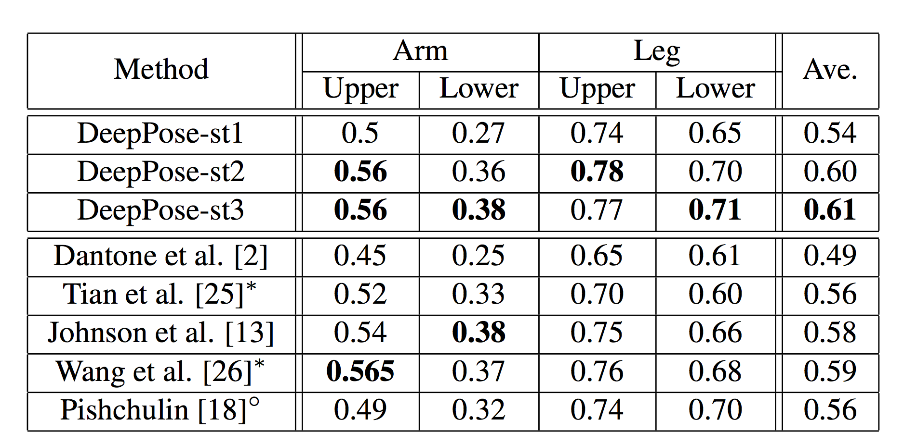
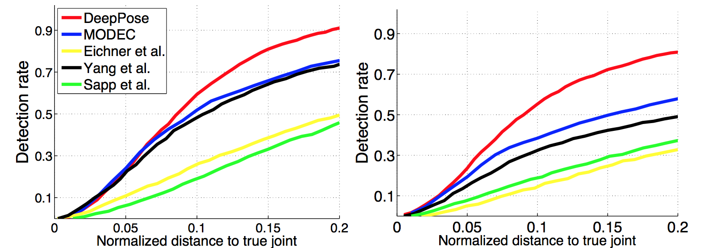
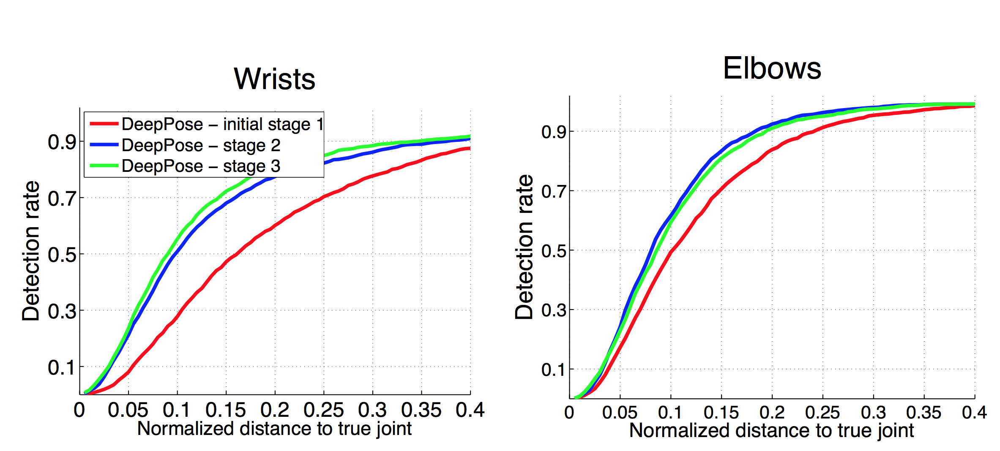
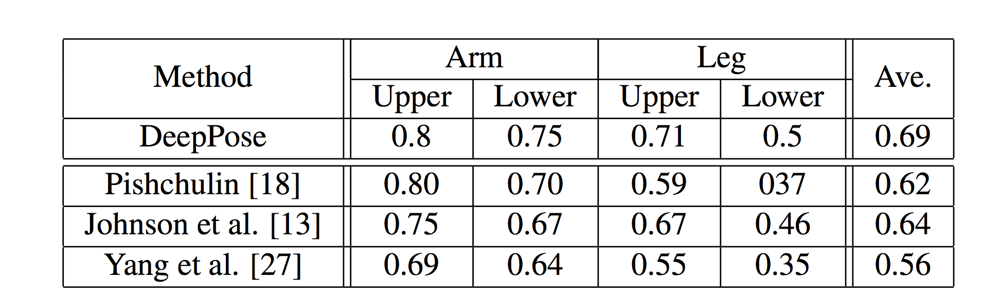

layout: true

 

 

---
name: title
class: center, middle

# DeepPose: Human Pose Estimation via Deep Neural Networks

Christophe Ecabert

LTS5, EPFL

June 1st, 2017 

---
class: center, middle

# Reference

Toshev *et al*. ***DeepPose: Human Pose Estimation via Deep Neural Networks*** Proceedings of the IEEE Conference on Computer Vision and Pattern Recognition 2014.

???

Google, Mountain View CA

---

# Overview
- Problem Statement
- Architecture
- Training
  - Loss function
  - Data
- Pose Estimation
- Results
  - Metrics / Dataset
  - Cross dataset performance
- Conclusions

---

# Problem Statement

- Given an image of a person, estimate the pose of the body by detecting the position of various body joints.
- Such task raises challenges mainly due to self-occlusion of different body parts.

<figure>

<figcaption>Human Body Pose Estimation</figcaption>
</figure>

???

- Detect joints positions : artivualtion location such as hips/elbow/knee
- Hard task due to self occlusions

---

# Architecture

- Convolutional Network as regressor
  - ***7-layers*** Architecture (*AlexNet*)
  - CNN captures the ***full context*** of each body joints
  - No need to desgin features / topological joint model
  - Increase precision with ***Cascaded*** architecture

<figure>

<figcaption>CNN-based Regressor</figcaption>
</figure>

???

- Arch
  - Convolutionnal layer
  - Local Response Normalisation layer (*param free*)
  - Pooling layer (*param free*)
  - Fully connected layer

---

# Data Normalisation Model

- Pose vector
  `$$ \boldsymbol{y} = \left(\dots, \boldsymbol{y}_i^{\top}, \dots \right)^{\top}, i \in \left\{1 \dots k \right\}$$`

  - where `$\boldsymbol{y}_i$` contains the `$x$` and `$y$` coordinates of the `$i^{th}$` joint.
- Bounding box
  `$$ b = \left( b_c, b_w, b_h\right), \quad b_c \in \mathbb{R}^2 $$`
- Normalisation
  `$$ N\left(\boldsymbol{y}_i, b \right) = \left( \begin{matrix}1/b_w& 0 \\ 0 & 1/b_h \end{matrix}\right) \left(\boldsymbol{y}_i - b_c \right) $$`
- Prediction 
  `$$y^{*} = N^{-1}\left(\psi\left(N\left(x,b \right);\theta \right), b\right)$$`

???

bc = Bounding box center

bw = Bounding box width

bh = Bounding box height

Psi = regressor : Predict normalized position from image patch b.

---

# Training Stage 1

- Sample normalisation
  `$$D_N = \left\{ \left(N \left(x, b \right), N \left(\boldsymbol{y}_i, b \right) \right) \vert \left( x, \boldsymbol{y}\right) \in D \right\}$$`
- Loss function
  `$$f(x, \boldsymbol{y}) = \sum_{(x,y) \in D_N} \sum_{i=1}^k \| \boldsymbol{y}_i - \psi_i(x, \theta) \|_2^2$$`
- Data Augmentation
  - Random perturbation of the bounding box 
  - Left/Right flis
- Parameters
  - SGD with Back-Propagation
  - Dropout of `$0.6$` on the fully connected layers
  - Learning rate : `$0.0005$`

???

Normalisation over the whole image or a given bbox provided by people detector

L2 norm between prediction and ground truth as loss function

Standard data augmentation -> Very simple

Standard learning

---

# Training Stage 2+

- Refine each joint indenpendantly, therefore specific normalisation
  `$$D_A^s = \left\{ \left(N \left(x, b \right), N \left(\boldsymbol{y}_i, b \right) \right) \vert \left( x, \boldsymbol{y}_i\right) \sim D,\\ \delta \sim \mathcal{N}^{s-1}, \\b = \left(\boldsymbol{y}_i + \delta, \sigma diam(\boldsymbol{y}) \right) \right\}$$`

- Loss function
  `$$f(x, \boldsymbol{y}_i) = \sum_{(x,\boldsymbol{y}_i) \in D_A^s} \| \boldsymbol{y}_i - \psi_i(x, \theta) \|_2^2$$`

- Data augmentation

  - Add normal displacement of mean and variance equal to the observed displacement `$\left(\boldsymbol{y}_i^{(s-1)} - \boldsymbol{y}_i \right)$`across all training samples.
  - Left/Right flips

???

Diameter function = Distance from ***shoulder to hip***

---

# Pose Estimation

- Predict body joint location
  `$$\boldsymbol{y}^1 \leftarrow N^{-1}\left(\psi\left(N\left(x,b_0 \right);\theta_1 \right), b_0\right)$$`
- Refinement step for each joint
  `$$\boldsymbol{y}_i^s \leftarrow \boldsymbol{y}_i^{s-1} + N^{-1}\left(\psi_i\left(N\left(x,b \right);\theta_s \right), b\right), \\ \text{for } b = b_i^{s-1}, \\ b_i^s \leftarrow \left( \boldsymbol{y}_i^s, \sigma diam(\boldsymbol{y}^s)\right)$$`

<figure>

<figcaption>Stage 1</figcaption>
</figure>

---

# Pose Estimation

<figure>

<figcaption>Stage s</figcaption>
</figure>

---

# Results 

- Datasets
  - Frames Labeled In Cinema (*FLIC*), 4000 + 1000 samples
  - Leeds Sports Dataset (*LSP*), 11000 + 1000 samples
- Metrics
  - Percentage of Correct Parts (*PCP*)
  - Percent of Detected Joints (*PDJ*)
- Joints selection
  - Compare with the most chalenging ones
  - lower/upper arms and legs

???

- FLIC : 4000 + 1000 from hollywood movies

- LSP: 11000 + 1000 Sport activities challenging appearance + articulation (pose) + **low resolution**

  ​

- PCP : Limbs Detected if distance between the **TWO** predictions and GT is smaller than **half** of the **limb length**
  - Penalize short limbs such as arms which are usually harder to detect.
- PDJ : Limb detected if error smaller than a fraction of torso diameter
  - Normalisation by torso size

---
# Results - LSP

<figure>

<figcaption>Percentage of Correct Parts (PCP) at 0.5 on LSP for Deep-Pose vs State-of-art approaches</figcaption>

</figure>

---

# Result - FLIC

<figure>

<figcaption>Percentage of detected joints (PDJ) on FLIC for two joints : elbow and wrist</figcaption>

</figure>

---

# Result - Cascade improvement

<figure>

<figcaption>PDJ on FLIC for the first stages</figcaption>

</figure>

---

# Result - Cross dataset

- Trained on *LSP* + *FLIC* 
- Tested on *ImageParse* 

<figure>

<figcaption>PCP at 0.5 on LSP on ImageParse for Deep-Pose vs State-of-art approaches</figcaption>

</figure>

---

# Conclusions

- CNN-based regression works even though it is popular for classification
  - Large capabilty of context capturing
- Cascade approach 
  - Improve the detection rate
  - Combination of smaller networks instead of a big one
- Simple architecture provides good  detection rate