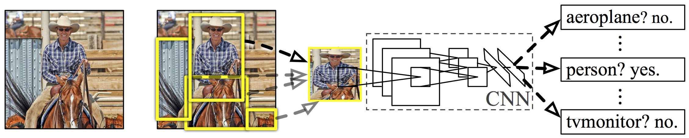
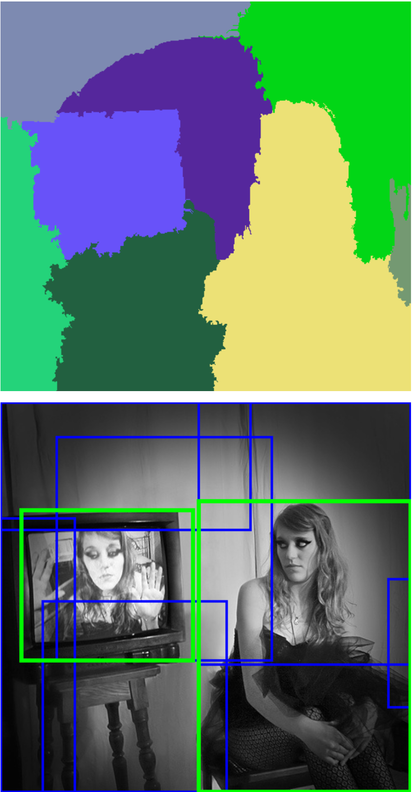
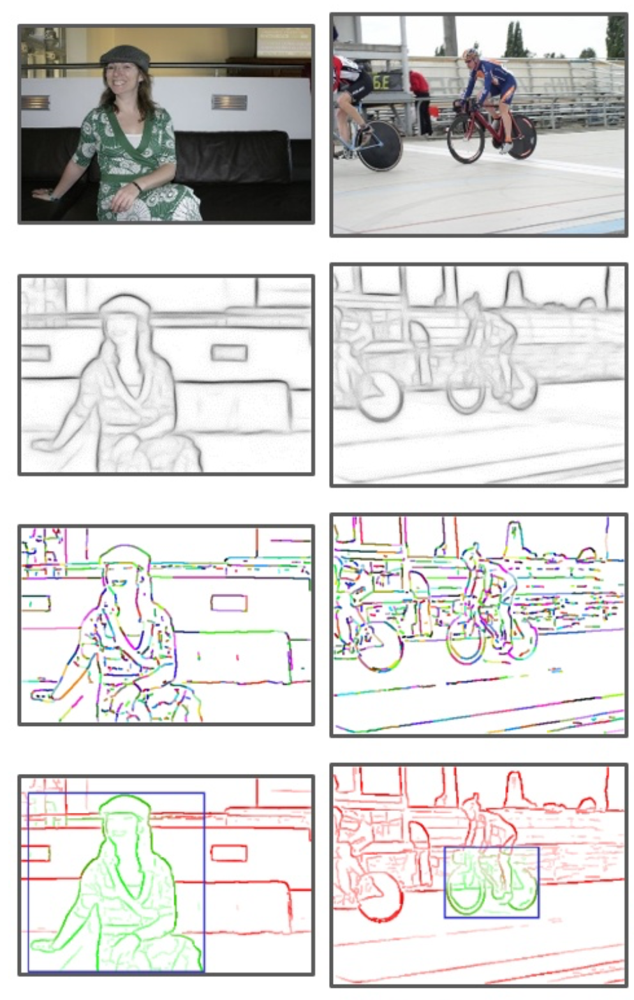
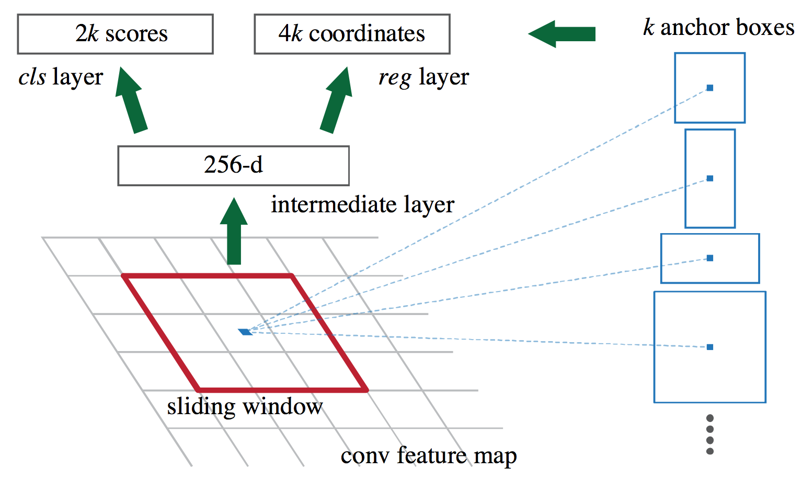
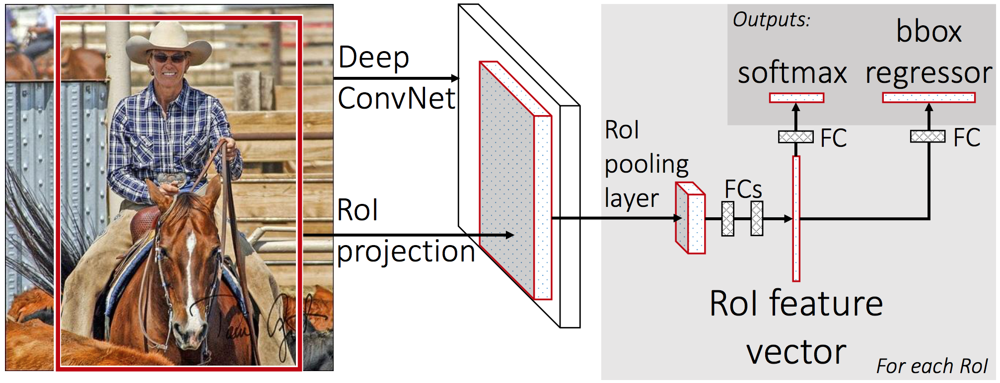
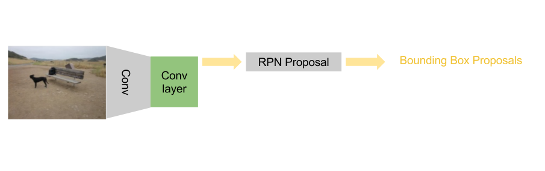
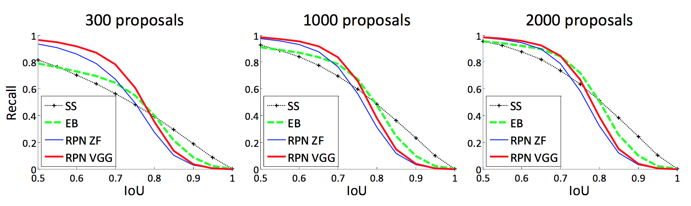

layout: true

 

 

---

name: title

class: center, middle

# Faster R-CNN: Towards Real-Time Object Detection with Region Proposal Networks

Christophe Ecabert

LTS5, EPFL

April 6th, 2017 

---

class: center, middle

# Reference

Ren *et al*. ***Faster R-CNN : Towards Real-Time Object Detection with Region Proposal Networks***, Neural Information Processing Systems (NIPS) 2015.

---

# Problem Statement

- Object detection chain 
  - Regions proposal
  - Features extraction
  - Object classification

<figure>

<figcaption>Object detection overview </figcaption>
</figure>

.cite-article[Girshick *et al*, Rich feature hierarchies for accurate object detection and semantic segmentation.]

???

Object detection can be split into different steps

- Region proposal
  - Sliding window
  - Selective Search
  - Edge boxes
- Features extractions
  - HOG/Sift
  - CNN
- Classification
  - Softmax
  - SVM 

***Can we merge everything together into one single network ?***

---

# Selective Search

.left-column50[

- Initial region with Graph Based Image Segmentation
- Group region based on similarity metrics
- Output bounding box of each region

.cite-article[Uijlings *et al*, Selective Search for Objection Recognition.]

]

.right-column50[

<figure>

<figcaption>Selective search </figcaption>
</figure>

]

???

- Super pixel segmentation
- Region growing approach therefore can be slow
- Color space influence the robustness of the search (search through multiple color space).
- Similarity
  - color
  - texture -> sift like feature
  - size
  - filling / area

---

# Edge Boxes

.left-column50[
- Informative features
  - Structured Edge Response map
  - Sparse information features
- Edge grouping by high affinity 
- Greedy search
- Contour removal
- Perform similar to *Selective Search* but much faster.

.cite-article[Zitnick *et al*, Edge Boxes: Location Object Proposals from Edges.]
]
.right-column50[
<figure>

<figcaption>Edge boxes proposal scheme</figcaption>
</figure>
]

???
- Use edges response map using Structured Edge detector
  - Edge groups
  - Affinity metric
  - Cluster groups to produce region proposal
  - Remove contour + groups on the windows.

---

# Architecture - Faster R-CNN

<figure>

<figcaption>Faster R-CNN Architecture</figcaption>
</figure>

???

- Share convolutional layer between RPN & classifier
- ROI polling layer 
- Standard fully connected layer + softmax for class predicition

---

# Region Proposal Network - RPN

<figure>

<figcaption>Faster R-CNN Architecture</figcaption>
</figure>

???
- Sliding window of size 3x3 used as input
- Sub-network outputs : **Binary** class score + bbox regression 
  - regression relative to the Anchor
- Scale is handle with anchors (k = 9, 3 scale (128, 256,515), 3 ratio(1:2, 1:1, 2:1))
  - Other uses : *Image pyramid or Filter pyramid*

---

# Loss Function

- Multitask loss function

`$$L(\left\{p_i\right\},\left\{t_i\right\}) = \frac{1}{N_{cls}} \sum_i L_{cls}(p_i, p_i^{*}) + \lambda \frac{1}{N_{reg}} \sum_i p_i^{*} L_{reg}(t_i, t_i^{*})$$`

- Object term term

`$$L_{cls}(p_i, p_i^{*}) = -p_i^{*} log(p_i)$$`

- Regression term

`$$ L_{reg}(t_i, t_i^{*}) = R(t_i - t_i^{*})$$`

`$$R(x) = \begin{cases} 0.5x^2, \qquad if \left|x\right| < 1\\ \left|x\right| - 0.5 \end{cases}$$`

???

- `$L_{cls}$` is the log loss over two classes (**object** vs no **object**, logistic probability) 
- Robust lost function estimator for regression (`$R(x)$`)
- `$L_{reg}$` only for positive object want to learn only for object
  - `$p_i^* = 1$` positve anchor

---

# Anchor Positive / Negative

An anchor is ***labelel as positive*** if :

- The anchor is the one with the ***highest*** Intersection over Union (*IoT*) overlap with a ground-truth box.
- The anchor has an *IoT* overlap with a ground-truth box ***higher than 0.7***.

An anchor is ***labelel as negative*** if :

- The anchor has an *IoT* ***lower than 0.3*** for all ground-truth boxes.

???

- Note that a single ground-truth box may assign positive labels to multiple anchors. Usually the second condition is sufficient to determine the positive samples; but we still adopt the first condition for the reason that in some rare cases the second condition may find no positive sample.
- Anchors that are neither positive nor negative do **not** contribute to the training objective.

---

# Object Detection Network : Fast R-CNN

<figure>

<figcaption>Fast R-CNN Architecture</figcaption>
</figure>

- Cost function similar to RPN training

`$$L(p, t, p^*, t^*) = L_{cls}(p, p^*) + \lambda \left[p^* >= 1 \right] L_{reg}(t, t^*)$$`

- Label
  - ***Positive*** if *IoT* overlap with ground-truth box larger than ***0.5***
  - ***Negative*** if *IoT* overlap with ground-truth box is in range ***[0.1, 0.5[***

---

# Training - 1 / 4 Steps

- Train Region Proposal Network, initialisation with an *ImageNet* pre-trained model.

<figure>

</figure>

???

Fine tune convolutional layers + learn RPN 

---

# Training - 2 / 4 Steps

- Train Fast R-CNN, initialized with an *ImageNet* pre-trained model.

<figure>

</figure>

???

- Fine tune convolutional layers + learn object detection
  -  Use proposal from step 1
  - At this point the two networks do **NOT** share the conv layers.

---

# Training - 3 / 4 Steps

- Model from step 2 is used to initalize RPN network (*Convolutional layers*), but they are **not** fine tuned, only RPN is updated.

<figure>

</figure>

???

- Init with network from step 2, now shares conv layers.
  - Keep them fixed while training RPN.

---

# Training - 4 / 4 Steps

- Fine tune fully connected layer of Fast R-CNN using shared convolutional layers from *step 2* and proposals from *step 3*.

<figure>

</figure>

???

- Fine tune FC layer
- Use proposals from RPN learned at *step 3*

---

# Results

- Redundance reduction by adopting Non-maximum Suppression (*NMS*) on the proposal regions with a threshold at ***0.7***.
- Top-*N* ranking at evulation to further reduce candidates.
- Used dataset / network for experimental results
  - Pascal VOC 2007 + 2012
  - Microsoft COCO (*Common Object in Context*)
  - Pre-traine ImageNet network (*ZF fast, VGG-16*)

???

- NMS leaves about **2k** candidates
- Test time keep top 300 candidates.
- ZF 5 conv layer + 3 fully connected
- VGG16 13 conv layer + 3 fully connected

---

# Results - VOC2007 & ZF

Detection results on *PASCAL VOC 2007* ***test set*** :

|     Train      |       |      Test      |          |          |
| :------------: | :---: | :------------: | :------: | :------: |
|     Method     | boxes |     Method     | Proposal |  mAP(%)  |
|       SS       |  2k   |       SS       |    2k    |   58.7   |
|       EB       |  2k   |       EB       |    2k    |   58.6   |
| RPN+ZF, shared |  2k   | RPN+ZF, shared |   300    | **59.9** |

Regrion Proposal Network improves the detection, the same detection network is used (*ZF*).

---

# Results - VOC2007 & VGG

Detection results on *PASCAL VOC 2007* ***test set*** :

|      Method       | Boxes |  Data   |  mAP(%)  |
| :---------------: | :---: | :-----: | :------: |
|        SS         |  2k   |   07    |   66.9   |
| RPN+VGG, unshared |  300  |   07    |   68.5   |
| RPN+VGG, unshared |  300  |   07    |   69.9   |
| RPN+VGG, unshared |  300  | 07 + 12 | **73.2** |

*07 : Trainset from VOC2007*

*07 + 12 : Trainset union from VOC2007 and VOC2012*

---

# Results - Recall vs IoT

<figure>

<figcaption>Recall vs IoT on PASCAL VOC 2007 test set</figcaption>
</figure>

- RPN performs in a similar way even when the number of candidates is reduced
- Number of candidates provided by SS / EB have a bigger impact on the overall performance

???

- Explains why the detection rate at the end is good.
  - Mainly due to the *cls* term.
- SS/EB drop quite drastically when proposal number is lowered.

---

# Result - Timing

Timing on K40 GPU, except for Selective Search

| Model |   Architecture   | Conv [ms] | Proposal [ms] | Region-wise [ms] | Total [ms] |  FPS   |
| :---: | :--------------: | :-------: | :-----------: | :--------------: | :--------: | :----: |
|  VGG  | SS + Fast R-CNN  |    146    |     1510      |       174        |    1830    |  0.5   |
|  VGG  | RPN + Fast R-CNN |    141    |      10       |        47        |    198     | **5**  |
|  ZF   | RPN + Fast R-CNN |    31     |       3       |        25        |     59     | **17** |

???

- SS is implemented on CPU
- region wise = *NMS, pooling, fully connected + softmax.*

---

# Conclusion

- Region Proposal Network with shared convolutional features (Proposal + Classification) allows regions generation step to be almost cost free
- Improved quality of the region proposals (i.e. SS, EB)
- Frame rate between *5 - 17* image par second
- Fused architecture is the basis of various object detection winining algorithm (*COCO, ILSVRC15'*)
- Same for localization and segmentation challenges.

???

Mainly COCO15' + ILSRVC15'
