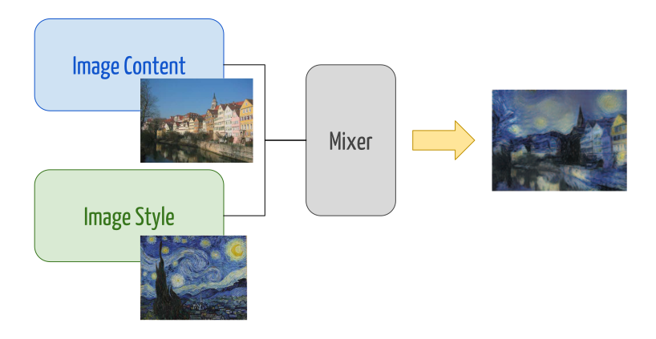
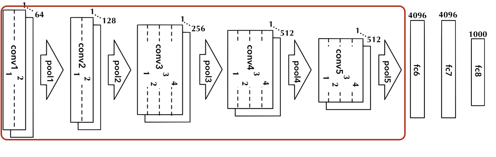
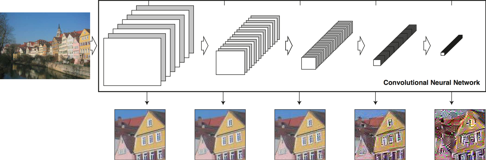
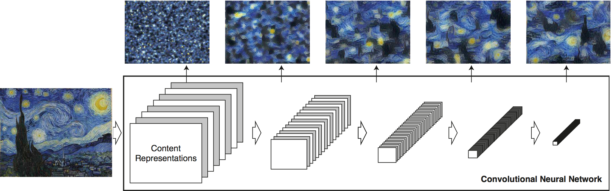
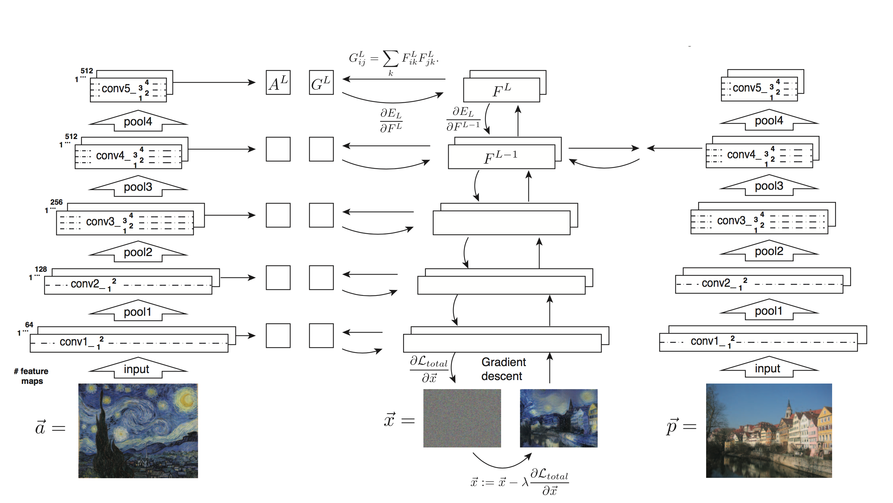
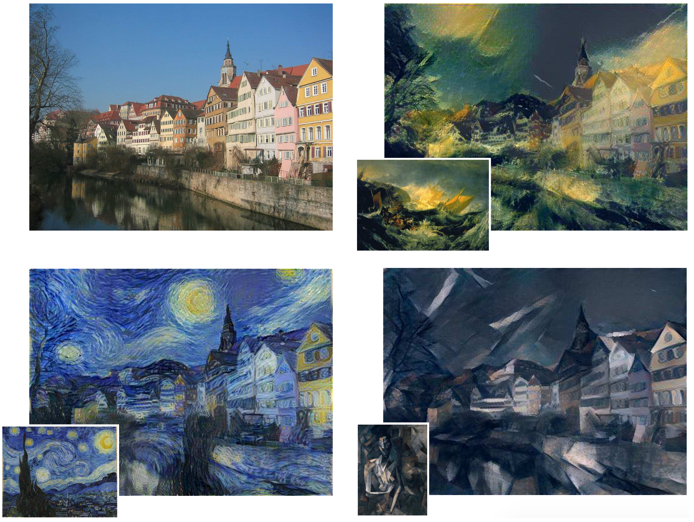
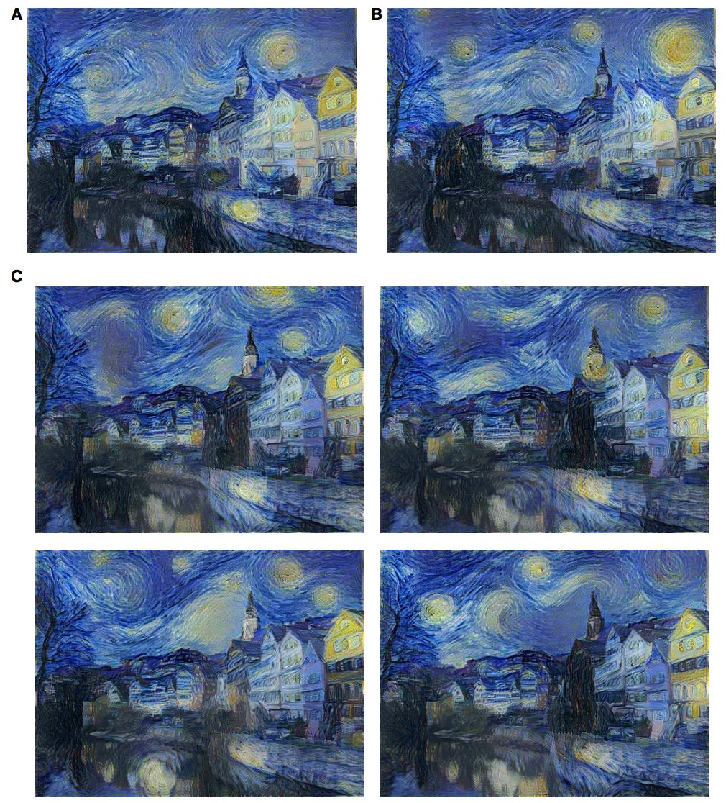
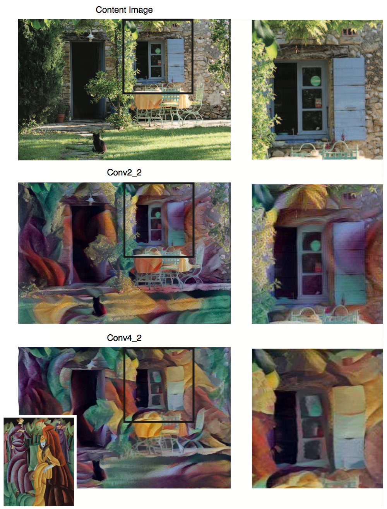
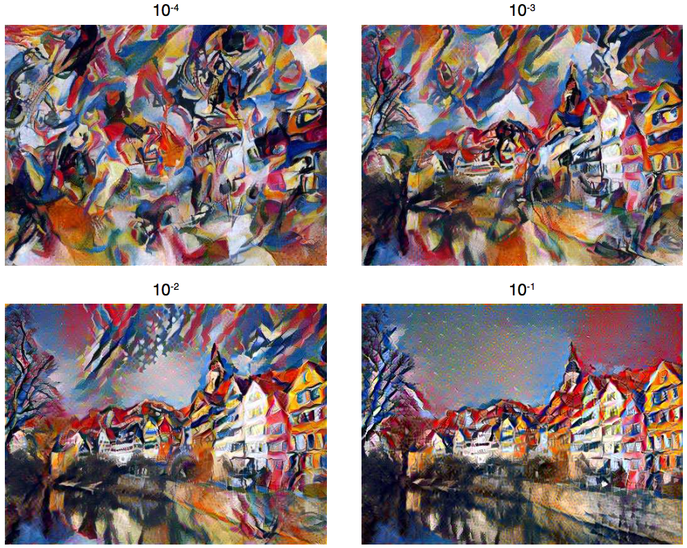
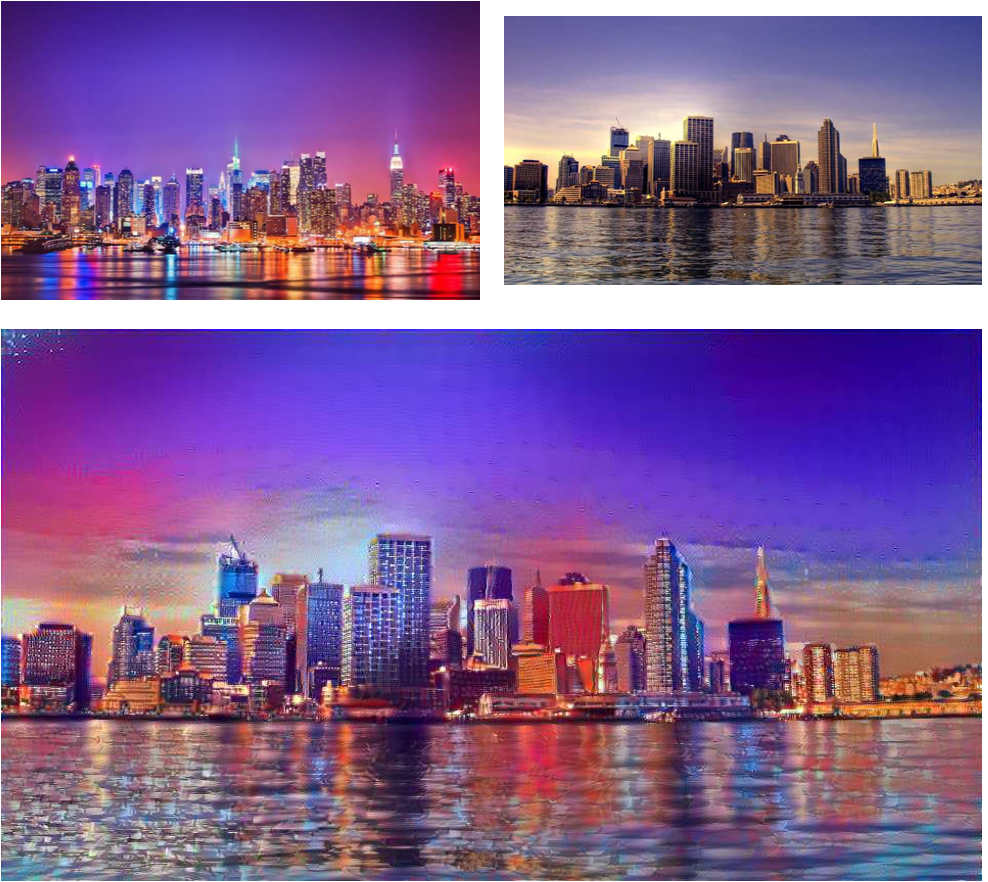

layout: true

 

 

---
name: title
class: center, middle

# Image Style Transfer Using Convolutional Network

Christophe Ecabert

LTS5, EPFL

May 18th, 2017 

---
class: center, middle

# Reference

Gatys *et al*. ***Image Style Transfer Using Convolutional Network*** Proceedings of the IEEE Conference on Computer Vision and Pattern Recognition 2016.

---

# Overview
- Problem Statement
- Image Representation
  - Contents
  - Style
- Transfering Style to Content
- Results
- Discussions
  - Initialisation
  - *Content* / *Style* ratio
- Conclusions

---

# Problem Statement

Given an image `$\boldsymbol{p}$` and a *style* `$\boldsymbol{a}$`, how to generate an image `$\boldsymbol{x}$` that combine / fuse both without compromising the *content* of the input.

<figure>

<figcaption>Style Transfer</figcaption>
</figure>

???

- Introduce the purpose of this paper
- Given an two images,  one of *content* and one of *style* generate a new one that combine the two of them by transfering the styling into the content.
- What is inside **"Mixer"** ?

---

# Image Representation

- Convolutional Network as hierarchical image descriptor
  - Based on VGG19
  - Fully connected layers not used
  - Filter's weights normalised to have mean activation value equal to 1.

<figure>

<figcaption>Modified 19-layer VGG network</figcaption>
</figure>		

???

- Need a description of what is in the image (features *content*)
- CNN can extract semantically meaningfull information as already seen.
  - First layer extract basic information (edges, colour, ...)
  - Last layer extract higher level information (texture, object, …)

---

# Content Representation

- Layers act as a non-linear filters bank
  - With different level of *abstraction*
- How to known what is *encoded* in each layer ?
  - Perform gradient descent on white noise to find images that match the feature response of the original image.
- Feature map for a given layer
  - Number of filters `$N_l$ `
  - Map dimensions `$M_l = w_l h_l$`
  - `$\boldsymbol{F}^l \in R^{N_l \times M_l}$`

<figure>

<figcaption>Content Encoding</figcaption>

</figure>

???

- Reconstruction from conv12, conv22, conv32 conv42 conv52
  - Low layer reconstruction almost perfect
  - higher detailed pixel information are *lost* **BUT** high-level content of the image is preserved

---

# Style Representation

- Style representation in a feature space designed to capture texture information

  - Built on top of filter response

  - Consist of correlation between feature map

  - Gram Matrix, `$\boldsymbol{G}^l \in R^{N_l \times N_l}$` with `$\boldsymbol{G}_{ij}^l = \sum_k \boldsymbol{F}_{ik}^l \boldsymbol{F}_{jk}^l$`

    ​

- Multiscale representation

<figure>

<figcaption>Style Encoding</figcaption>

</figure>

???

- Reuse same features extracted from CNN.
  - Feature space based on correlation between each featue map of the CNN.
  - Gij = inner product between the vectorised feature maps i and j.

---

# Transfering Style To Content

- Content loss 
  `$$ \mathcal{L}_{content} (\boldsymbol{p}, \boldsymbol{x}, l) = \frac{1}{2}\sum_{i,j} \left( \boldsymbol{F}_{ij}^l - \boldsymbol{P}_{ij}^l \right)^2 $$`

- Stlye loss

  `$$ E_l = \frac{1}{4 N_l^2 M_l^2} \sum_{i,j} \left( \boldsymbol{G}_{ij}^l - \boldsymbol{A}_{ij}^l \right)^2$$`

  `$$ \mathcal{L}_{style} (\boldsymbol{a}, \boldsymbol{x}) = \sum_{l=0}^L w_l E_l$$`

- Transfer loss

  `$$ \mathcal{L}(\boldsymbol{p}, \boldsymbol{a}, \boldsymbol{x}) = \alpha \mathcal{L}_{content} (\boldsymbol{p}, \boldsymbol{x}, l) + \beta \mathcal{L}_{style} (\boldsymbol{a}, \boldsymbol{x}) $$`

???

- Find a solution **x** that is similar to the content of **p** and have the same style as **a**.
- Similarity metric as cost functions

---

# Transfering Style To Content

<figure>

<figcaption>Optimisation scheme</figcaption>
</figure>

---

# Results 

<figure>

<figcaption>Different styles applied to the same sample</figcaption>
</figure>

???

Different style applied

- Turner
- Van Gogh
- Picasso

---

# Discussions - Initialisation

- Transfer initialisation
  - White noise
  - Fixed image

<figure>

<figcaption>Initialisation : A content, B style, C white noise</figcaption>
</figure>

???

- Initialising with fixed image leads to the same output (up to stochastics gradient descent procedure)
- White noise allow the generation of infinite number of new images.

---

# Discussions - Layer selection

.left-column50[

- Matching different layers have a large impact
  - CNN extract *style* features at multiple scale 

]
.right-column50[
<figure>

<figcaption>CNN layer selection impact</figcaption>
</figure>
]

???

- Low level layer end up being blended due to large constraint on the style.

---

# Discussions - Content / Style Ratio

- Complete disentangling of *content* / *style* is not possible
  - Can not synthesised an image that perfectly combined the two of them
  - Linear combination of both of them, can emphasis one or the other with `$\alpha / \beta$` ratio

<figure>

<figcaption>Content / style balancing</figcaption>
</figure>

---

# Conclusions

- Fancy application of convolutional network
- CNN are good hierarchical semantic descritptor
  - Disentangling capabilities
- Has some limitations
  - Image resolution (*currently 512 x 512*)
  - Synthesis speed, *up to one hour* on K40 GPU.
- Low level noise
  - More significant when both content and style input are photographs

<figure>

</figure>