layout: true

 

 

---

name: title

class: center, middle

# Large Pose 3D Face Reconstruction from a Single Image via Direct Volumetric CNN Regression

Christophe Ecabert

LTS5, EPFL

February 8th, 2018

---

class: center, middle

# Reference

Jackson *et al*. ***Large Pose 3D Face Reconstruction from a Single Image via Direct Volumetric CNN Regression***, Proceedings of the IEEE International Conference on Computer Vision 2017.

???

From image to 3d volume regression

---

# Problem Statement

<figure>
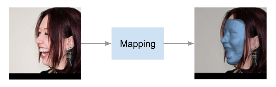
<figcaption>Target </figcaption>
</figure>

- Generate 3D face from a single image
  - Estimate 3D Volume, extract *iso-surface*
- Learn the mapping *image* - *3D* volume in a **supervised** manner

???

- Large pose handling solution
- Transform regression pipeline into a volumetric segmentation problem.

---

# Volumetric Representation

- This approach is not  based on any model
  - No *blendshape* / *statistical* model needed
- 3D surfaces representation based on Volumetric data
  - Surface are linearly sampled on a gird of dimension `$\{w, h, d\}$`
  - How to chose the grid dimensions ?

<figure>
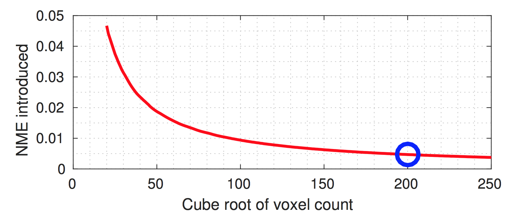
<figcaption>Voxelisation error </figcaption>
</figure>

???

- Error represented as a function of voxel density

---

# Volumetric Regression Network - VRN

- Learn a mapping from an image to a 3D volume `$f : \boldsymbol{I} \rightarrow \boldsymbol{V}$`

- *Hourglass* network topology including *skip connections*

  ​

  <figure>
  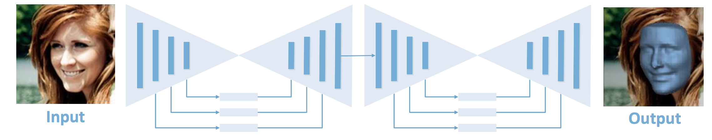
  <figcaption>Proposed VRN structure</figcaption>
  </figure>

- Cross entropy cost function `$$ l = \sum_{w=0}^{W-1}\sum_{h=0}^{H-1}\sum_{d=0}^{D-1} \left[V_{whd} log\hat{V}_{whd} + \left(1 - V_{whd} \right) log \left(1 - \hat{V}_{whd} \right) \right] $$`

---

# VRN - Multitask

- Achieve two tasks
  - Landmarks regression
  - 3D reconstruction
- Learn more reliable feature to increase performance

<figure>
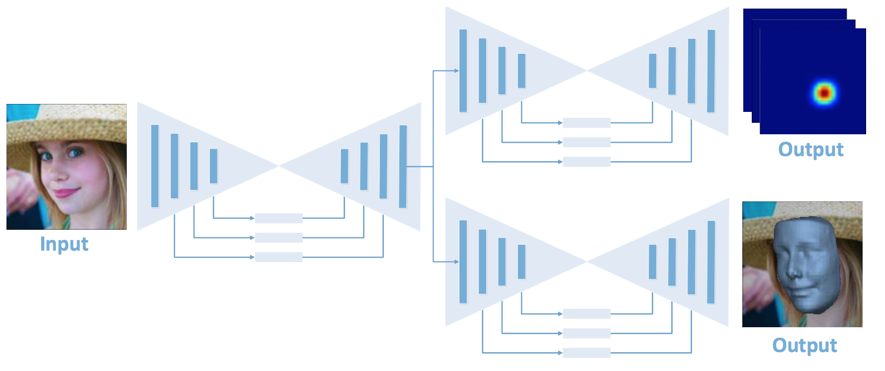
<figcaption>Proposed VRN-Multitask</figcaption>
</figure>

---

# VRN - Guided

- Propose to use landmarks as a prior in the reconstruction
  - Landmarks act as a guidance system
- Combine landarks and image to feed the network

<figure>
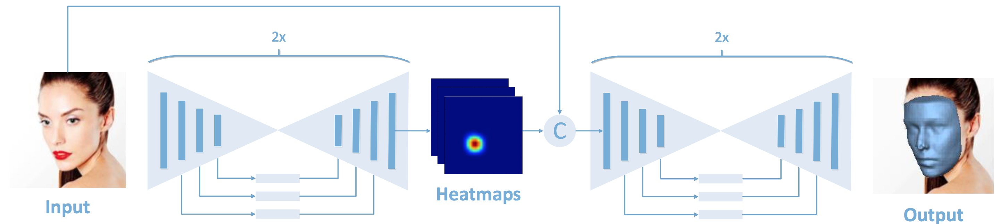
<figcaption>Proposed VRN-Guided</figcaption>
</figure>

---

# Results - Samples

<figure>
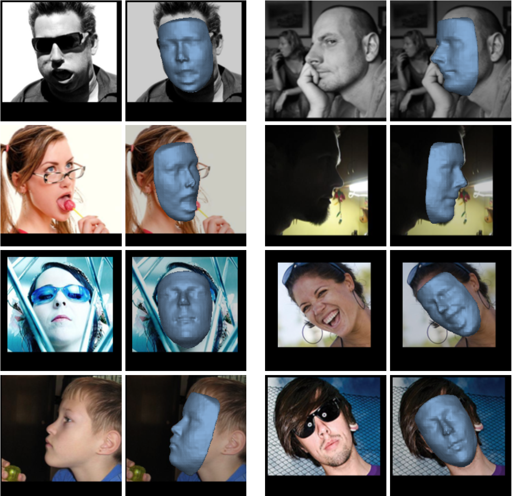
<figcaption>Reconstruction samples of AFLW2000-3D dataset (VRN Guided)</figcaption>
</figure>

---

# Results - Datasets / Metrics

- Tested on various datasets
  - *AFLW2000-3D*
     - 3D meshes for the first 2000 images of *ALFW*
  - BU-4DFE
     - Rendered Images
     - Pitch `$\left[-20°, 20° \right]$`, Roll `$\left[-80°, 80° \right]$`
     - Happy / Surprise expression
  - Florence 
     - 20 different poses for each face
- Metric
  - Normalize Mean Error (*NME*)
  - Average per-vertex error normalised by interoccular distance `$d$`
    `$$e = \frac{1}{N } \sum_{k}^{N} \frac{\left|\left| \boldsymbol{x}_k - \boldsymbol{y}_k  \right|\right|_2}{d}$$`

---

# Results - Comparisons

.left-column50[

<figure>
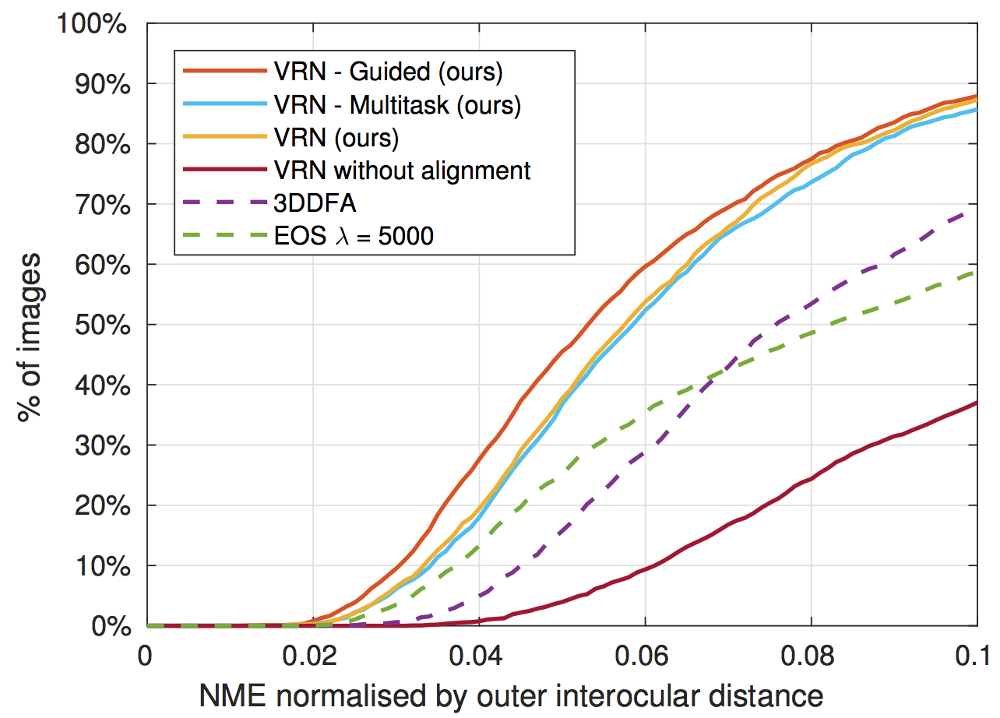
<figcaption>AFLW2000-3D</figcaption>
</figure>

<figure>
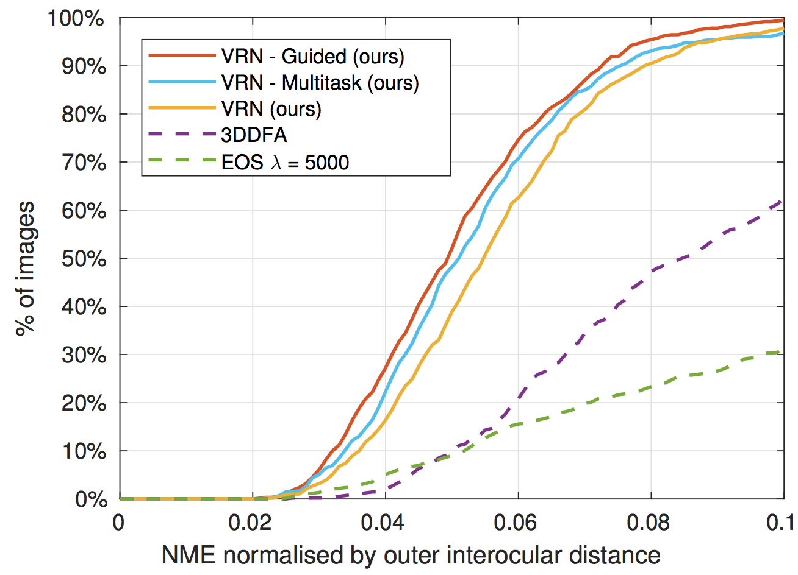
<figcaption>Florence</figcaption>
</figure>

]

.right-column50[

<figure>
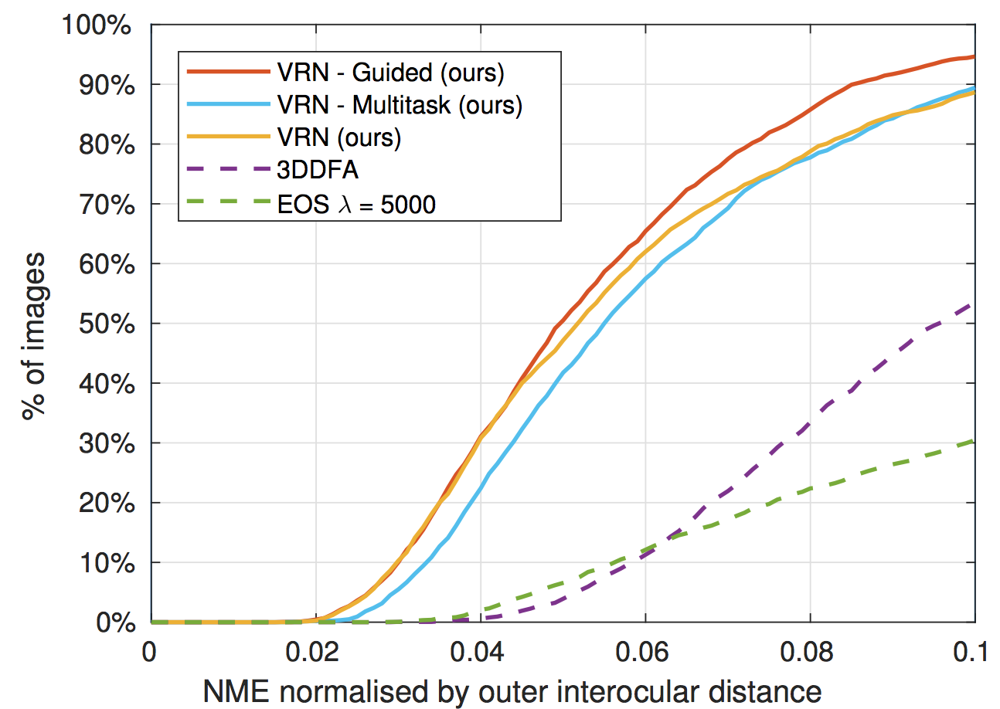
<figcaption>BU-4DFE</figcaption>
</figure>

]

---

# Ablation Studies

- Pose effect

<figure>
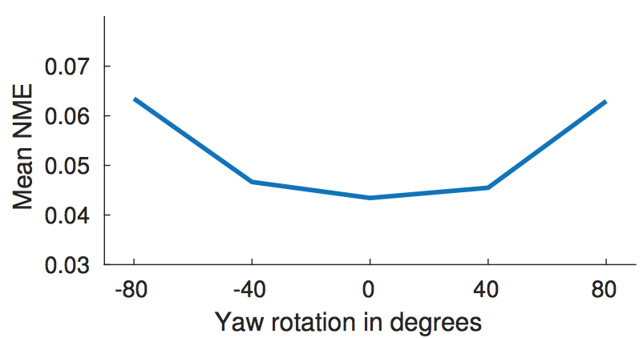
<figcaption>Impact of the pose on the reconstruction on the Florence dataset</figcaption>
</figure>

- Expression

<figure>
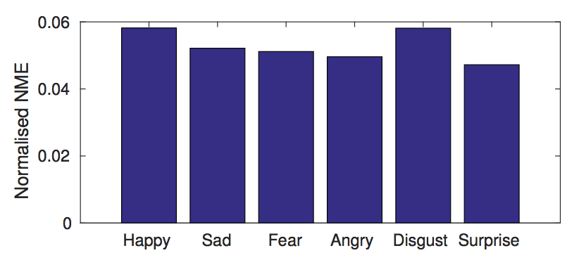
<figcaption>Impact of the expression on the reconstruction on the BU-4DFE dataset</figcaption>
</figure>

---

# Conclusion

- Novel approach to 3D face reconstruction
  - No model needed
  - Proposed three network topologies that improve on previous methods
- Handle
  - Large pose variation 
  - Facial expressions
  - Occlusions
- Performance improvrement over three diffrerent datasets