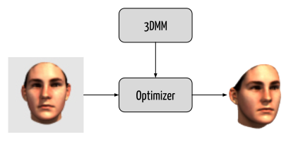
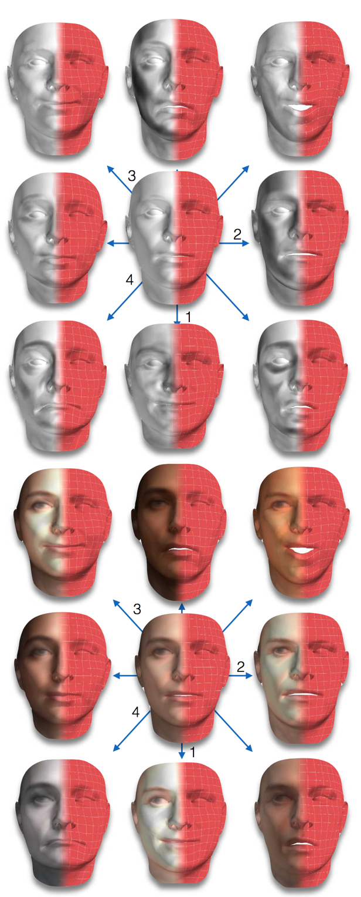
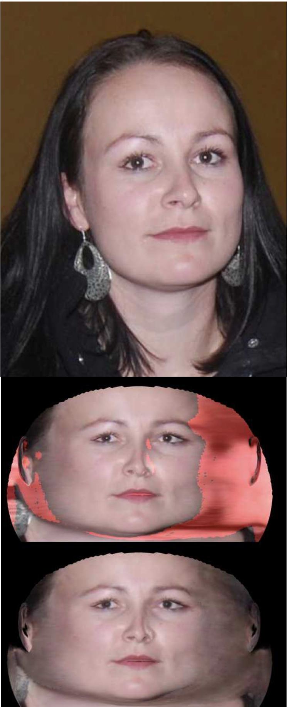
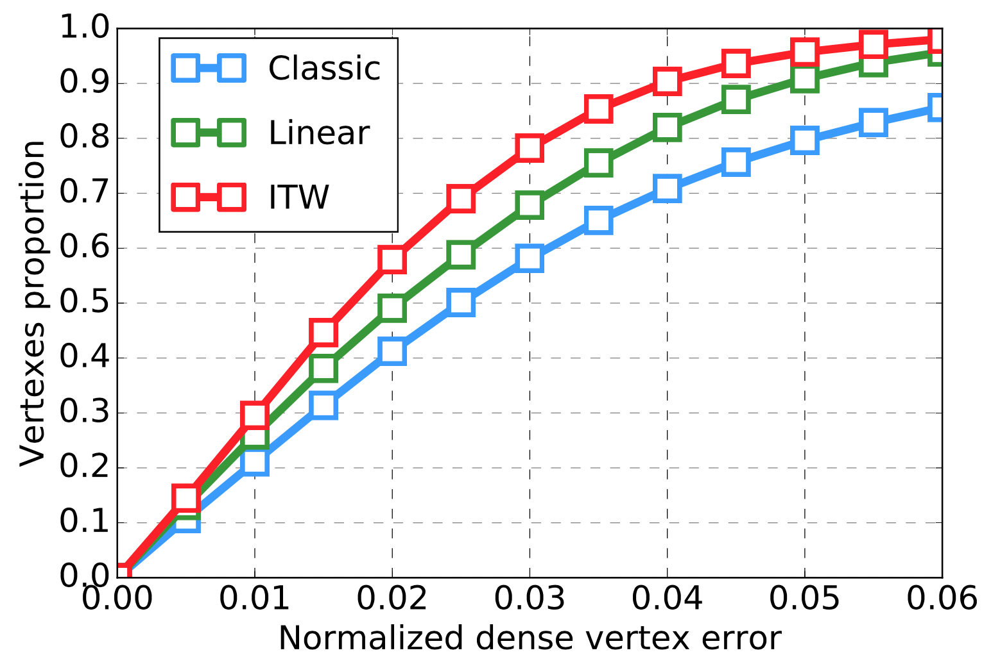
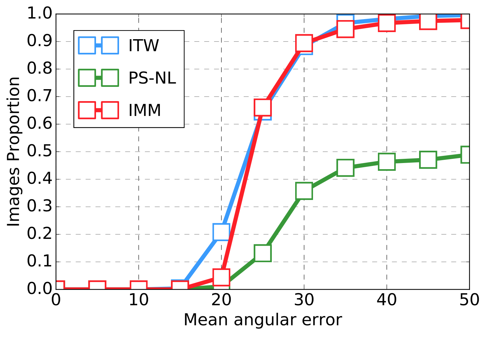
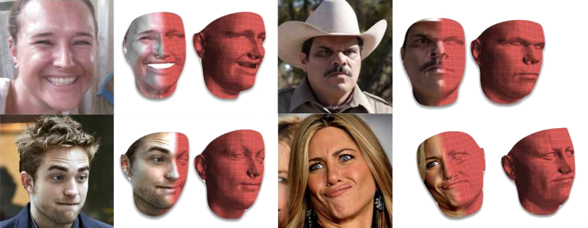

layout: true

 

 

---

name: title

class: center, middle

# 3D Face Morphable Model "In-The-Wild"

Christophe Ecabert

LTS5, EPFL

September  12th, 2017 

---

class: center, middle

# Reference

Booth *et al*. ***3D Face Morphable Model "In-The-Wild"***, Proceedings of the IEEE Conference on Computer Vision and Pattern Recognition 2017.

---

# Problem Statement

- Problem
  - Model design
  - Fitting

<figure>

<figcaption>Processus overview </figcaption>
</figure>

.cite-article[Blanz and Vetter, *A Morphable Model for the Synthesis of 3D Faces*]

???

Topics:

- How to simplified model with in-the-wild texture, ***learnt*** from available dataset
- How to Fit such models in a efficient way using ***project-out*** technique
- Contributions:
  - Building texture model with missing data
  - Efficiently fit model

---

# 3D Morphable Models

.left-column60[

- Similar to Active Appearance Model for 3D data

  - Statistical models for shape and texture

- Two components:

  - Shape model

     `$$\quad \mathcal{S}: \mathbb{R}^{n_s} \rightarrow \mathbb{R}^{3N} \qquad \mathcal{S}(\textbf{p}) = \overline{\boldsymbol{s}} + \boldsymbol{U}_s \boldsymbol{p}$$`

  - Texture model:

     `$$\quad \mathcal{T}: \mathbb{R}^{n_t} \rightarrow \mathbb{R}^{CN} \qquad \mathcal{T}(\boldsymbol{\lambda}) = \overline{\boldsymbol{t}} + \boldsymbol{U}_t \boldsymbol{\lambda}$$`

]

.right-column40[

<figure>

<figcaption>Texture Variation</figcaption>
</figure>

]

???

- Extension of well known ***AAM*** for 3D data
- Shape model can be split into two subpart for ***expression + Id*** modelling
- Texture model can also be ***feature*** based and not only RGB value

---

# Camera Model

- Extrinsic parameters (*i.e. rigid transform*) composed of  *Rotation* and *Translation*

  `$$\left[v_x, v_y, v_z\right]^{\top} = \boldsymbol{R}_{q} \boldsymbol{x}_i + \boldsymbol{T}$$`

- Perspective projection
  `$$\boldsymbol{x}' = \frac{f}{v_z} \begin{bmatrix} v_x \\ v_y \end{bmatrix} + \begin{bmatrix} c_x \\ c_y \end{bmatrix}$$`

- Camera parameters 

  `$$ \boldsymbol{c} = \left[f, q_1, q_2, q_3, t_x, t_y, t_z\right] $$`

- Camera operator `$\qquad \mathcal{W}: \mathbb{R}^{n_s, n_c} \rightarrow \mathbb{R}^{2N} \qquad \mathcal{W}\left(\boldsymbol{p}, \boldsymbol{c}\right) \equiv \mathcal{P}\left(\mathcal{S}\left(p\right), c\right)$`

???

- Add rigid transform to align with our data
- Use standard perspective projection
- Use quaternion for rotation representation (*avoid gimbal lock*)
  - Optmize only for 3 params since quaternion are unitary therefore the last one is given for free

---

# Texture Model "In-The-Wild"

.left-column60[

- Construct the model as feature based `$\mathcal{F}: \quad \mathbb{R}^{H \times W} \rightarrow \mathbb{R}^{H \times W \times C}$` 

- The recovered texture map have ***holes*** due to self-occlusion

  `$\boldsymbol{X} = \left[\boldsymbol{t}_1, ..., \boldsymbol{t}_M \right] \in \mathbb{R}^{CN \times M}$ `

- Recover missing information by solving 

`$$ \begin{align} \boldsymbol{X} &= \boldsymbol{L} + \boldsymbol{E} \\ \boldsymbol{L}^*, \boldsymbol{E}^* &= argmin \left|\left| \boldsymbol{L} \right|\right|_* + \lambda \left|\left| \boldsymbol{E} \right|\right|_1 \\ & \quad s.t. \mathcal{P}_{\Omega}\left( \boldsymbol{X} \right) = \mathcal{P}_{\Omega}\left( \boldsymbol{L} + \boldsymbol{E} \right)  \end{align}$$`

.cite-article[Shang *et al*, *Robust Principal Component Analysis with Missing Data*]

]

.right-column40[

<figure>

<figcaption>Texture Map In-The-Wild</figcaption>
</figure>

]

???

- X measurement (data with missing information)
- L clean data to recover / E non gaussian noise (sparse representation of missing data)
- Omega set representing the observed data (i.e. indexes)
- P = projection operator: P(X) = x_ij **IF** (i,j) in Omega, **0** otherwise
- Solved with *ADMM* scheme

---

# Model Fitting

- Estimate *shape*, *texture* and *camera* parameters by minimising the error between the generated sample and the input image 
- Texture cost `$$\boldsymbol{p}^{*}, \boldsymbol{c}^{*}, \boldsymbol{\lambda}^{*} = argmin \quad \left|\left| \boldsymbol{F}\left(\mathcal{W}\left( \boldsymbol{p}, \boldsymbol{c} \right)\right) - \mathcal{T}\left(\boldsymbol{\lambda}\right) \right|\right|^2$$`
- Parameters regularizer  `$$\boldsymbol{p}^{*}, \boldsymbol{\lambda}^{*} = argmin \quad c_s \left|\left| \boldsymbol{p} \right|\right|^{2}_{\boldsymbol{\Sigma}_s^{-1}} + c_t \left|\left| \boldsymbol{\lambda} \right|\right|^{2}_{\boldsymbol{\Sigma}_t^{-1}}$$`
- Landmarks constraints `$$\boldsymbol{p}^{*}, \boldsymbol{c}^{*} = argmin \quad c_l \left|\left| \mathcal{W}\left( \boldsymbol{p}, \boldsymbol{c} \right) - \boldsymbol{s}_l \right|\right|^{2}$$`
- Finally `$$ \boldsymbol{p}^{*}, \boldsymbol{c}^{*}, \boldsymbol{\lambda}^{*} = argmin \quad \left|\left| \boldsymbol{F}\left(\mathcal{W}\left( \boldsymbol{p}, \boldsymbol{c} \right)\right) - \mathcal{T}\left(\boldsymbol{\lambda}\right) \right|\right|^2 + c_s \left|\left| \boldsymbol{p} \right|\right|^{2}_{\boldsymbol{\Sigma}_s^{-1}} + c_t \left|\left| \boldsymbol{\lambda} \right|\right|^{2}_{\boldsymbol{\Sigma}_t^{-1}} + c_l \left|\left| \mathcal{W}\left( \boldsymbol{p}, \boldsymbol{c} \right) - \boldsymbol{s}_l \right|\right|^{2}$$`

???
- Minimise the error between generated instance and input image
- Avoid overfitting / stay in the solution span add regularizers for shape + texture 
- Optionnaly can add landmarks constraints for faster convergence (*If camera is correctly estimated can only optimize for shape + texture parameters*)
- **NO LINEARITIES** due to camera projection in texture/landmarks terms
  - Linearize with first order taylor expansion

---

# Framework

- Optimization is conducted in a *Gauss-Newton* Framework

  - Additive parameters update

  `$$\boldsymbol{p} \leftarrow \boldsymbol{p} + \boldsymbol{\delta p}, \quad \boldsymbol{c} \leftarrow \boldsymbol{c} + \boldsymbol{\delta c}, \quad \boldsymbol{\lambda} \leftarrow \boldsymbol{\lambda} + \boldsymbol{\delta \lambda} $$`

  - Non linear function due to projection operation, use first order *Taylor* expansion.

  `$$ \boldsymbol{F}\left( \mathcal{W}\left( \boldsymbol{p} + \boldsymbol{\delta p}, \boldsymbol{c} + \boldsymbol{\delta c} \right) \right)\approx \boldsymbol{F}\left( \mathcal{W}\left( \boldsymbol{p}, \boldsymbol{c} \right) \right) + \boldsymbol{J}_{\boldsymbol{F}, \boldsymbol{p}} \boldsymbol{\delta p} + \boldsymbol{J}_{\boldsymbol{F}, \boldsymbol{c}} \boldsymbol{\delta c} $$`

  - Similar for sparse landmarks

  `$$ \mathcal{W}_l\left( \boldsymbol{p} + \boldsymbol{\delta p}, \boldsymbol{c} + \boldsymbol{\delta c} \right) \approx \mathcal{W}_l \left( \boldsymbol{p}, \boldsymbol{c} \right) + \boldsymbol{J}_{\mathcal{W}_l, \boldsymbol{p}} \boldsymbol{\delta p} + \boldsymbol{J}_{\mathcal{W}_l, \boldsymbol{c}} \boldsymbol{\delta c} $$`

???

Linearization + update

---

# Framework - Simultaneous

- Solve for all parameters at the same time

  `$$\begin{align} \boldsymbol{p}^{*}, \boldsymbol{c}^{*}, \boldsymbol{\lambda}^{*} = argmin  \quad & \left|\left| \boldsymbol{F}\left( \mathcal{W}\left( \boldsymbol{p}, \boldsymbol{c} \right) \right) + \boldsymbol{J}_{\boldsymbol{F}, \boldsymbol{p}} \boldsymbol{\delta p} + \boldsymbol{J}_{\boldsymbol{F}, \boldsymbol{c}} \boldsymbol{\delta c} - \mathcal{T}\left(\boldsymbol{\lambda} + \boldsymbol{\delta \lambda}\right) \right|\right|^2 + \\ & c_l \left|\left| \mathcal{W}_l \left( \boldsymbol{p}, \boldsymbol{c} \right) + \boldsymbol{J}_{\mathcal{W}_l, \boldsymbol{p}} \boldsymbol{\delta p} + \boldsymbol{J}_{\mathcal{W}_l, \boldsymbol{c}} \boldsymbol{\delta c} - \boldsymbol{s}_l \right|\right|^{2} + \\ &c_s \left|\left| \boldsymbol{p} + \boldsymbol{\delta p} \right|\right|^{2}_{\boldsymbol{\Sigma}_s^{-1}} + c_t \left|\left| \boldsymbol{\lambda} + \boldsymbol{\delta \lambda} \right|\right|^{2}_{\boldsymbol{\Sigma}_t^{-1}}  \end{align}$$`

- Then

  `$$\begin{align}\boldsymbol{b} &= \left[\boldsymbol{p}^{\top}, \boldsymbol{c}^{\top}, \boldsymbol{\lambda}^{\top} \right]^{\top} \quad \boldsymbol{\delta b} = \left[\boldsymbol{\delta p}^{\top}, \boldsymbol{\delta c}^{\top}, \boldsymbol{\delta \lambda}^{\top} \right]^{\top} \\ \boldsymbol{\delta b} &= - \boldsymbol{H}^{-1} \left( \boldsymbol{J}_{\boldsymbol{F}}^{\top} \boldsymbol{e}_{\boldsymbol{F}} + c_l \boldsymbol{J}_{\mathcal{W}_l}^{\top} \boldsymbol{e}_{l} + c_s \boldsymbol{\Sigma}_s^{-1} \boldsymbol{p} + c_t \boldsymbol{\Sigma}_t^{-1} \boldsymbol{\lambda} \right) \\ \boldsymbol{J}_{\boldsymbol{F}} &= \left[\boldsymbol{J}_{\boldsymbol{F}, \boldsymbol{p}}^{\top}, \boldsymbol{J}_{\boldsymbol{F}, \boldsymbol{c}}^{\top}, -\boldsymbol{U}_t \right]^{\top} \qquad \boldsymbol{e}_{\boldsymbol{F}} = \boldsymbol{F}\left( \mathcal{W}\left( \boldsymbol{p}, \boldsymbol{c} \right) \right) - \mathcal{T}\left( \lambda \right) \\ \boldsymbol{J}_{\mathcal{W}_l} &= \left[\boldsymbol{J}_{\mathcal{W}_l, \boldsymbol{p}}^{\top}, \boldsymbol{J}_{\mathcal{W}_l, \boldsymbol{c}}^{\top}, \boldsymbol{0}_{n_t \times 2L} \right]^{\top} \qquad \boldsymbol{e}_l = \mathcal{W}\left( \boldsymbol{p}, \boldsymbol{c} \right) - \boldsymbol{s}_l \end{align}$$`

- Complexity `$\mathcal{O}\left( \left( n_s + n_c + n_t \right)^{3} + CN \left( n_s + n_c + n_t \right)^{2} \right)$`

???

- Dominated by texture reconstruction

---

# Framework - Project-Out

- Remove texture parameter and optimize on the *orthogonal complement* of the texture space

  `$$\begin{align} \boldsymbol{p}^{*}, \boldsymbol{c}^{*} = argmin  \quad & \left|\left| \boldsymbol{F}\left( \mathcal{W}\left( \boldsymbol{p}, \boldsymbol{c} \right) \right) + \boldsymbol{J}_{\boldsymbol{F}, \boldsymbol{p}} \boldsymbol{\delta p} + \boldsymbol{J}_{\boldsymbol{F}, \boldsymbol{c}} \boldsymbol{\delta c} - \bar{\boldsymbol{t}}  \right|\right|^2_{\boldsymbol{P}} + \\ & c_l \left|\left| \mathcal{W}_l \left( \boldsymbol{p}, \boldsymbol{c} \right) + \boldsymbol{J}_{\mathcal{W}_l, \boldsymbol{p}} \boldsymbol{\delta p} + \boldsymbol{J}_{\mathcal{W}_l, \boldsymbol{c}} \boldsymbol{\delta c} - \boldsymbol{s}_l \right|\right|^{2} + \\ &c_s \left|\left| \boldsymbol{p} + \boldsymbol{\delta p} \right|\right|{2}_{\boldsymbol{\Sigma}_s^{-1}} \end{align}$$`

- where `$\boldsymbol{P} = \boldsymbol{E} - \boldsymbol{U}_t \boldsymbol{U}_t^{\top}$` is the orthogonal complement of the texture space acting as the *project-out* operator.

  `$$\begin{align} \boldsymbol{\delta p} &= \boldsymbol{H}_p^{-1} \left( \boldsymbol{J}_{\boldsymbol{F}, \boldsymbol{p}}^{\top} \boldsymbol{P} \boldsymbol{e}_{\boldsymbol{F}} + c_l \boldsymbol{J}_{\mathcal{W}_l, \boldsymbol{p}}^{\top} \boldsymbol{e}_l + c_s \boldsymbol{\Sigma}_s^{-1} \boldsymbol{p} \right) \\ \boldsymbol{\delta c} &= \boldsymbol{H}_p^{-1} \left( \boldsymbol{J}_{\boldsymbol{F}, \boldsymbol{c}}^{\top} \boldsymbol{P} \boldsymbol{e}_{\boldsymbol{F}} + c_l \boldsymbol{J}_{\mathcal{W}_l, \boldsymbol{c}}^{\top} \boldsymbol{e}_l \right) \\ \boldsymbol{H}_p &= \boldsymbol{J}_{\boldsymbol{F}, \boldsymbol{p}}^{\top} \boldsymbol{P} \boldsymbol{J}_{\boldsymbol{F}, \boldsymbol{p}} + c_l \boldsymbol{J}_{\mathcal{W}_l, \boldsymbol{p}}^{\top} \boldsymbol{J}_{\mathcal{W}_l, \boldsymbol{p}} + c_s \boldsymbol{\Sigma}_s^{-1} \qquad \boldsymbol{e}_{\boldsymbol{F}} = \boldsymbol{F}\left( \mathcal{W}\left( \boldsymbol{p}, \boldsymbol{c} \right) \right) - \bar{\boldsymbol{t}} \\ \boldsymbol{H}_c &= \boldsymbol{J}_{\boldsymbol{F}, \boldsymbol{c}}^{\top} \boldsymbol{P} \boldsymbol{J}_{\boldsymbol{F}, \boldsymbol{c}} + c_l \boldsymbol{J}_{\mathcal{W}_l, \boldsymbol{c}}^{\top} \boldsymbol{J}_{\mathcal{W}_l, \boldsymbol{c}} \qquad \boldsymbol{e}_l = \mathcal{W}\left( \boldsymbol{p}, \boldsymbol{c} \right) - \boldsymbol{s}_l \end{align}$$`

- Complexity `$\mathcal{O}\left( \left(n_s + n_c \right)^3 + CNn_t\left( n_s + n_c \right) + CN \left(n_s + n_c \right)^2 \right)$`

???

- Solve for *lambda* and plug solution into previous problem
- **E** unitary matrix (*CN x CN*)

---

# Results

<figure>

<figcaption>Accuracy results for facial shape estimation on KF-ITW database</figcaption>

</figure>

???

 - Classic: *Basel Face Model*
 - Linear: Cascaded regressors
 - ITW: Project-out + "In-The-Wild" texture model

---

# Result

<figure>

<figcaption>Results on facial surface normal estimation</figcaption>

</figure>

???

- Compare with Structure-From-Shadow process (multi-view)
  - Similar performance with single image input

---

# Results - Samples

   

<figure>

<figcaption>Examples of in the wild fits of our ITW 3DMM taken from 300W</figcaption>

</figure>

---

# Conclusion

- Propose efficient fitting algorithm inspired by previous work in AAM field
- Introduce "In-The-WIld" texture model
  - Solution to overcome missing data
  - Highlight benefit of using ITW texture model compare to other *classical* algorithms

???
Stuff
