layout: true

name: lts5-canvas

 

 

---

layout: true
name: lts5-question
background-image: url(../Common/question-mark.jpg)
background-position: center
background-size: 300px

 

 

---

name: title

class: center, middle

template: lts5-canvas

# Inverse Rendering : Vision meets Graphic

Christophe Ecabert

LTS5, EPFL

July 1st, 2019

---

template: lts5-canvas

# Content

- Computer Graphic Basics
- Rendering Pipeline
  - Scene components
- Differentiable Renderer
  - Samples
- Vision inputs
  - Samples
- Issues
---

template: lts5-canvas

# Computer Graphic Basics

  

.left-column40[

- Scene
  - Geometry
  - Transformations
  - Lights / Materials
  - Camera
- Renderer
  - Ray tracing
  - Rasterizer

]

.right-column60[

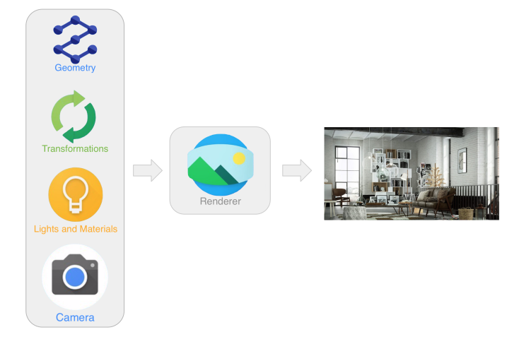

]

---

template: lts5-canvas

# Compute Graphics - Samples

  

.left-column50[
 
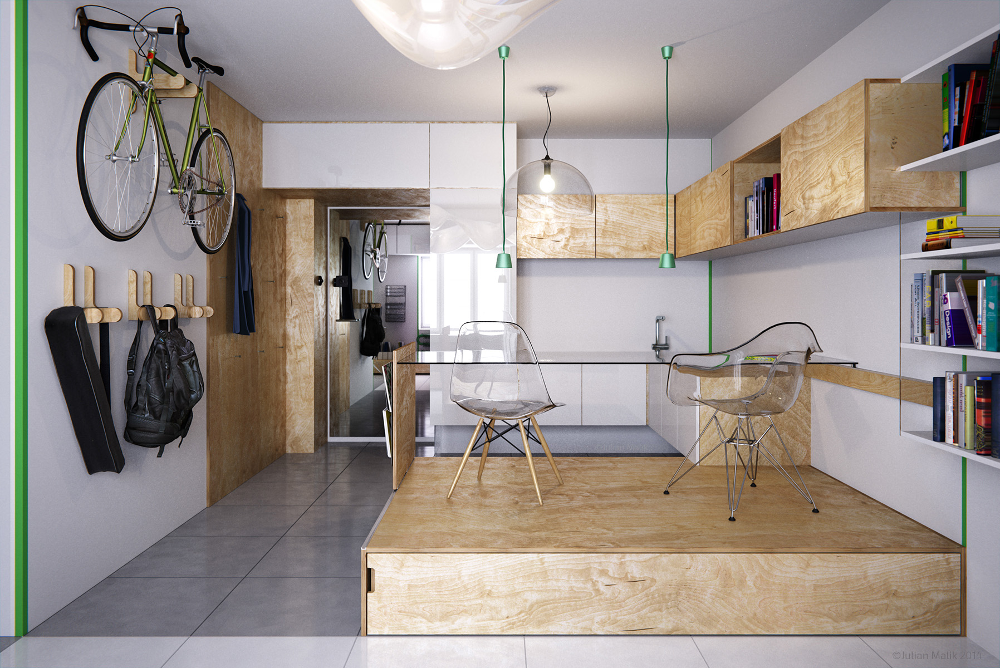
]

.right-column50[
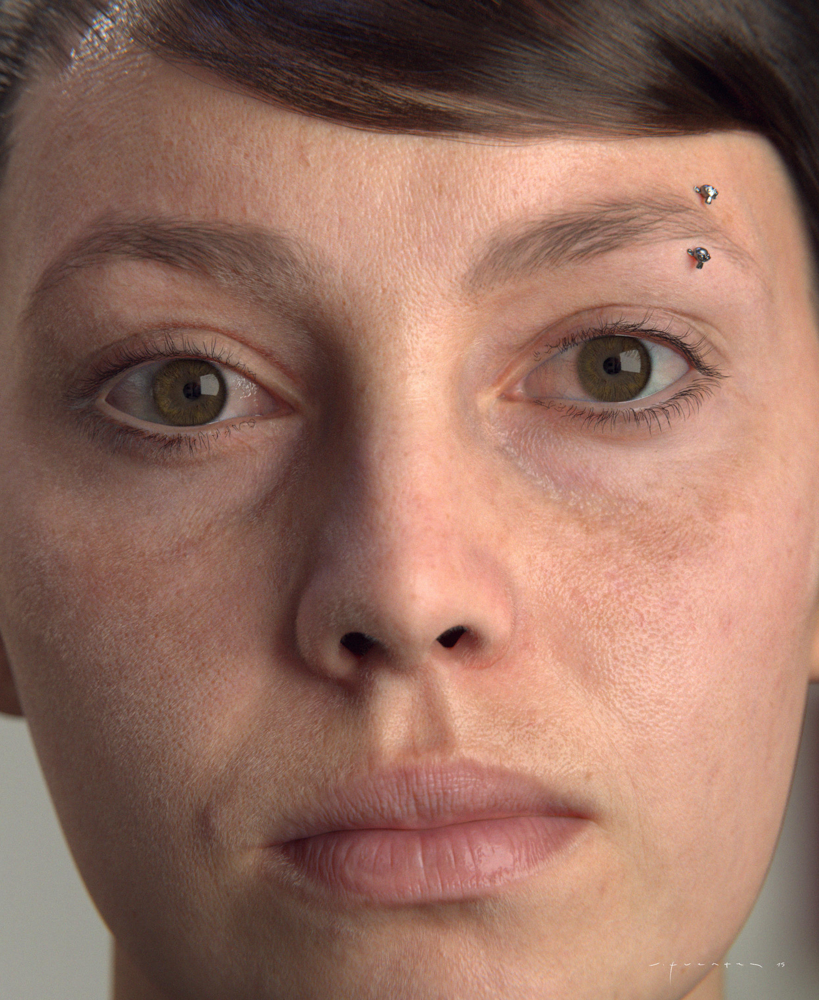
]

---

template: lts5-canvas

# Renderer - Ray Tracing

  

.left-column40[

- Follow the path of the light
  - Intersection
  - Refraction
- Pixel to lights
- Lights to pixels

]

.right-column60[

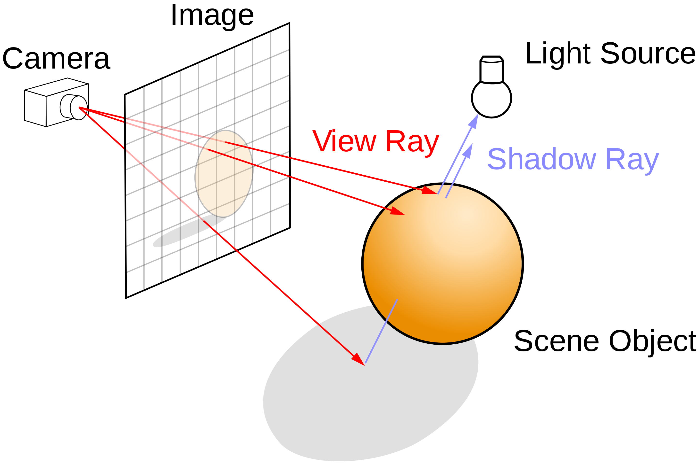

]

???

- Ray tracing
  - Samples rays and follow path

---

template: lts5-canvas

# Renderer - Rasterizer

 

.left-column50[

- Follow the path of the **geometry** primitive
- Project *primitive*
  - Check whether pixel are *inside/outside*
  - Depth test for *Z-ordering*

]

.right-column50[

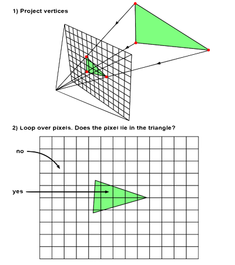

]

???

- Use geometry as input

---

template: lts5-canvas

# Rasterization Pipeline

- Standard rendering pipeline component
  - Vertex Processor
     - Rigid Transformation (*i.e. Rotation + Translation*)
  - Rasterizer
     - 3D to 2D Conversion (*i.e. Projection*)
  - Fragment Processor
     - Appearance Transformation (*i.e. Colors, Lighting, ...*)
  - Image

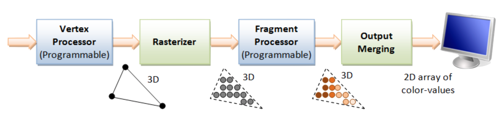

---

template: lts5-canvas

# Geometry

.left-column50[

    

- Mesh geometry 
  - 3D Points
  - Triangles
- Surface parameterized with *Statistical Model*                    

`$$ \boldsymbol{x} = \bar{\boldsymbol{x}} + \left[\boldsymbol{U}_{id}, \boldsymbol{U}_{exp} \right] \boldsymbol{w}_{shp} $$`

]

.right-column50[

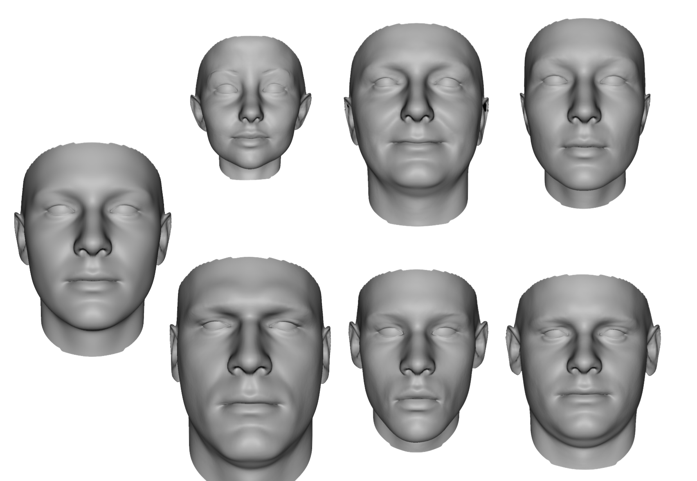

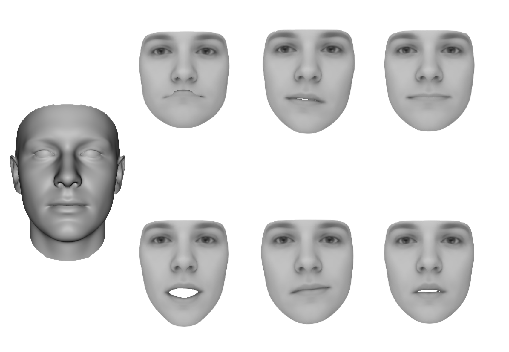

]

---

template: lts5-canvas

# Transforms

- Bring objects from canonical cooridinate system in ***World***'s coordinate system

`$$\boldsymbol{x}_t^i = \boldsymbol{R}\left(\boldsymbol{q}\right) \boldsymbol{x}^i + \boldsymbol{T}$$`

- Rotation
  - Euler's angles
  - Quaternions
  - Axis angle (*i.e. Rodrigues*)

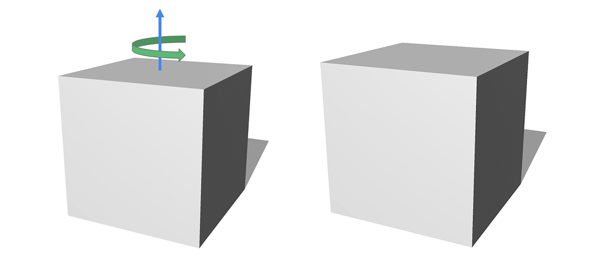

---

template: lts5-canvas

# Lights and Materials

.left-column50[

  

- Skin colors parameterize with *Statistical Model*

`$$\boldsymbol{t}^i = \bar{\boldsymbol{t}} + \boldsymbol{U}_{tex} \boldsymbol{w}_{tex}$$`

- Illumination approximated by *Spherical Harmonics*

`$$\begin{align} \boldsymbol{t}_{I}^i &= \phi\left(\boldsymbol{n}^i \right) \boldsymbol{w}_{l} \odot \boldsymbol{t}^i \\ \\ \phi\left(\boldsymbol{n}^i \right) &= \left[1, n_x, n_y, n_z, n_x n_y, n_x n_z, n_y n_z, n_x^2 - n_y^2, 3n_z^2 - 1 \right] \end{align} $$`

]

.right-column50[

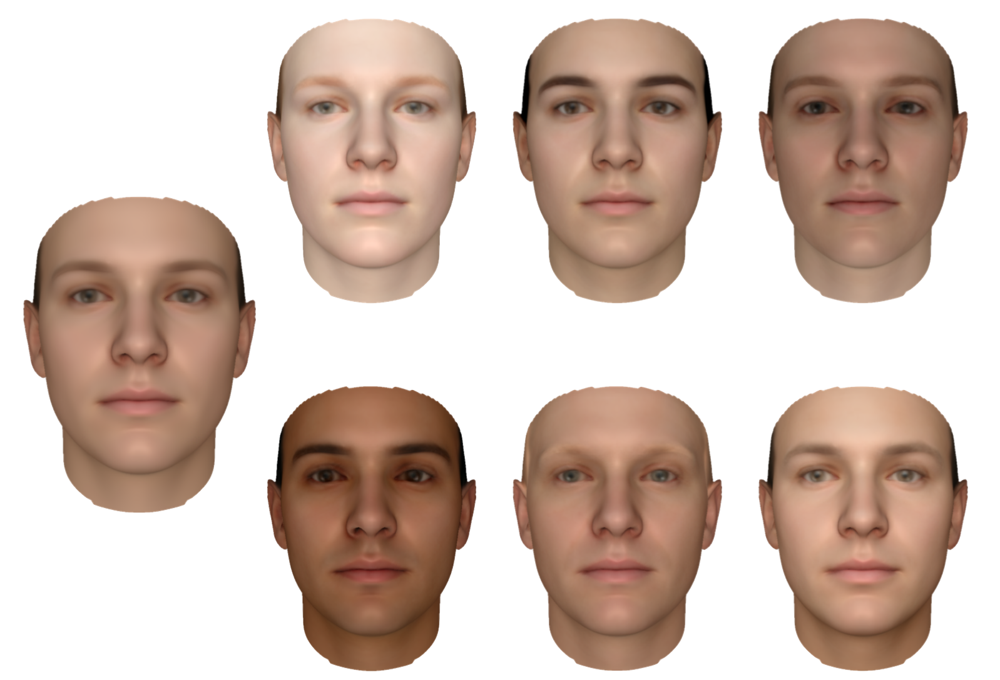

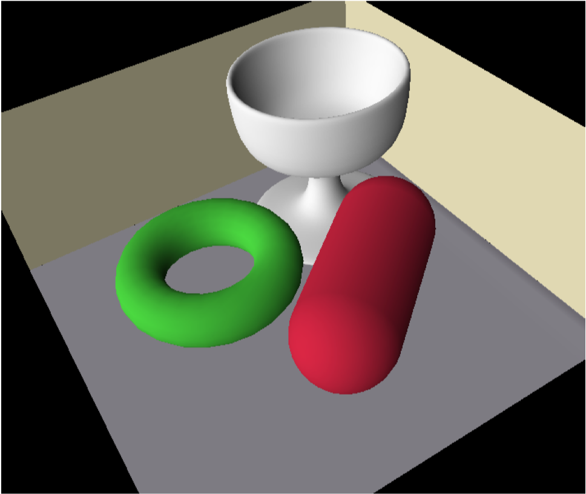

]

---

template: lts5-canvas

#Camera

- Assumed camera being placed at the ***World***'s origin **without** loss of generality
- Pinhole camera model under full perspective projection model
  - `$\prod: \mathbb{R}^3 \rightarrow \mathbb{R}^2$`
  - Non-linear transformation 
`$$
\begin{bmatrix} u_x^i \\ u_y^i \end{bmatrix} = \begin{bmatrix} f \frac{\boldsymbol{x}_{t_{x}}^i}{\boldsymbol{x}_{t_{z}}^i} + c_x \\ f \frac{\boldsymbol{x}_{t_{y}}^i}{\boldsymbol{x}_{t_{z}}^i} + c_y \end{bmatrix}
$$`

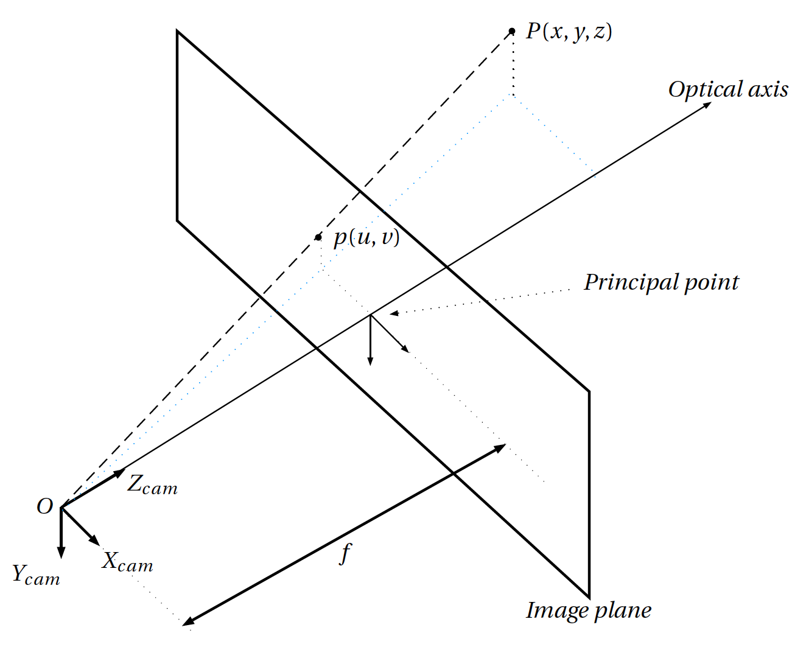

---
template: lts5-canvas
# Differentiable Rendering

- Discrete functions

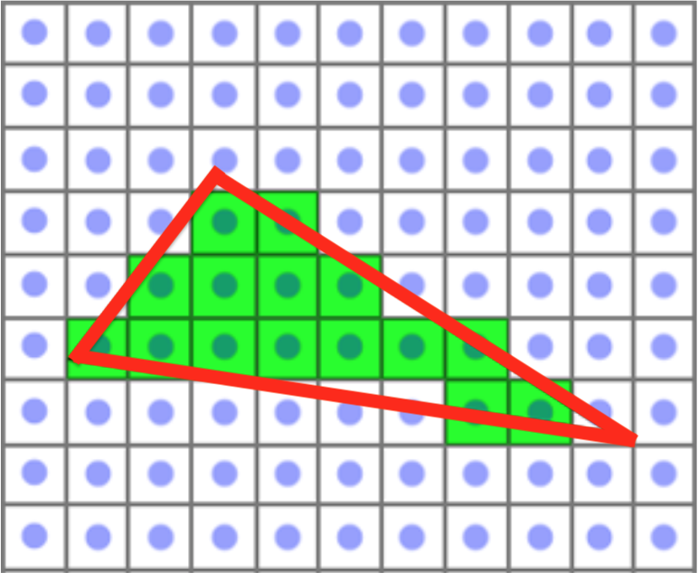

- Interpolation on the fly

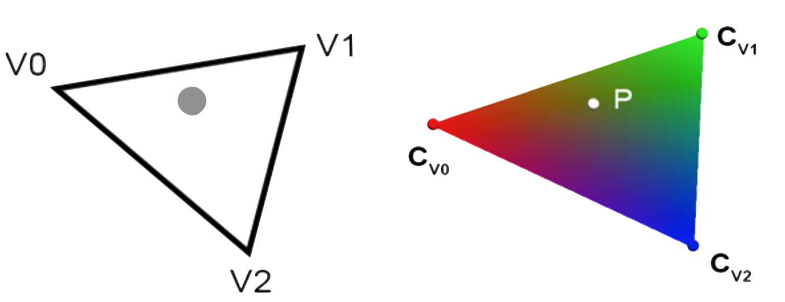

---
template: lts5-canvas
# Differentiable Rendering - II

- Forward model is not fully differentiable [7]
  - Approximation will be made to approximate the *real* derivative
- Partial derivatives
  - Appearance: `$\frac{\partial f}{\partial \boldsymbol{w}_{tex}}$`, `$\frac{\partial f}{\partial \boldsymbol{w}_{l}}$`, `$\frac{\partial f}{\partial \boldsymbol{w}_{ct}}$`
  - Geometry: `$ \frac{\partial f}{\partial \boldsymbol{w}_{shp}} =  \frac{\partial f}{\partial \boldsymbol{U}}  \frac{\partial \boldsymbol{U}}{\partial \boldsymbol{x}_{t}}  \frac{\partial \boldsymbol{x}_t}{\partial \boldsymbol{x}} \frac{\partial \boldsymbol{x}}{\partial \boldsymbol{w}_{shp}}$`, `$ \frac{\partial f}{\partial \boldsymbol{c}} =  \frac{\partial f}{\partial \boldsymbol{U}} \frac{\partial \boldsymbol{U}}{\partial \boldsymbol{x}_{t}}  \frac{\partial \boldsymbol{x}_t}{\partial \boldsymbol{c}}$`

 

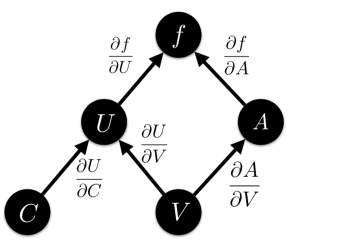

???

- Work with projected geometry
  - Problem at object boundary / occlusions

---

template: lts5-canvas

# Differentiating Intensity with Respect to 2D Coordinates

.left-column60[

- Segment image space
  - Interior
  - Boundary
  - Exterior
- Boundary edges
  - Pass depth test
  - Join triangles with opposing normals
- Derivative approximation
  - Central-difference `$\frac{1}{2} \left[-1, 0, 1 \right]$`
  - Forward-difference `$\left[0, -1, 1 \right]$`
  - Backward-difference `$\left[-1, 1, 0 \right]$`

]

.right-column40[

  

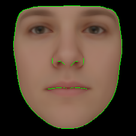

]

???

- Boundary 
  - Depth test => **Foreground**
  - Opposition: One tri **facing** the camera, one tri **facing the opposite** direction (back)

---

template: lts5-canvas

# Inverse Rendering

- Cost function [8]
  - Probabilistic approach - Likelihood
- Regularizer
`$$
\begin{align}
\mathcal{L}\left(\theta |I\right) &= \prod_{l}^{L} \prod_{x \in \mathcal{F}} \frac{\ell_p^l}{b_p} + \lambda \mathcal{R}\left(\theta \right) \\ \\
\ell_p^l &= \frac{1}{N} \text{exp}\left(- \frac{1}{2\left(\frac{\sigma}{2^l}\right)^2 }\left|\left|I_p^l - \tilde{I}_{p}^{l} \right|\right|^2 \right) \\ \\
\mathcal{R}\left(\theta \right) &= \left|\left| \theta \right|\right|^2 
\end{align}
  $$`
- Pipeline

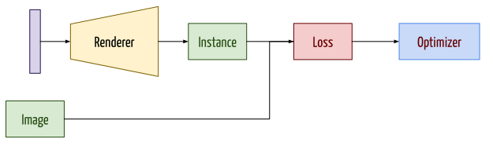

???

- Anayslis by synthesis 
- **No 3D Ground Truth**

---

template: lts5-canvas

# Samples

.left-column50[

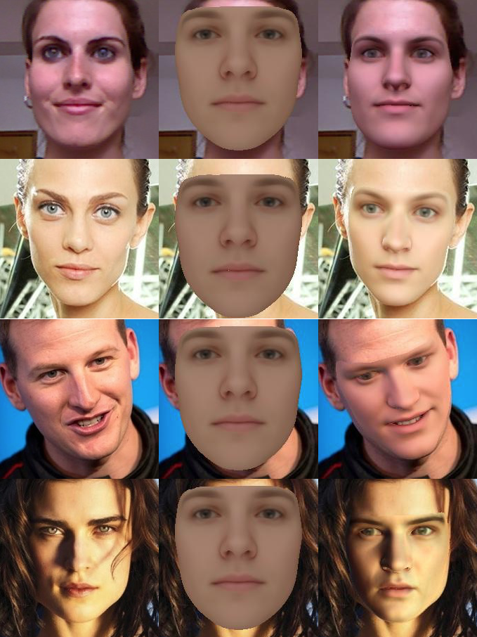

]

.right-column50[

]

---

template: lts5-canvas

# Vision meets Graphic

 

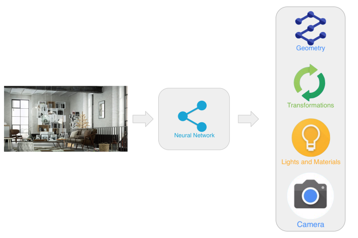

???

- CNN are good at predicting parameters 
- Predict scene parameters in a supervised way … not optimal

---

template: lts5-canvas

# Vision meets Graphic - II

 

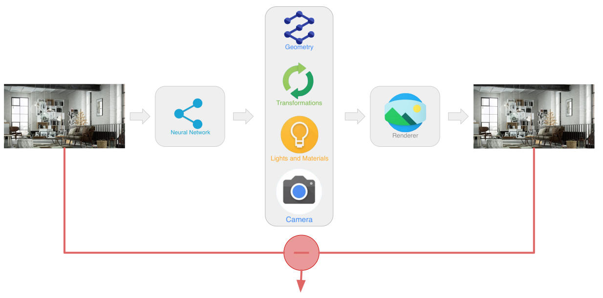

---

template: lts5-canvas

# Samples

    

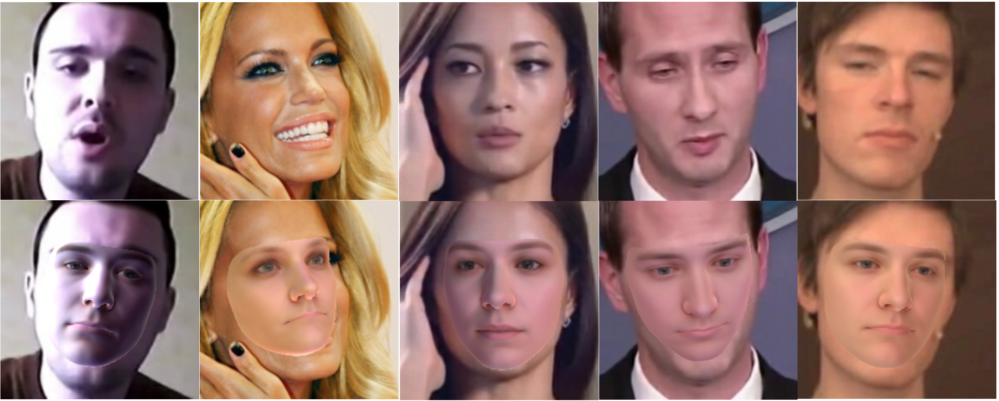

---

template: lts5-canvas

# Issues

- Differentiable renderer not off-the-shelf
  - Custom implementation 
     - Bug prone
  - Numercial gradient-check does **not** work because of the approximations made
- Training the regressor
  - Pose recovery
  - Surface shrinking, *Z* vs *Shape*
  - Initialization / Optimizer selection 
  - Relative Learning selection
- Dealing with occlusions
  - Face segmentation under analysis

???

- Proper scheme for gradient validation, suggestion
- Different optimizer give large different results
- How to properly select relative learning rate for each parameters

---

template: lts5-question

# Questions

---

template: lts5-canvas

# References

.text-small[

[1] [https://en.wikipedia.org/wiki/Ray_tracing_(graphics)](https://en.wikipedia.org/wiki/Ray_tracing_(graphics))

[2] https://www.scratchapixel.com/lessons/3d-basic-rendering/rasterization-practical-implementation/overview-rasterization-algorithm

[3] https://www.ntu.edu.sg/home/ehchua/programming/opengl/CG_BasicsTheory.html

[4] A 3D Face Model for Pose and Illumination Invariant Face Recognition, Paysan et al, 2009

[5] https://medium.com/tensorflow/introducing-tensorflow-graphics-computer-graphics-meets-deep-learning-c8e3877b7668

[6] Spherical Harmonic Lighting: The Gritty Details, R. Green, 2003

[7] OpenDR An Approximate Differentiable Renderer, Loper et al., 2014

[8] Background modeling for generative image models, Schönborn et al, 2015

]

