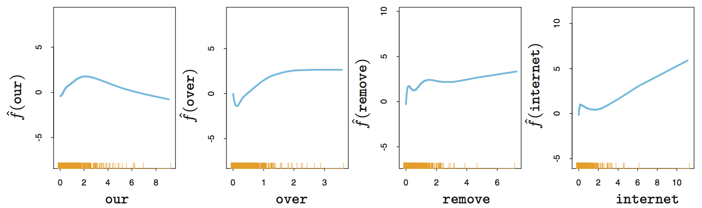
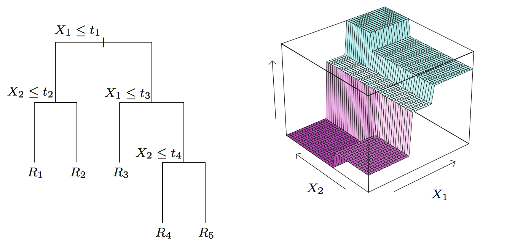
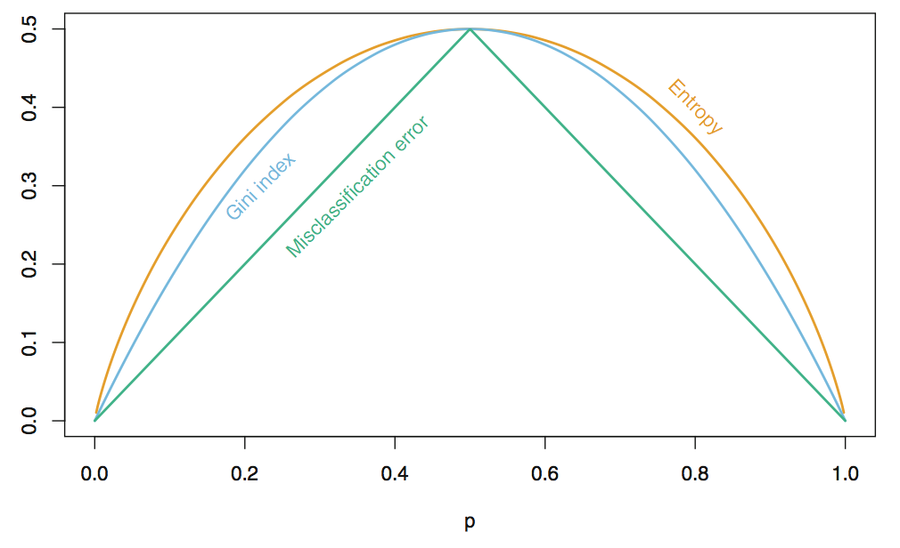
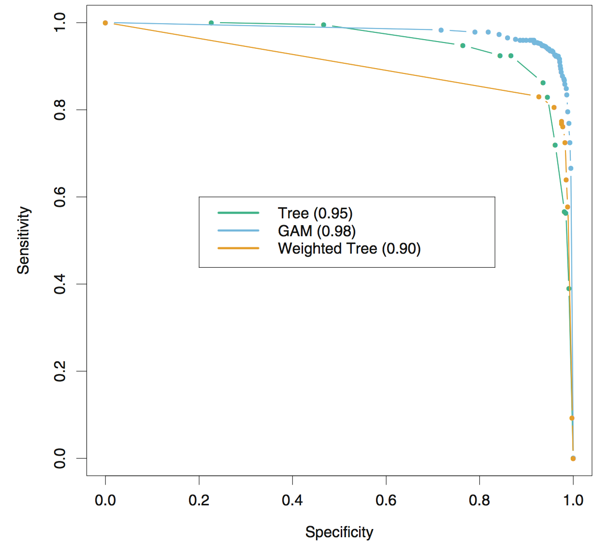
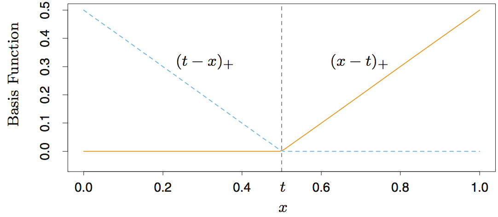
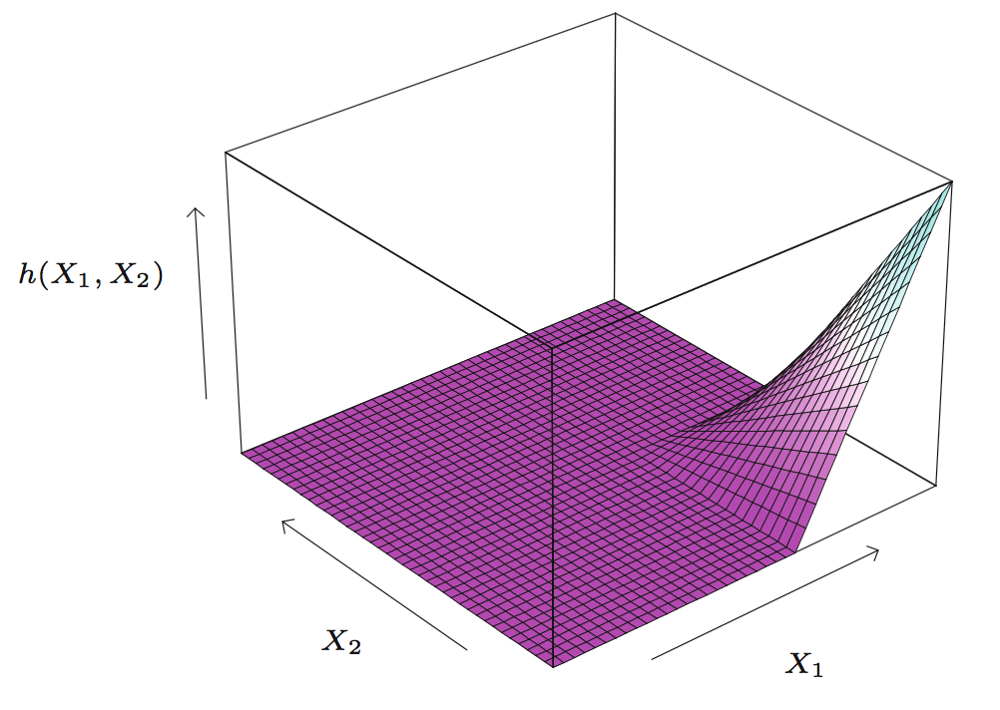
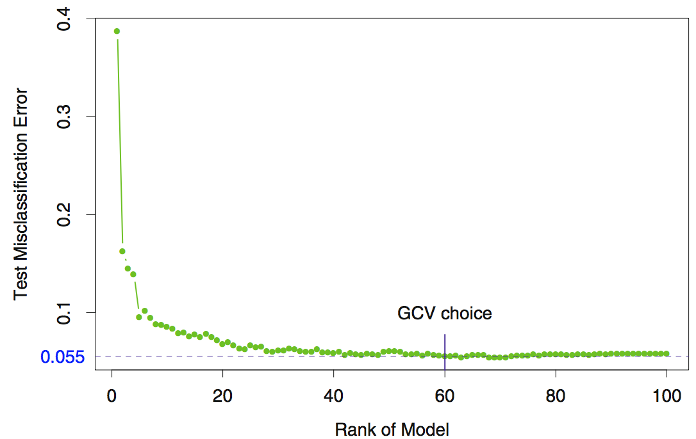

layout: true

name: lts5-canvas

 

 

---

name: title

class: center, middle

# Additive Models, Trees, and Related Methods

Christophe Ecabert

LTS5, EPFL

June 29th, 2018

---

# Content

- Generalized Additive Model - *GAM*
  - Background
  - Fitting
- Tree-Based Methods - *CART*
  - Regression
  - Classification
- Multivariate Adaptive Regression Spline - *MARS*
  - Background
  - Fitting

???

What's on the agenda

---

# General Additive Models

- Linear regression

`$$ E\left(Y |x_1, \dots, x_p \right) = \alpha_0 + \alpha_1 x_1 + \dots + \alpha_p x_p$$`

- Generalised Additive Models
  `$$E\left(Y |x_1, \dots, x_p \right) = \alpha + f_1\left(x_1 \right) + \dots + f_p\left(x_p \right)$$`

- $f_i$ are *smooth* functions, fitted using a *scatterplot smoother* independently

  - Polynomials
  - Cubic Smoothing Spline
  - Kernel smoother

- The condionnal mean `$\mu\left(x \right)$` of a response `$Y$` is related to an additive function of the predictors using a ***link*** function `$g$`

  `$$ g\left[\mu\left(x \right) \right] = \alpha + f_1\left(x_1 \right) + \dots + f_p\left(x_p \right)$$`

???

- Not all function `$f_i$` have to be nonlinear
  - Provide insight of the data set (feature dependance ...)

---

# GAM - Link functions

- Identity link, used for linear and additive models for Gaussian response data
  - `$g\left(\mu \right) = \mu$`
- Logit / Probit for modeling binomial probabilities
  - `$g\left(\mu \right) = \text{logit}\left(\mu \right) = log\left(\frac{\mu}{1 - \mu} \right)$` or `$g\left(\mu \right) = \text{probit}\left(\mu \right) = \sqrt{2} \text{erf}^{-1}\left(2\mu - 1 \right)$`
- Log-linear / log-additive models for Poisson count data
  - `$g\left(\mu \right) = log\left(\mu \right)$`

- Not all the `$f_i$` functions need to be nonlinear
  - Mix linear functions with other parametric forms with nonlinear terms 
- Additive model can be used to represent time series with different regime
  - `$Y_t = S_t + T_t + \epsilon_t$`
  - `$S_t$` a seasonal term
  - `$T_t$` a trend term

---

# GAM - Fitting

- Additive model `$ Y = \alpha + \sum_{j=1}^{p} f_j\left(x_j\right) + \epsilon$`
- Estimate parameters using a *Penalised Residual Sum of Squared* error scheme
  `$$ PRSS(\alpha, f_1, \dots, f_p) = \sum_{i=1}^N \left(y_i - \alpha - \sum_{j=1}^{p} f_j\left(x_{ij}\right) \right)^2 + \sum_{j=1}^p \lambda_j \int f_{j}^{''}\left(t_j \right)^2 dt_j $$`
- Solved using backfitting algorithm (*cubic smoothing spline*)
  - Estimate each `$f_j$` indenpendently, loop until reach stable point
  - `$f_j$` is a cubic spline
  - Force `$\sum_{1}^N f_j \left(x_{ij} \right) = 0 \quad \forall j$`

???

- PRSS: Penalized Residual Sum of Squared error
- Spam dataset: predict email/spam label from the content of an email
  - features: Count appearance (*words, sequence of chars, mail length, ...*)

---

# Tree-Based Methods

- Can do both, *classification* and *regression*
- Feature space partitioning
  - Set of rectangles
  - Fit simple constant model
- Model

`$$ \hat{f}\left(x \right) = \sum_{m=1}^{M} c_m I\{x \in R_m \} $$`

- Representation

---

# Regression trees

- The fitting algorithm for `$f\left(x \right) = \sum_{m=1}^{M} c_m I\left(x \in R_m \right)$` needs to define
  - The splitting variable `$x_j$` 
  - The split point `$s$`
  - The constant model `$c_m$`
- Minimize the errors squared `$\sum \left(y_i - f\left(x_i \right) \right)^2$`
  - Optimal model given by `$\hat{c}_m = avg\left(y_i | x_i \in R_m \right)$`
- Finding the best binary partition in term of minimum sum of squares is general computationnaly .red[**infeasible**]
- Greedy algorithm
  - define binary half-planes
    `$$R_1\left(j, s \right) = \{x |x_j \leq s \} \quad \text{and} \quad R_2\left(j, s \right) = \{x |x_j > s \}$$`
  - Seek `$j$`,  `$s$` and `$c_{1/2}$`
    `$$\text{min}_{j, s} \left[\text{min}_{c_1} \sum_{x_i \in R_1\left(j, s\right)} \left(y_i - c_1 \right)^2 + \text{min}_{c_2} \sum_{x_i \in R_2\left(j, s\right)} \left(y_i - c_2 \right)^2 \right] $$`
  	 Iterate recursively over the two newly created region	

???

- Exhaustive search
- Use features component as candidate for threshold values.

---

# Classification trees

- MSE as *node impurity* metric is not suited for classification
- Defines class probability as 
  `$$\hat{p}_{mk} = \frac{1}{N_m} \sum_{x_i \in Rm} I\left(y_i = k \right) $$`
  - Classifiy the observation in node `$m$` to class `$k\left(m \right) = \text{argmax}_k \hat{p}_{mk}$`
- Node impurity metrics
  - Misclassification error `$\frac{1}{N_m} \sum_{i \in R_m} I \left(y_i \neq k\left(m \right) \right) = 1 - \hat{p}_{mk}$`
  - Gini index `$\sum_{k \neq k'}\hat{p}_{mk} \hat{p}_{mk'} = \sum_{k=1}^K \hat{p}_{mk} \left(1 - \hat{p}_{mk} \right) $`
  - Cross-entropy `$- \sum_{k=1}^K \hat{p}_{mk} log\left( \hat{p}_{mk}\right)$`

---

# Binary trees - Issues

- Limitations
  - Why Binary splits?
     - Having multilevel of split will fragment the data too quickly and distribution of the data might not be well capture then by the tree
  - Linear combination splits
     - Instead of restricting the split to be `$x_j \leq s$`  defines it as a linear combination `$\sum a_j x_j \leq s$`
     - Can improve the predictive capability but it hurts the interpretability 
     - Keeping discrete splits make it computationally better 
  - Instability
     - Small differences in the data can lead to completely different partition. 
     - Error from the top node are broadcasted to its children 
  - Lack of smoothness
     - Constant model at each node can degrate the performance in regression settings

---

# Performance

- Performance on the `spam` dataset 

---

# Multivariate Adaptive Regression Splines - MARS 

- Adaptive procedure for regression
- Suited for high-dimension problem
- Generalization of CART (*in regression setting*)
- Uses expansions of piecewise linear basis

`$$ \left(x - t \right)_{+} = \begin{cases} x - t, \quad \text{if } x > t \\ 0, \quad \text{otherwise} \end{cases} \quad \text{and} \quad \left(t - x \right)_{+} = \begin{cases} t - x, \quad \text{if } x < t \\ 0, \quad \text{otherwise} \end{cases} $$`

---

# MARS - Fitting

- Define a collection of possible basis
`$$ \mathcal{C} = \{\left(x_j - t \right)_{+}, \left(t - x_j\right)_{+} \}_{t \in \{x_{1j}, \dots, x_{Nj}\\ j = 1, \dots, p} $$`
- There is a total of `$2Np$` basis functions 
- Basis functions are define over the entire space `$h\left( x \right) \in \mathbb{R}^p$`
- Model defined as a combination of functions from `$\mathcal{C}$`
`$$f\left( x \right) = \alpha_0 + \sum_{m=1}^M \alpha_m h_m\left(x \right) $$`
- `$h_m\left(x \right)$` is a function of `$\mathcal{C}$` or a product of two or more functions.
- Build `$h_m\left(x \right)$` iteratively 
  - Start with `$h_0 \left(x \right) = 1$`
  - At each stage consider as a new basis function pair all product of a function `h_m` in the model set `$\mathcal{M}$` with one of the reflected pairs in `$\mathcal{C}$`.  Add to the model  `$\mathcal{M}$` the term of the form
    `$$\hat{\beta}_{M+1}h_l\left(x \right) \cdot \left(x_j - t \right) + \hat{\beta}_{M+2}h_l\left(x \right) \cdot \left(t - x_j\right), h_l \in \mathcal{M}$$`

---

# MARS - Example

- 2D examples

---

# MARS - Fitting

- Fitting basis function defined from the dataset will lead to large model of form `$f\left( x \right) = \alpha_0 + \sum_{m=1}^M \alpha_m h_m\left(x \right)$`
  - Will typically overfit the data
  - Apply backward deletion procedure to overcome the issue
- Delete terms whose removal cause the smallest increase in residual squared error.
- Uses generalized cross-validation
  - `$GCV\left(\lambda \right) = \frac{\sum_{i=1}^N \left(y_i - \hat{f}_{\lambda}\left( x_i \right) \right)^2}{\left(1 - M\left(\lambda \right)/N \right)^2}$`
  - `$\hat{f}_{\lambda}\left( x_i \right)$` best model of each size (*number of terms*)
  - `$M\left(\lambda \right)$` effective number of parameters in the model

