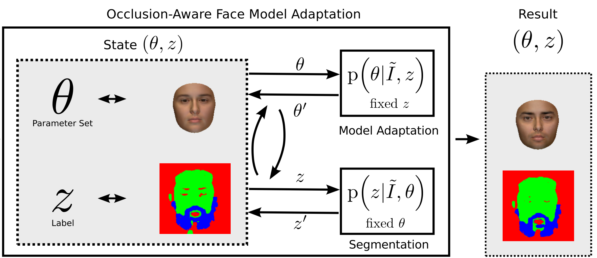

layout: true

name: lts5-canvas

 

 

---

layout: true
name: lts5-question
background-image: url(../Common/question-mark.jpg)
background-position: center
background-size: 300px

 

 

---

name: title

class: center, middle

template: lts5-canvas

# Progress Talk

Christophe Ecabert

LTS5, EPFL

June 14th, 2018

---

template: lts5-canvas

# Content

- Problem statement
- Unsupervised learning
- Network structure
- Occlusions handling
  - Probabilistic approach
  - Attention Mechanism

???

What's on the agenda

---

template: lts5-canvas

# Problem Statement

- 3D Face reconstruction
  - Identity + Expression
  - Appearance
  - Pose / Projection
  - Illumination (Optional)

 

???

- Monocular face reconstruction -> single image
- Model-based -> parameters to estimate

---

template: lts5-canvas

# Unsupervised learning

- Learn the *mapping* function within an *analysis-by-synthesis* framework
- Transform 3D instance into image with rendering stage part of the *model*

 

---

template: lts5-canvas

# Network Structure

- Tewari et al.

- Genova et al.

---

template: lts5-canvas

# Occlusion Handling

- Probabilisitic approach

---

template: lts5-canvas

# Occlusion Handling

- Attention Mechanism
  - What ground truth 
  - Spatial Resolution
  - Training ?

---

template: lts5-question

exclude: true

# Questions

---

template: lts5-canvas

# References

.text-small[

[1] MoFA: Model-based Deep Convolutional Face Autoencoder for Unsupervised Monocular Reconstruction, Tewari et al., 2017

[2] Unsupervised Training for 3D Morphable Model Regression, Genova et al., 2018

[3] Occlusion-Aware 3D Morphable Models and an Illumination Prior for Face Image Analysis, Egger et al., 2018

[4] Face Attention Network: An Effective Face Detector for the Occluded Faces, Wang et al., 2018

]

