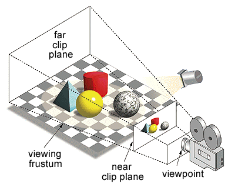
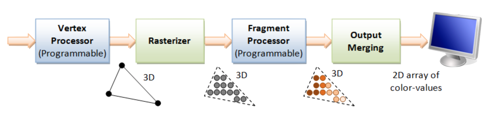
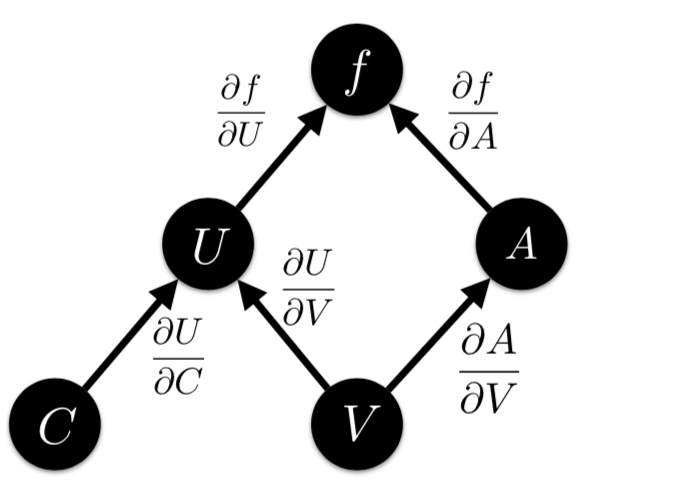
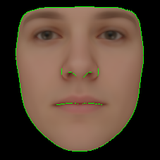
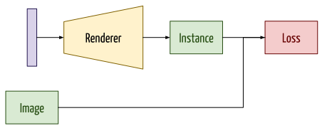
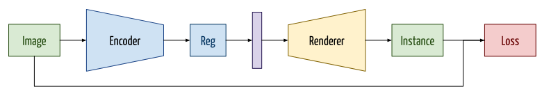
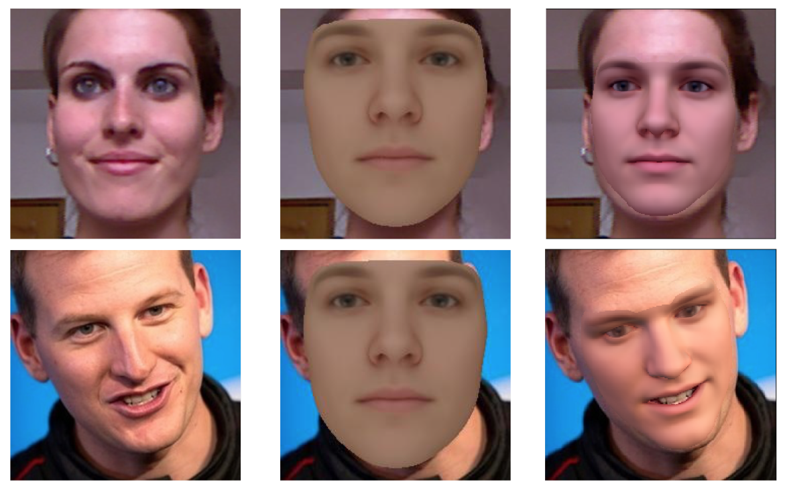
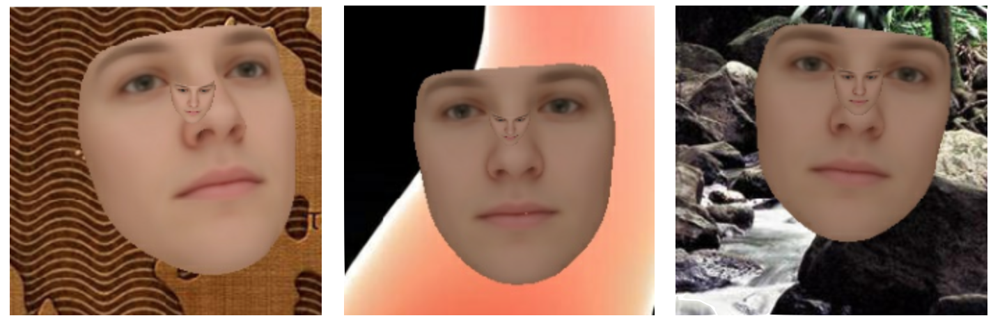

layout: true

name: lts5-canvas

 

 

---

layout: true
name: lts5-question
background-image: url(../Common/question-mark.jpg)
background-position: center
background-size: 300px

 

 

---

name: title

class: center, middle

template: lts5-canvas

# Progress Talk

Christophe Ecabert

LTS5, EPFL

April 24th, 2019

---

template: lts5-canvas

# Content

- Problem Statement
- Standard Rendering Pipeline
- Differentiable Rendering
- Architecture
  - Optimization
  - Regression
- Issues

???

What's on the agenda

---

template: lts5-canvas

# Problem Statement

.left-column60[

- Given a single image, approximate the 3D scene that generate it
- Variables
  - Pose / Projection
  - Geometry (*i.e. Identity, Expression*)
  - Color / Appearance (*i.e. Aldebo*)
  - Illumination / Lighting

]

.right-column40[

]

???

- Monocular face reconstruction -> single image
- Model-based -> parameters to estimate

---

template: lts5-canvas

# Rendering Pipeline

- Standard rendering pipeline component
  - Vertex Processor
     - Rigid Transformation (*i.e. Rotation + Translation*)
  - Rasterizer
     - 3D to 2D Conversion (*i.e. Projection*)
  - Fragment Processor
     - Appearance Transformation (*i.e. Colors, Lighting, ...*)
  - Display

???

- Standard rendering pipeline

---

template: lts5-canvas

# Vertex Processor

- Geometry parameterized with *Statistical Model*

  `$$ \boldsymbol{x} = \bar{\boldsymbol{x}} + \left[\boldsymbol{U}_{id}, \boldsymbol{U}_{exp} \right] \boldsymbol{w}_{shp} $$`

- Assumed camera is placed at *world*'s origin **without** loss of generality

`$$\boldsymbol{x}_t^i = \boldsymbol{R}\left(\boldsymbol{q}\right) \boldsymbol{x}^i + \boldsymbol{T}$$`

- Rotation
  - Euler's angles
  - Quaternions
  - Axis angle (*i.e. Rodrigues*)

???

- Camera placed at world origin => **View Transform = Identity**

---

template: lts5-canvas

# Rasterization

- Pinhole camera model under full perspective projection model 
  -  `$\prod: \mathbb{R}^3 \rightarrow \mathbb{R}^2$`
- Non-linear transform

`$$
\begin{bmatrix} u_x^i \\ u_y^i \end{bmatrix} = \begin{bmatrix} f \frac{\boldsymbol{x}_{t_{x}}^i}{\boldsymbol{x}_{t_{z}}^i} + c_x \\ f \frac{\boldsymbol{x}_{t_{y}}^i}{\boldsymbol{x}_{t_{z}}^i} + c_y \end{bmatrix}
$$`

---

template: lts5-canvas

# Fragment Processor

- Skin color parameterized with *Statistical Model*

`$$
\boldsymbol{t}^i = \bar{\boldsymbol{t}} + \boldsymbol{U}_{tex} \boldsymbol{w}_{tex}
$$`

- Lighting approximated using *Spherical Harmonics* model

`$$
\boldsymbol{t}_{I}^i = \phi\left(\boldsymbol{n}^i \right) \boldsymbol{w}_{l} \odot \boldsymbol{t}^i
$$`

- Linear Color Transform [2]

`$$
\begin{align}
\boldsymbol{t}_{C}^i &= \boldsymbol{M} \boldsymbol{t}_I^i + \boldsymbol{o} \\
\boldsymbol{M} &= \begin{bmatrix} g_r & 0 & 0 \\  0 & g_g & 0 \\ 0 & 0 & g_b\end{bmatrix} \left[c \boldsymbol{I} + \left(1 - c \right) \begin{bmatrix} 0.3 & 0.59 & 0.11 \\  0.3 & 0.59 & 0.11 \\ 0.3 & 0.59 & 0.11 \end{bmatrix} \right]
\end{align}
$$`

???

- Albebo -> skin color
- Lighting: Global illumination approximated with SH -> **Low freq only**
- Color Transform
  - Compensate for overall tone, grayscale, paintings

---

template: lts5-canvas

# Differentiable Rendering

- Forward model is not fully differentiable [3]
  - Assumption will be made to approximate the *real* derivative
- Partial derivatives
  - Appearance: `$\frac{\partial f}{\partial \boldsymbol{w}_{tex}}$`, `$\frac{\partial f}{\partial \boldsymbol{w}_{l}}$`, `$\frac{\partial f}{\partial \boldsymbol{w}_{ct}}$`
  - Geometry: `$ \frac{\partial f}{\partial \boldsymbol{w}_{s}} =  \frac{\partial f}{\partial \boldsymbol{U}}  \frac{\partial \boldsymbol{U}}{\partial \boldsymbol{x}_{t}}  \frac{\partial \boldsymbol{x}_t}{\partial \boldsymbol{x}} \frac{\partial \boldsymbol{x}}{\partial \boldsymbol{w}_{shp}}$`, `$ \frac{\partial f}{\partial \boldsymbol{c}} =  \frac{\partial f}{\partial \boldsymbol{U}} \frac{\partial \boldsymbol{U}}{\partial \boldsymbol{x}_{t}}  \frac{\partial \boldsymbol{x}_t}{\partial \boldsymbol{c}}$`

---

template: lts5-canvas

# Differentiating Intensity with Respect to 2D Coordinates

.left-column60[

- Segment image space
  - Interior
  - Boundary
  - Exterior
- Boundary edges
  - Pass depth test
  - Join triangles with opposing normals
- Derivative approximation
  - Central-difference `$\frac{1}{2} \left[-1, 0, 1 \right]$`
  - Forward-difference `$\left[0, -1, 1 \right]$`
  - Backward-difference `$\left[-1, 1, 0 \right]$`

]

.right-column40[

  

]

???

- Boundary 
  - Depth test => **Foreground**
  - Opposition: One tri **facing** the camera, one tri **facing the opposite** direction (back)

---

template: lts5-canvas

# Architecture

- Optimization

- Regression

???

- Regression
  - Encoder uses AlexNet architecture 
  - All fully connected layers are learned

---

template: lts5-canvas

# Architecture - Results

- Optimization-based
  - Adam optimizer
  - Likelihood-based cost function with background modeling [5]

???

- Optimization: Work but not all the time
- Regression, can not learn the pose, therefore can not learn to regress the object's parameters 

---

template: lts5-canvas

# Architecture - Results

- Regression-based
  - Adam optimizer
  - Likelihood-based cost function with background modeling [5]

---

template: lts5-canvas

# Issues

- Differentiable renderer validation
  - Gradient-check does **not** work because of the approximations made
- Training the regressor
  - Pose recovery
  - Surface shrinking, *Z* vs *Shape*
  - Initialization / Optimizer selection 
  - Relative Learning selection

???

- Proper scheme for gradient validation, suggestion
- Different optimizer give large different results
- How to properly select relative learning rate for each parameters

---

template: lts5-question

exclude: true

# Questions

---

template: lts5-canvas

# References

.text-small[

[1] https://www.ntu.edu.sg/home/ehchua/programming/opengl/CG_BasicsTheory.html

[2] 3D Morpahbel Face Model, A Unified Approach for Analysis and Synthesis of Images, Face Processing, 2006

[3] OpenDR An Approximate Differentiable Renderer, Loper et al., 2014

[4] MoFA: Model-based Deep Convolutional Face Autoencoder for Unsupervised Monocular Reconstruction, Tewari et al., 2017

[5] Background modeling for generative image models, Schönborn et al., 2015

]

