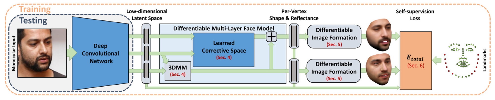

layout: true

name: lts5-canvas

 

 

---

layout: true
name: lts5-question
background-image: url(../Common/question-mark.jpg)
background-position: center
background-size: 300px

 

 

---

name: title

class: center, middle

template: lts5-canvas

# Progress Talk

Christophe Ecabert

LTS5, EPFL

February 6th, 2020

---

template: lts5-canvas

# Content

- Problem Statement
  - Targets / Challenges
  - Approaches
- Modeling
  - Face
  - Light
  - Camera
- Coefficient Prediction
  - Constraints
  - Results
- Issues
- On going work
  - Ambient occlusion 
  - Model augmentation
  - Domain adaptation

???

What's on the agenda

---

template: lts5-canvas

# Problem Statement

- Reconstruct a 3D object given a single *RGB* image of the subject
  - Human face

- Challenges
  - Little to no ground truth available 
  - Non-right / Non-convex object
  - Occlusion
  - Image quality / resolution
  - Out of distribution samples
- Approach
  - Explicit modeling
  - Analysis-by-synthesis framework

???

- Monocular face reconstruction -> single image
- Model-based -> parameters to estimate
  - Explicit modeling

---

template: lts5-canvas

# Modeling - Face

.left-column50[
.left[
- Statistical model learned from 3D scans of various subjects
  - Scanned 200 people
  - Mostly caucasien
  - Only neutral expression
- Shape Model
  - Added expression from FaceWarehouse

`$$ \boldsymbol{x} = \bar{\boldsymbol{x}} + \left[\boldsymbol{U}_{id}, \boldsymbol{U}_{exp} \right] \boldsymbol{w}_{shp} $$`

- Statistical Appearance Model
  - Illumination free
  - Valid for neutral expression

`$$\boldsymbol{t}^i = \bar{\boldsymbol{t}} + \boldsymbol{U}_{tex} \boldsymbol{w}_{tex}$$`
]

]

.right-column50[

]

---

template: lts5-canvas

# Modeling - Lighting

- Illumination approximated by *Spherical Harmonics*
  - Assuming Lamberitan surface
  - Global diffuse lighting
  - No specular lighting
- Surface Normal estimation
  - Approximation using one-ring neighbors 

`$$\begin{align} \boldsymbol{t}_{I}^i &= \phi\left(\boldsymbol{n}^i \right) \boldsymbol{w}_{l} \odot \boldsymbol{t}^i \\ \\ \phi\left(\boldsymbol{n}^i \right) &= \left[1, n_x, n_y, n_z, n_x n_y, n_x n_z, n_y n_z, n_x^2 - n_y^2, 3n_z^2 - 1 \right] \end{align} $$`

---

template: lts5-canvas

# Modeling - Camera

- Full perspective camera projection
  - Pinhole model
  - Placed at the origin, only ***intrinsic*** parameters

`$$
\begin{bmatrix} u_x^i \\ u_y^i \end{bmatrix} = \begin{bmatrix} f \frac{\boldsymbol{x}_{t_{x}}^i}{\boldsymbol{x}_{t_{z}}^i} + c_x \\ f \frac{\boldsymbol{x}_{t_{y}}^i}{\boldsymbol{x}_{t_{z}}^i} + c_y \end{bmatrix}
$$`

- Object Rigid Transform
  - Aboslute Position
  - Orientation

---

template: lts5-canvas

# Coefficient Prediction - Architecture

 	

---

template: lts5-canvas

# Coefficient Prediction - Loss

- Likelihood 
`$$\mathcal{L}\left(\theta |\tilde{I}\right) = w_{ph}\ell_{ph} \cdot w_{sp}\ell_{sp} \cdot w_{lms}\ell_{lms} \cdot w_{reg}\ell_{reg}$$`
- Photometric
`$$\begin{align}  \ell_{ph} &= \prod_{l}^{L} \prod_{p \in \mathcal{F} \cap \mathcal{A}} \frac{\ell_{face}^{l}\left(\theta, \tilde{I}_{p}^{l}\right)}{b\left(\theta\right)} \\  \ell_{face}^{l}\left(\theta, \tilde{I}_{p}^{l}\right) &= \frac{1}{N} \text{exp}\left(- \frac{1}{2\left(\frac{\sigma}{2^l}\right)^2 }\left|\left|I_p^l\left(\theta\right) - \tilde{I}_{p}^{l} \right|\right|^2 \right) \\  b\left(\theta\right) &= \frac{1}{\delta}h_b\left( I_{p}^{l}\left(\theta\right)\right)\end{align}$$`
- Spatial gradient
`$$\ell_{sp} = \prod_{p \in \mathcal{A}} \frac{1}{|\mathcal{A}|} \text{exp}\left(- \frac{1}{2\sigma^2} \| \nabla_x \tilde{I}_p - \nabla_x I_p\left(\theta\right) \|^2\right) \prod_{p \in \mathcal{A}} \frac{1}{|\mathcal{A}|} \text{exp}\left(- \frac{1}{2\sigma^2} \| \nabla_y \tilde{I}_p - \nabla_y I_p\left(\theta\right) \|^2\right)$$`

---

template: lts5-canvas

# Coefficient Prediction - Loss

- Landmarks
`$$\ell_{lms} = \prod_{k \in \mathcal{P}} \frac{1}{|\mathcal{P}|} \text{exp}\left(- \frac{1}{2\sigma^2} \| \phi(\boldsymbol{x}_k) - \boldsymbol{s}_k \|^2\right)$$`
- Model regularization
`$$\ell_{reg} = \text{exp}\left(-\frac{1}{2}\|\boldsymbol{w}_{id}\|^2\right) \text{exp}\left(-\frac{1}{2} \|\boldsymbol{w}_{exp}\|^2\right) \text{exp}\left(-\frac{1}{2} \|\boldsymbol{w}_{tex}\|^2\right)$$`

 

---

template: lts5-canvas

# Coefficient Prediction - Results

.left-column70[

]

.right-column30[

]

---

template: lts5-canvas

# Issues

- Segmentation / landmarks quality
  - No segmentation ground truth available, used *PSPNet* network trained for skin segmentation
  - Landmark annotations used when available otherwise used *FAN-2D* network to detect them
- Over estimation of the ***lighting*** parameters
  - Add extra rendering with only the reflectance as color, no light 
- Properly balance each term in the loss function
  - Hyperparameter tuning nightmare...

???

- Fan2D -> A. Bulat ICCV 2017
- PSPNet -> skin segmentation, maybe add hair segmentation as well 
  - Combining two class in on training ?

---

template: lts5-canvas

# On going work - Ambient Occlusion

- Not every vertex receive the same amount of light due to the geometry of the object
  - Faces are non-convex object

 

---

template: lts5-canvas

# On going work - Model Augmentation

- Expressiveness of face model is limited due to the small training set
  - Problem with sample out of the distribution
- Learn corrective basis to compensate for the model's limitations : ***Shape*** + ***Appearance***
  - Augemented basis
  - Coefficients prediction
- Constraints
  - Small deformations
  - Signal smooth, at least for the shape
     - Laplacian regularization

???

- How to initialize basis
  - Impose orthogonality
- Regularization
  - Laplacian, which one: ***Combinatorial***, ***Normalize***, ....

---

template: lts5-canvas

# On going work - Domain Adaptation

- Image resolution adaptation
  - Downsample "realisticly" an image to look like genuine low resolution image
- Challenges
  - No ground truth
  - Unpaired data
  - No clear definition of "low resolution" images
- Up to known
  - Gather data from face detection dataset and select image in range of desired resolution. ***NO*** resizing is applied
     - Tiny face == low resolution
     - Large face == high resolution
  - Autoencoder based on UNet architecture
  - Training procedure based on Generative Adversarial Network framework

???

- Will it work, dunno .... 

- Purpose, low resolution face reconstruction

---

template: lts5-question

exclude: true

# Questions

---

template: lts5-canvas

exclude: true

# References

.text-small[

put ref here

]

