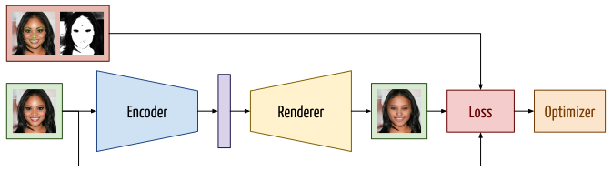
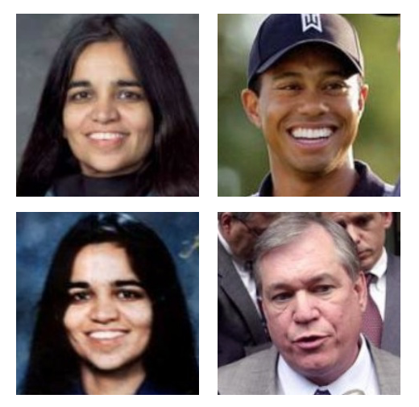
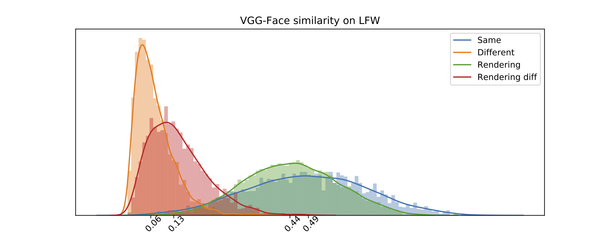

layout: true
name: lts5-question
background-image: url(../Common/question-mark.jpg)
background-position: center
background-size: 300px

 

 

---
layout: true

name: lts5-canvas

 

 

---
name: title
class: center, middle
template: lts5-canvas
# Progress Talk

Christophe Ecabert

LTS5, EPFL

June 11th, 2020

---
template: lts5-canvas
# Content

- Problem Statement
- Priors Modeling
- Reconstruction Pipeline
  - Architecture
  - Losses
- Benchmarking
- On going work
  - Decoupled Feature Space
- Open Questions

???

What's on the agenda

---
template: lts5-canvas
# Problem Statement

- Reconstruct a 3D object given a single *RGB* image
  - Interest in human face

- Challenges
  - Little to no 3D ground truth available 
  - Non-rigid / Non-convex object
  - Occlusion / Image quality / resolution
  - Out of distribution samples
- Approach
  - Prior injection using explicit modeling
  - Analysis-by-synthesis framework

???

- Monocular face reconstruction -> single image
- Model-based -> parameters to estimate
  - Explicit modeling

---
template: lts5-canvas

#Face Modeling

.left-column60[
- Morphable Model: Statistical model learned from 3D scans from various subject
  - Shape: Identity + Expression
     - `$ \boldsymbol{x} = \bar{\boldsymbol{x}} + \left[\boldsymbol{U}_{id}, \boldsymbol{U}_{exp} \right] \boldsymbol{w}_{shp} $`
  - Albedo: Illumination-free Texture
     - `$\boldsymbol{t} = \bar{\boldsymbol{t}} + \boldsymbol{U}_{tex} \boldsymbol{w}_{tex}$`
- Environmental Illumination Approximation
  - Spherical Harmonics Lighting
     - Lambertian Surface
     - Ambient lighting
  - `$\boldsymbol{t}_{I}^i = \phi\left(\boldsymbol{n}^i \right) \boldsymbol{w}_{l} \odot \boldsymbol{t}^i \\ \phi\left(\boldsymbol{n} \right) = \left[1, n_x, n_y, n_z, n_x n_y, n_x n_z, n_y n_z, n_x^2 - n_y^2, 3n_z^2 - 1 \right]$`
- Rigid Object Pose
  - Rotation / Translation

]
.right-column40[

]

???

- PCa-based Statistical model for **shape**/**albedo**
- No specular lighting

---
template: lts5-canvas

#Reconstruction Pipeline - Architecture

.left-column40[

- Autoencoder-like structure
  - Learnable Encoder
  - Fixed Decoder
- Trained on corpus of image in the wild
  - CelebA
  - 300VW (*sampled*)
  - 300W-LP

]

.right-column60[

 

]

???

- Landmarks detected using sota face tracker - Fan2D Adrian Bulat
  - 2D / 2.5D landmarks
- Semantic segmentation
  - Bilateral Segmentation Network + CelebAHQ-Mask dataset
  - Skin segmentation

---

template: lts5-canvas

# Reconstruction Pipeline - Weak supervision

.left-column40[

- Facial Landmarks, *A Bulat*
  - 2D 
  - 2.5D, Projection of 3D landmarks
- Semantic Segmentation
  - Bilateral Segmentation Network - BiSeNet
  - CelebAMask-HQ

]

.right-column60[

]

---
template: lts5-canvas
# Reconstruction Pipeline - Losses

- Likelihood 
  `$$\mathcal{L}\left(\theta |\tilde{I}\right) = w_{ph}\ell_{ph} \cdot w_{lms}\ell_{lms} \cdot w_{reg}\ell_{reg} + w_{sym}\ell_{sym}$$`
- Photometric
  `$$\begin{align}  \ell_{ph} &= \prod_{l}^{L} \prod_{p \in \mathcal{F} \cap \mathcal{A}} \frac{\ell_{face}^{l}\left(\theta, \tilde{I}_{p}^{l}\right)}{b\left(\theta\right)} \\  \ell_{face}^{l}\left(\theta, \tilde{I}_{p}^{l}\right) &= \frac{1}{N} \text{exp}\left(- \frac{1}{2\left(\frac{\sigma}{2^l}\right)^2 }\left|\left|I_p^l\left(\theta\right) - \tilde{I}_{p}^{l} \right|\right|^2 \right) \\  b\left(\theta\right) &= \frac{1}{\delta}h_b\left( I_{p}^{l}\left(\theta\right)\right)\end{align}$$`
- Landmarks / Landmark Pairs
  `$$\ell_{lms} = \prod_{k \in \mathcal{P}} \frac{1}{|\mathcal{P}|} \text{exp}\left(- \frac{1}{2\sigma^2} \| \phi(\boldsymbol{x}_k) - \boldsymbol{s}_k \|^2\right)$$`

---

template: lts5-canvas

#Reconstruction Pipeline - Losses

- Model regularization
  `$$\ell_{reg} = \text{exp}\left(-\frac{1}{2}\|\boldsymbol{w}_{id}\|^2\right) \text{exp}\left(-\frac{1}{2} \|\boldsymbol{w}_{exp}\|^2\right) \text{exp}\left(-\frac{1}{2} \|\boldsymbol{w}_{tex}\|^2\right)$$`
- Albedo symmetry constraints
  `$$\ell_{sym} = \left|\left| \boldsymbol{t} - \text{flip}\left( \boldsymbol{t}\right) \right|\right|^2$$`

---
template: lts5-canvas

# Benchmarking

.left-column50[
- Geometry
	- Florence MICC Dataset
  - Rigid ICP Alignment with Isotropic Scale
  - Point-to-plane metric
- Appearance
  - LFW Dataset
  - Image Pair Embedding Similarity

]
.right-column50[

]
???

- Two different modalities

---

template: lts5-canvas

# Benchmarking - Geometry

- Video sequence for each subject 
  - Per frame reconstruction + Aggregation
  - Neutral expression ground truth
- Rigid Alignment with Isotropic Scale
  - `$\text{min} \sum_i \left(\left(\boldsymbol{s}\boldsymbol{R}\boldsymbol{x}_{p}^i + \boldsymbol{t} - \boldsymbol{x}_t^i \right) \cdot \boldsymbol{n}^i\right)^2$`
  - Point-to-plane / Point-to-point errors

|          | Cooperative |   Indoor    |   Outdoor   |
| -------- | :---------: | :---------: | :---------: |
| Meanshape|1.28 ± 0.30|1.28 ± 0.30|1.28 ± 0.30|
| Model A |1.40 ± 0.39|1.45 ± 0.43|1.64 ± 0.46|
| Model B |1.84 ± 0.48|2.13 ± 0.56|2.11 ± 0.57|

???

- SOTA: Giant mess, since everyone is reporting different values for the same papers ....

---

template: lts5-canvas

# Benchmarking - Appearance

.left-column40[

- Image Pairs of Different / Same Subject from LFW
  - VGG-Face Embedding
- Compare Face Embedding Similarity Distributions
  - *Real* - *Real* 
  - *Real* - *Reconstructed*
  - *Reconstructed* - *Reconstructed*

]

.right-column60[

]

???

- Red should match orange
- Green should match blue.

---

template: lts5-canvas

# On Going Work - Decoupled Feature Space

- Have dedicated feature space for each components
  - "Semi-Supervised 3D Face Reconstruction With Nonlinear Disentangled Representations", *ICLR2020* 

- Regressor
  - LayerNormalization, only mean + std [1]
  - FCs
  - Dropout

.cite-article[[1] Understanding and Improving Layer Normalization, Xu et al]

---

template: lts5-canvas

# Open Questions / Discussion

- Geometry benchmarking on MICC dataset
  - Everyone is using the "same" protocol, but still report different results
- Capture Geometry Information
  - Lack of geometry variation, expression seems to be captured but not identity
     - Perceptual loss might help ....
- Data Quality
  - Weak supervision defined using other trained models, source of errors
  - Segmentation quality is less critical, worst case everything is dismissed 
  - Large scale, roughly 200k training samples.
- Variational Formulation for Morphable Model Coefficients regression
  - Image close to each other (*i.e. same person*) should be close in the coefficient space. Autoencoder formulation does not guarantee it.
  - KL-Divergence regularization might simplify the hyper-parameters tuning due to its explicit formulation. 

