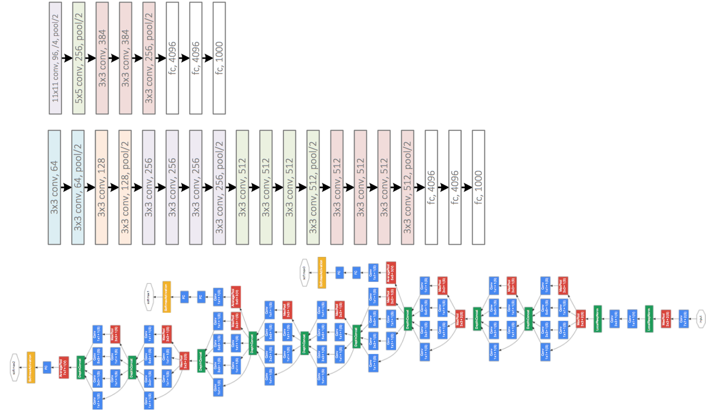
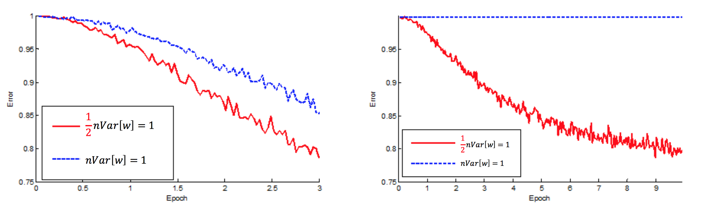
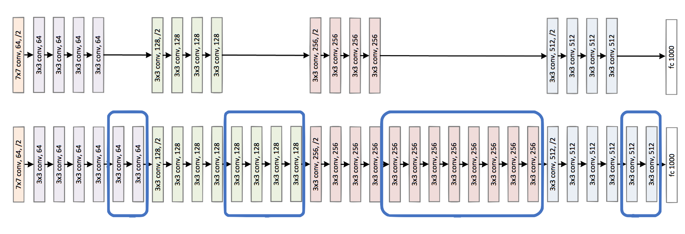
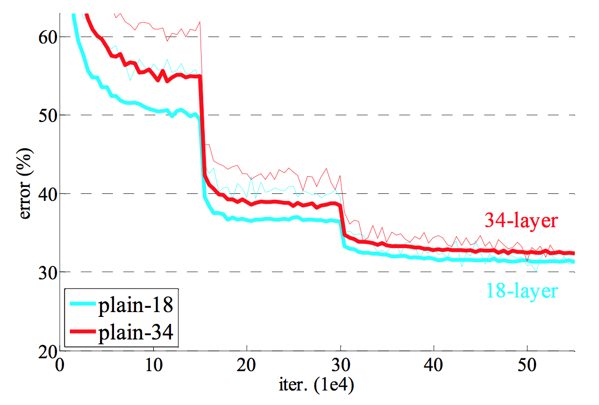
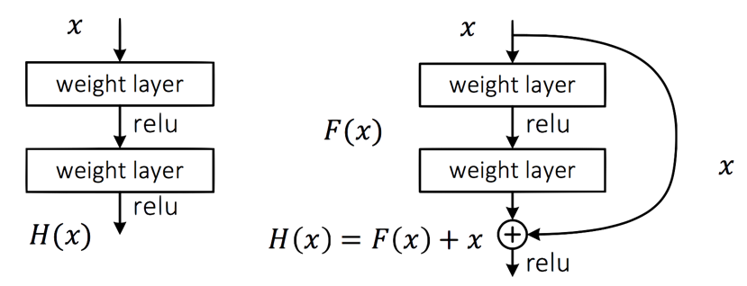
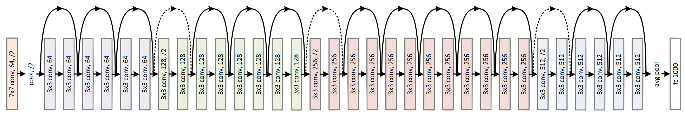
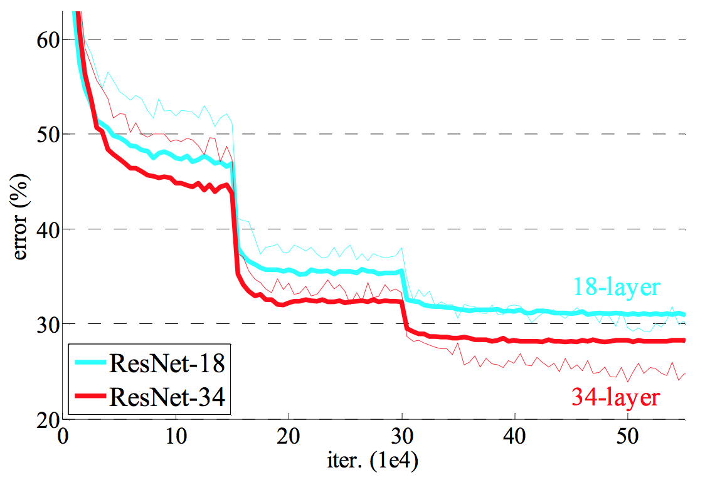
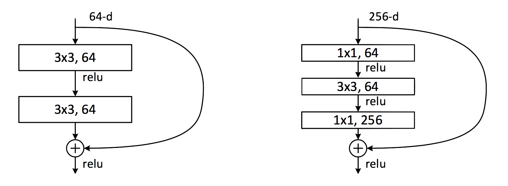
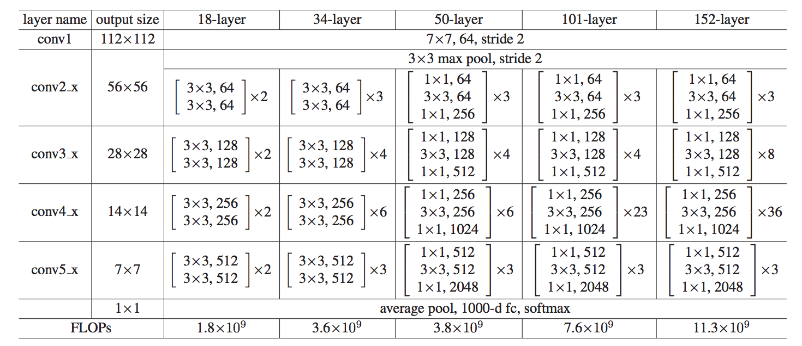
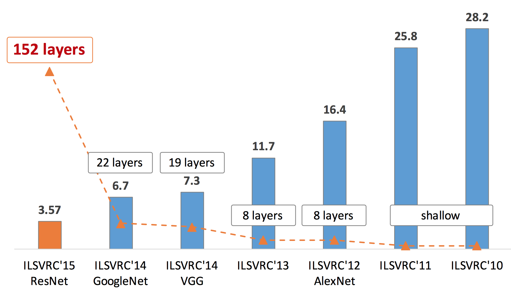

layout: true

 

 

---

name: title

class: center, middle

# *Deep Residual Learning for Image Recognition* (ResNet)

Christophe Ecabert

LTS5, EPFL

March 23rd, 2017 

---

class: center, middle

# Reference

He *et al*. 	***Deep Residual Learning for Image Recognition*** Proceedings of the IEEE Conference on Computer Vision and Pattern Recognition 2016.

---

# Recap

- Dropout	
    - Learn better feature representation
    - Longer training time
- AlexNet 
    - Depth matter
- GoogLeNet 
    - _Inception_ cell (Network in network)
    - 1x1 convolution for dimension reduction / adaptation
- Batch normalization
    - Accelerate training
    - Less sensitive to initialization 
    - Improve regularization 

---

# Recap On Architecture
<figure>

<figcaption>AlexNet (8 layers), VGG19 (19 layers), GoogLeNet (22 layers)</figcaption>
</figure>

---
# Exploding / Vanishing signals

- Single layer model 
  `$$ \mathbf{x}_ l = f(\mathbf{y}_{l-1}) $$`
  `$$ \mathbf{y}_l = \mathbf{W}_l \mathbf{x}_l + \mathbf{b}_l $$`

- Single layer with ReLU activation function
  `$$ Var[y_l] = \frac{1}{2} n_l Var[w_l] Var[y_{l-1}] $$`

- With `$L$` layers 
  `$$ Var[y_l] = Var[y_1] \left( \prod_{l=2}^L \frac{1}{2} n_l Var[w_l] \right) $$`

He _et al_. _Delving Deep into Rectifiers: Surpassing Human-Level Performance on ImageNet Classification_ (2015)

---
# Initialization

- Weight distribution requirements
  `$$ \frac{1}{2} n_l Var[w_l] = 1, \quad \forall l $$`

Therefore weight are initialized with zero mean gaussian noise with a standard deviation of `$\sigma_l = \sqrt{2 /n_l}$` and `$\mathbf{b}_l = 0$`.
For the first layer, `$n_1 Var[w_1] = 1$` should hold as well.

<figure>

<figcaption>The convergence of a 22-layer and 30-layer model with ReLU.</figcaption>
</figure>

---
# Learning Better Network - Stacking layers

- Adding layers exposes a degradation problem, the accuracy decreases as the depth increases.
- Such degradation *is not caused by overfitting*.
- Considering the following experiment :
    - Train two networks, one shallow (*18 layers*) and one deep (*34 layers*).

<figure>

<figcaption>Experimental Setup</figcaption>
</figure>

---
# Degradation problem

- Issues
    - Richer solution space
    - Solver can not find the solution when going deeper

- The deeper network should, in the worst case, have same performance as the shallow one since it exists a solution where the extra layers are identities (*i.e. same as shallow network*).

<figure>

<figcaption>Training on ImageNet</figcaption>
</figure>

---

# Deep Residual Network

- **Plain** vs **Residuel** Network

<figure>

<figcaption>Mapping lerning : Plain vs Residual</figcaption>
</figure>

- Design motivation
    - All *3x3* convolution or paired with *1x1*.
    - Feature maps size halfed, number of filter doubled (*preserves time complexity*).
    - No max-pooling, play with filter stride.
    - End with global average pooling layer + single fully connected.

---
# Training

<figure>

<figcaption>Residual Architecture</figcaption>
</figure>

<figure>

<figcaption>Training on ImageNet</figcaption>
</figure>

---
# Going Even Deeper

<figure>

<figcaption>Deeper residual function `$\mathcal{F}$` for ImageNet</figcaption>
</figure>

---

# ResNet Architecture 
<figure>

<figcaption>Deeper Architecture</figcaption>
</figure>

---
# Smooth Propagation Forward / Backward

- Plain network, multiplicative process.
  `$$ x_{L} = \prod_{i = l}^{L - 1} W_{i} x_{l} $$`

- Residual network, cumulative process.
  `$$ x_L = x_l + \sum_{i = l}^{L-1} F(x_i) $$`

---
# Results

- Training process
    - Data augmentation (*random crop, scale augmentation, ...*)
    - Per-pixel mean subtraction
    - Color augmentation (*PCA on RGB, add multipules of principal components*)
    - Batch Normalization after **each** convolution and **before** activation function
    - Weights initialization with proper standard deviation accroding to ReLU.
    - Train from scratch with standard *SGD*.

---
# Results

| Method                 | Top 5% error |
| :--------------------- | :----------: |
| VGG (*ILSVRC14*)       |     8.43     |
| GoogLeNet (*ILSVRC14*) |     7.89     |
| VGG (*v5*)             |     7.1      |
| BN-Inception           |     5.81     |
| ResNet-50              |     5.25     |
| ResNet-101             |     4.60     |
| ResNet-152             |   **4.49**   |
Error rate of single-model on the ImageNet validation set.

---
# Results

| Method                 | Top 5% error |
| :--------------------- | :----------: |
| VGG (*ILSVRC14*)       |     7.32     |
| GoogLeNet (*ILSVRC14*) |     6.66     |
| VGG (*v5*)             |     6.80     |
| BN-Inception           |     4.82     |
| ResNet (*ILSVRC15*)    |   **3.57**   |

:Error rate of ensembles on the *ImageNet* test set.

---
# Results

<figure>

<figcaption>Results on ImageNet</figcaption>
</figure>

---
# Conclusions

- Residual architecture
    - Even with very deep structure, it has smaller complexity than plain network (*i.e. VGG*)
    - Features of any layers are additive outcomes 
    - Enables smooth forward/backward propagation
    - Greatly eases the optimization of the model