layout: true

 

 

---

name: title

class: center, middle

# Learning from Simulated and Unsupervised Images through Adversarial Training

Christophe Ecabert

LTS5, EPFL

November 23th, 2017 

---

class: center, middle

# Reference

Shrivastava *et al*. ***Learning from Simulated and Unsupervised Images through Adversarial Training***, Proceedings of the IEEE Conference on Computer Vision and Pattern Recognition 2017.

???

Work done @Apple. First entry in their machine learning blog.

---

# Problem Statement

- Currently annotating large amount of data is still a challenging problem
  - Learn how to transform synthetic samples into photorealistics one.
- Pipeline

<figure>
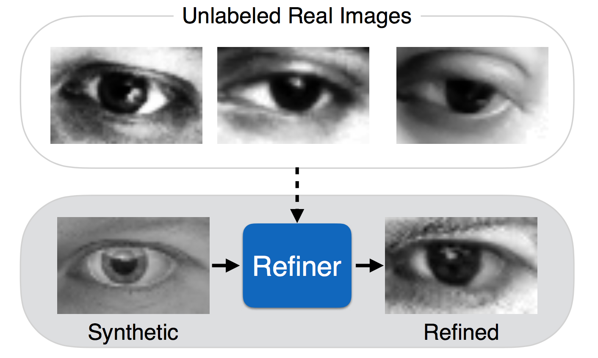
<figcaption>Pipeline overview </figcaption>
</figure>

???

- Huge amount of data needed to train NN system -> not necesserly the power to do annotation
- Synthetic data provide the ground truth for free (i.e. generated)
  - However synthetic data are still bias (not perfect match)
- Increasing the realism of synth data is very costly and not easy
- The problem is how to BRIDGE the gap between synth / real data 
- Show two examples
  - Eye tracking
  - Hand tracking

---

# Refiner

- Learn mapping between ***synthetic*** - ***real***
- Based on *Generative Adversarial Network* (*GAN*)
  - Learned using *synthetic* images and *real* unlabeled images
  - Should preserve annotations
  - Image generated should be without artifacts 
- Contributions
  - Self-Regularization for preserving annotations
  - Local Adversial Loss for the generation of images without any artifacts
  - Updating the *Discriminator* using History of *Refined* images

???

- Use GAN since they're able to generate photorealistic images.
- Labels of synthetic data should not be **destroyed** otherwise it's useless.

---

# Adversarial Loss and Self-Regularization

- Using a set of unlabel real images `$\boldsymbol{y}_i \in \mathcal{Y}$`, learn a refiner `$\boldsymbol{R}_{\theta}(\boldsymbol{x})$` that transform the synthetic image `$\boldsymbol{x}$` into a *real* one.

- The refiner is learned by minimizing 
  `$$\mathcal{L}_{R}\left(\theta \right) = \sum_i L_{real} \left(\boldsymbol{\theta}; \boldsymbol{x}_i, \mathcal{Y} \right) + \lambda L_{reg} \left(\boldsymbol{\theta}; \boldsymbol{x}_i \right)$$`

- The Discriminator is learned by minimizing 
  `$$\mathcal{L}_D(\phi) = - \sum_i log\left( D_{\phi}\left(\boldsymbol{\tilde{x}}_i \right) \right) - \sum_j log\left( 1 - D_{\phi}\left(\mathcal{Y}_j \right) \right)$$`

- The loss function `$L_{real}$` 
  `$$L_{real} \left(\boldsymbol{\theta}; \boldsymbol{x}_i, \mathcal{Y} \right) =- log\left( 1 - D_{\phi}\left( R_{\theta} \left( \boldsymbol{x}_i \right)\right) \right)$$`

???

- Refiner
  - maximize probability to have a real object
- Discriminator
  - max cross-entropy for two classes : *Synth* / *Real*

---

#Adversarial Loss and Self-Regularization

- Image generated should preserve the annotation, to ensure it a regularization term is added. This term is defined as a *per-pixel* difference
  `$$L_{reg} = \left|\left| \psi\left(\boldsymbol{\tilde{x}}\right) - \boldsymbol{x}   \right|\right|_1$$`

- The function `$\psi$` maps from image space to features space

  - Identity
  - Image derivative
  - Mean of color channels
  - Learned transformations

- Finally refiner is learned by minimizing
  `$$\mathcal{L}_{R}\left(\theta \right) = - \sum_i log\left( 1 - D_{\phi}\left( R_{\theta} \left( \boldsymbol{x}_i \right)\right) \right) + \lambda \left|\left| \psi\left(R_{\theta} \left( \boldsymbol{x}_i\right)\right) - \psi\left(\boldsymbol{x}_i\right)   \right|\right|_1$$`

???

- Used identity mapping in their experiments or color channel

---

# Local Adversarial Loss

- Image should be generated without artifacts
  - Discriminator classifies patches of the image
  - Sum over every patches during training

<figure>
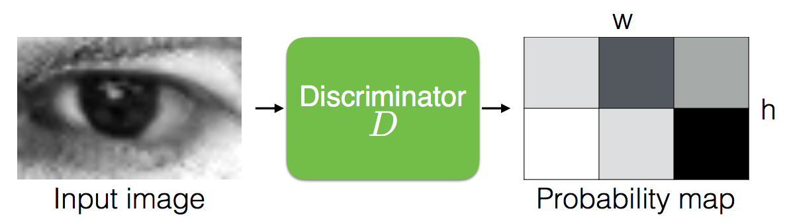
<figcaption>Patch-based Loss</figcaption>
</figure>

???

- Want to learn to generate images without any artifact
- Learn discrimination over patches within the sample.
  - Without patches the refiner tends over-emphasize feature that fool the current discriminator
  - *Increase virtualy* the number of samples

---

# Update using History of Refined Images

- Usual approach would update Discriminator with current refined images
  - Divergence in Adversarial Training
  - Refiner network could re-insertting artifact forgotten by the Discriminator
- Solution is to use refined samples from previous iterations of the refiner

<figure>
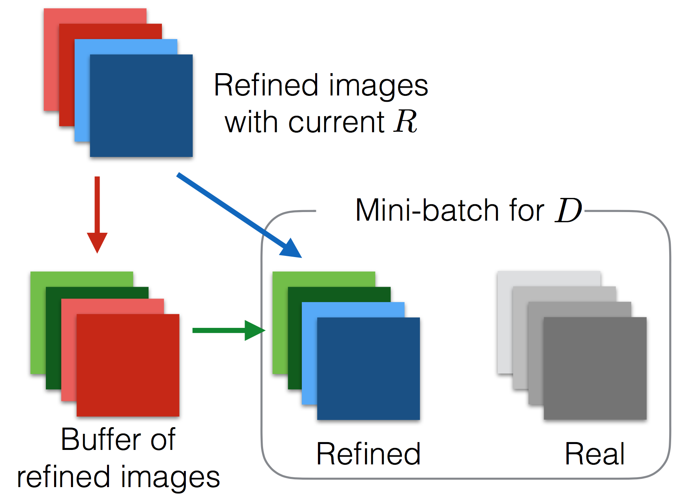
<figcaption>Parameters update with History</figcaption>
</figure>

???

- Use history to avoid distribution shift.

---

# Implementation Details

- Generator
  - Input image *55 x 35* pixels
  - ResNet cells (*3x3 conv x64*) *x4*
  - Aggregation at the end with *1x1 conv*
- Discriminator
  - *5* convolutional layers (*3x3, 3x3, 3x3, 1x1, 1x1*)
  - Softmax

???

- Specification for gaze estimation
  - Similar for hand tracking, only input image size changes

---

# Results - Samples

- Few examples
  - Left, real images from *MPIIGaze* dataset
  - Synthetic / Refined images 

<figure>
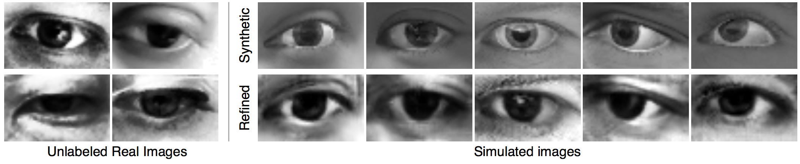
<figcaption>Output samples </figcaption>
</figure>

<figure>
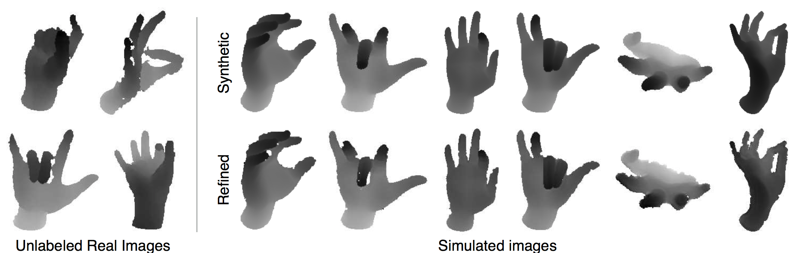
<figcaption>Output samples </figcaption>
</figure>

---

# Results - Gaze Estimation

- Tested on *MPIIGaze* dataset

.right-column50[

<figure>
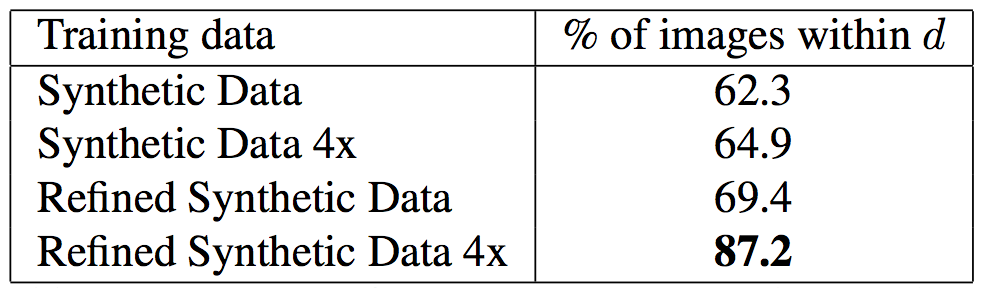
<figcaption>Impact of Refined Synthetic Data </figcaption>
</figure>

<figure>
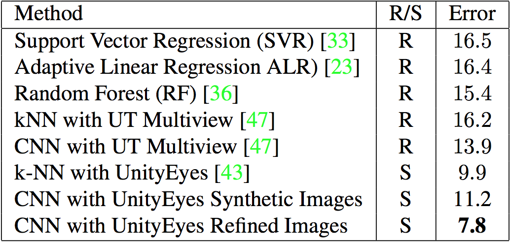
<figcaption>Comparison with State-of-the-Art</figcaption>
</figure>

]

.left-column50[

<figure>
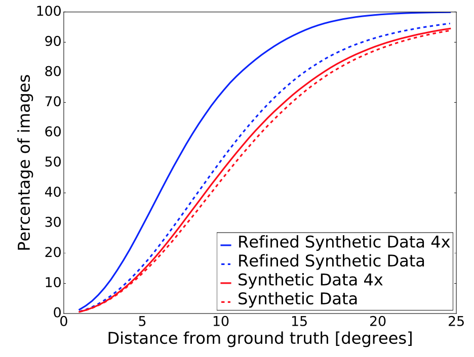
<figcaption>Cumulative Error Distribution</figcaption>
</figure>

]

???

- Used CNN to performed the detection
  - Once trained on synthetic data **ONLY**
  - Once trained on **Refined** data
- 4x = **ALL** training samples
- d = 7 degrees 

---

# Results - Hand Pose Estimation

- Tested on NYU hand pose dataset

.right-column50[

<figure>
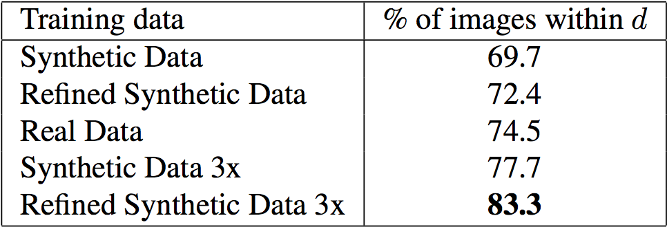
<figcaption>Impact of Refined Synthetic Data </figcaption>
</figure>

]

.left-column50[

<figure>
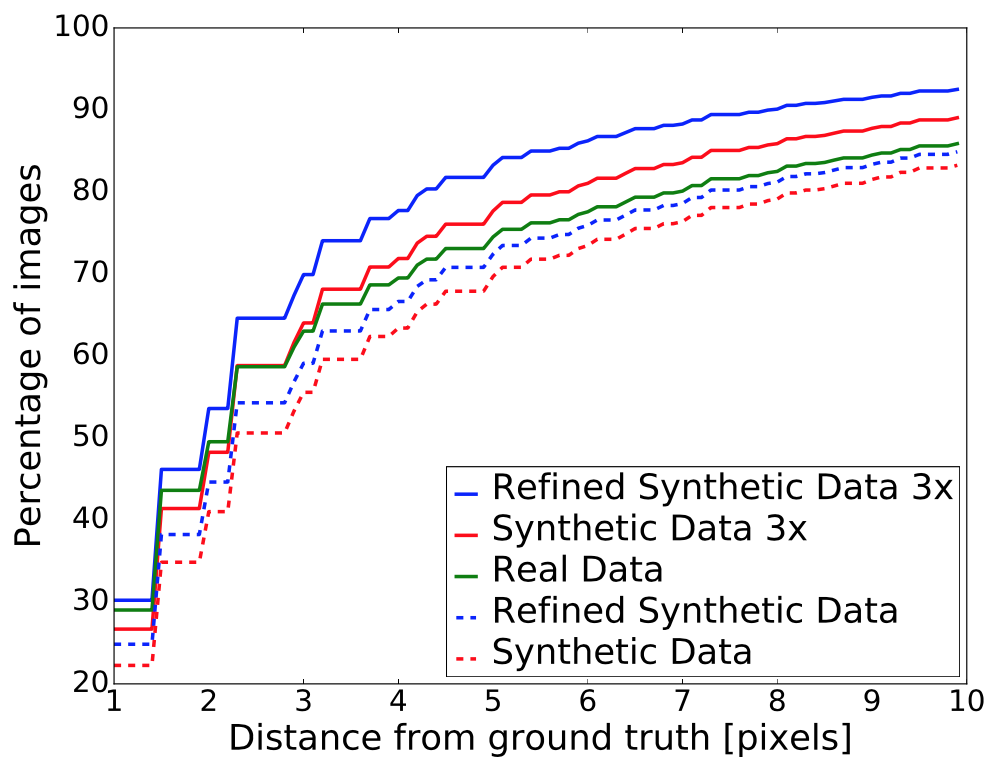
<figcaption>Cumulative Error Distribution</figcaption>
</figure>

]

???

- Used CNN to performed the detection
  - Detect 14 hand joints
  - Dataset composed of **Synthetic + Real** data
  - Once trained on synthetic data **ONLY**
  - Once trained on **Refined** data
  - Once on **Real** data
- 3x = **ALL** training samples
- d = 5 pixels

---

# Ablation Study 

- Examples of each impact

  - Patch-based Loss
  - History update

  ​

.left-column50[

<figure>
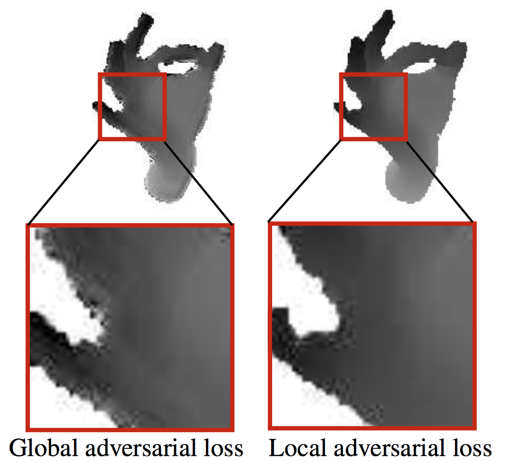
<figcaption>Global vs Local Loss</figcaption>
</figure>

]

.right-column50[

<figure>
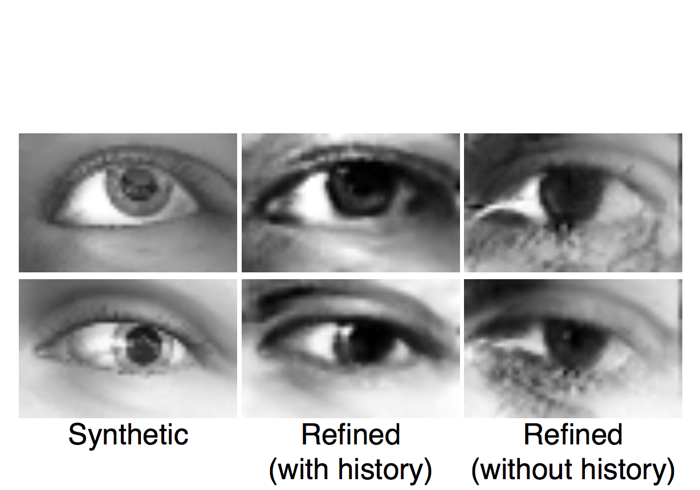
<figcaption>Learning with and without history samples</figcaption>
</figure>

]

---

# Conclusions

- Proposed a solution to add *realism* to synthetic data learned from unlabel samples.
- Showed three keys aspect to succesfult achieve it
  - Self-Regularization
  - Local Adverserial Loss
  - Update through History
- Showed significant improvement over two tasks
  - Gaze estimation
  - Hand Pose Estimation