layout: true

 

 

---
name: title
class: center, middle

# Finding Tiny Faces

Christophe Ecabert

LTS5, EPFL

June 15th, 2017 

---
class: center, middle

# Reference

Hu *et al*. ***Finding Tiny Faces*** Proceedings of the IEEE Conference on Computer Vision and Pattern Recognition 2017 (*submission*).

???

Not yet released in CVPR 2017

---

# Overview
- Problem Statement
- Challenges
  - Scale
  - Architecture
  - Context
  - Resolution
  - Template Size Selection
- Detector Structure
- Results
- Conclusions

---

# Problem Statement

- How to detect faces within a broad scale variation ?

<figure>

<figcaption>Faces Detection in the Wild</figcaption>
</figure>

???

- Find faces within a ***large*** variation in scale (fews pixels up to 300px)
- Reported 1000 faces in the pictures

---

# Scales

- Detector should handle different scales
  - Image Pyramid 
  - Specific Detector for a given scale
  - Region-classifiers run on "ROI"-pooled image features (*i.e. Faster RCNN*)
- How to properly select template dimensions ?
  - Small template to capture small faces
  - Large template to exploit detailed features
- Hybrid Approach

<figure>
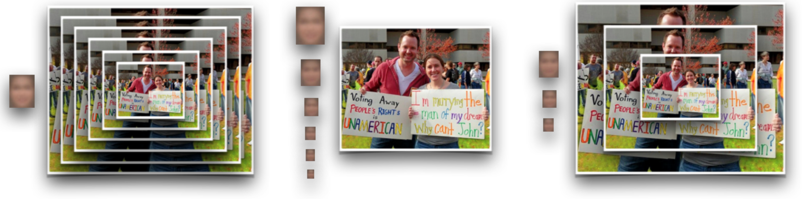
<figcaption>Handling Different Scale</figcaption>
</figure>

???

- Previous work were using SIFT like descriptor with scale invariant classifier
- Recent work uses scale-normalized classifier
  - ROI pooling 
  - Pyramid Image
- Problem tiny template do not capture enough information for small object 
  - Solution go with habrid approach

---

# Architecture

- Fixed-size object detection
  - Treated as a *binary heatmap prediction problem*
  - Predictors based on ***Fully Convolutional Network*** (FCN)
  - Defined over state-of-the-art architecture *ResNet* / *VGG*

<figure>
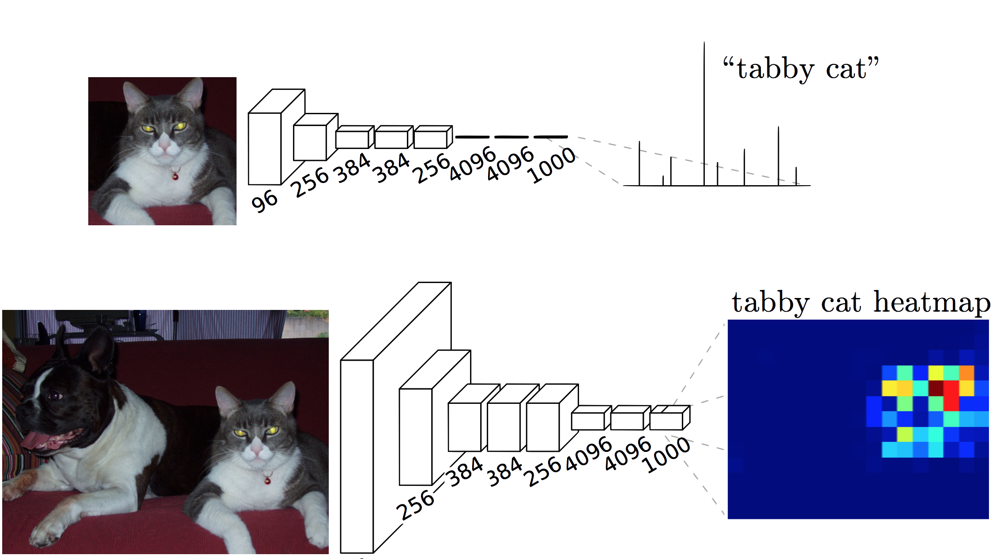
<figcaption>Fully Convolutional Network</figcaption>
</figure>

.cite-article[Simonyan *et al*, Very Deep Convolutional Networks For Large-Scale Image Recognition]

???

- Heatmap -> map of probabily to have an object at this location
- FCN : similar to CNN but instead of predicting a single label, output a map of probability.

---

# Context

- Finding small object is hard due to the lack of information on the object
  - Image neighbour brings the extra information (*i.e. context*)
  - How to define neighbourhood ?

<figure>
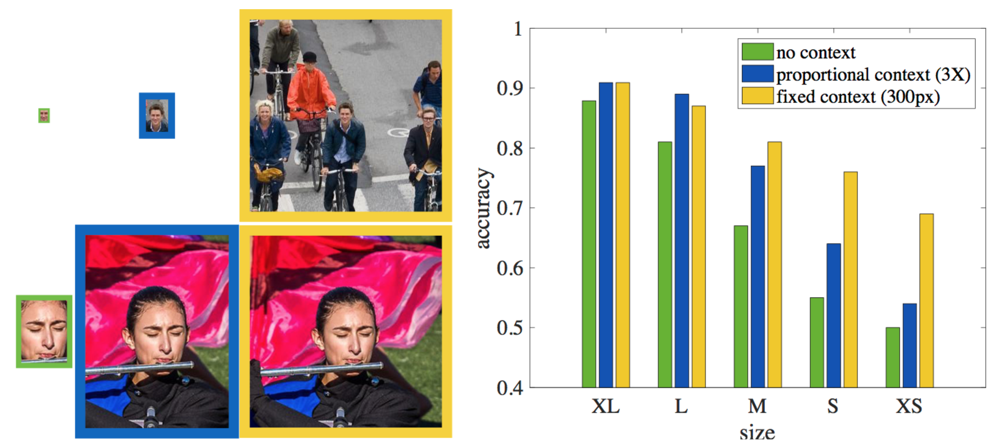

<figcaption>Impact of context with human experiment</figcaption>
</figure>

???

- Tiny region therefore not so much detail on the object
- "Context"
  - Experiment : Classify as True / False face by human 

---

# Context

- Adding object's context helps
  - ***A lot*** for small object
  - *A bit* for large object 
- Fusing features from different level helps for every object (*i.e. foveal descriptor*)

<figure>
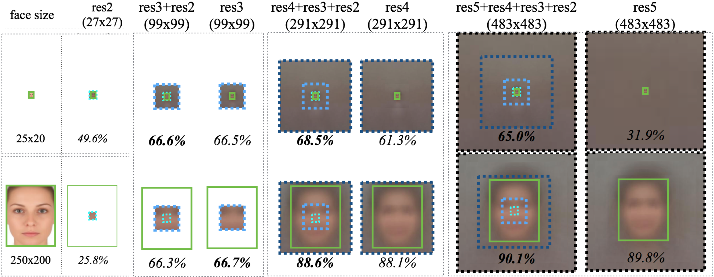

<figcaption>Context + Recptive Field fusion impact</figcaption>
</figure>

???

- Adding context for small object helps up to a certain point
  - Object too small with respect to the search space.
- Multi-level information helps

---

# Resolution - I

- What if template has a different size than the actual object ?
  - Template of 50x40,  object 25x20 with 2x upscaling.
  - Template of 125x100,  object 250x200 with 2x downsampling.

<figure>
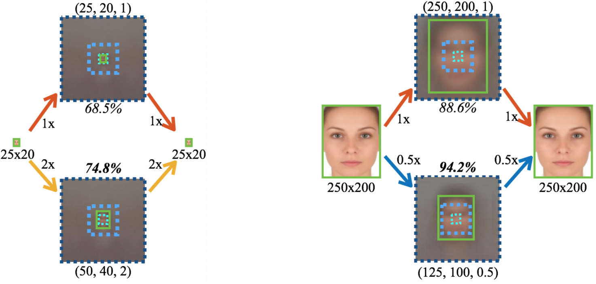

<figcaption>Image Resolution impact</figcaption>
</figure>

- Lead to performance improvement, ***why***  ?
  - There is less medium size samples than small ones in the training
  - Yet still performing ***better*** with upsampled image !

???

- Lots of small object in the training
  - Easier to label them / Have more occurrences 
- In the data set there is a lot more small size sample, there fore why is there an improvement for small face ?
  - Should learn better small object detection
  - ResNet pretraining object dimension

---

# Resolution - II

- The issue comes from the descriptor itself (*i.e. ResNet / VGG*)
  - Lots of medium size in the training set (*ImageNet*)

<figure>
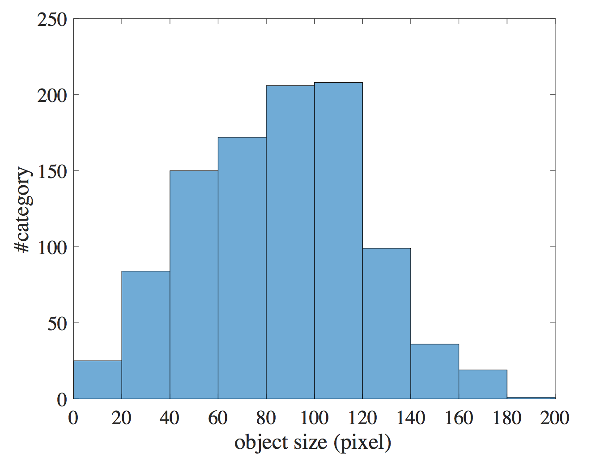

<figcaption>Average object size distribution in ImageNet dataset</figcaption>
</figure>

???

- More than 80% categories have an average object size between 40-140px.

---

# Template Size - I

- How to properly select the template size ?
  - *Cluster* training samples to define candidates
  - Train each cluster for a range of scales : *0.5x, 1x, 2x*
  - Pick *best* detector for each object size

<figure>
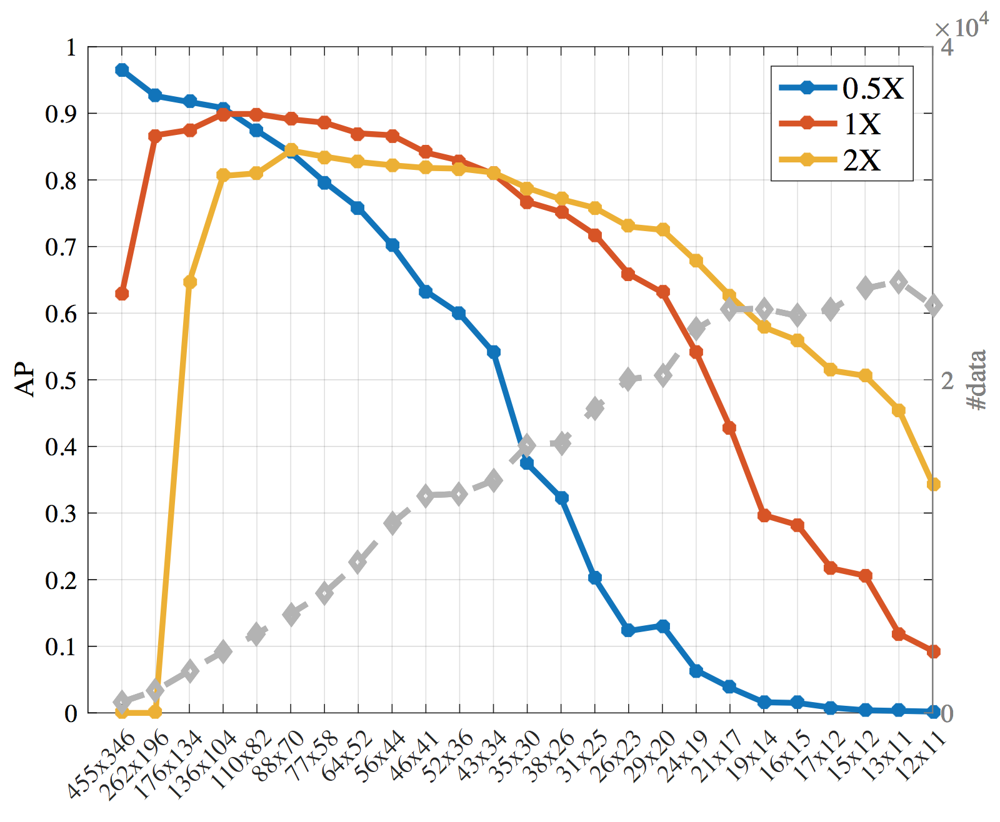

<figcaption>Template Size Analysis</figcaption>
</figure>

???

- Clustering based on Jaccard distance : Intersection over Union of bbox.
- Trend :
  - Large object use 0.5x scale (> 140px)
  - Small object use 2x scale (< 40px)
  - Otherwise use 1x scale
- Lots of redundancy, can we prune the number of template ?

---

# Template Size - II

- Lots of template sizes, is it possible to prune search space without too much influencing the overall performance ?
- Two sets of templates
  - Set A, tuned for object of size ***40 - 140*** pixels and run on all resolution
  - Set B, build for object ***< 20*** pixels and run on ***2x*** upsampled image.

<figure>
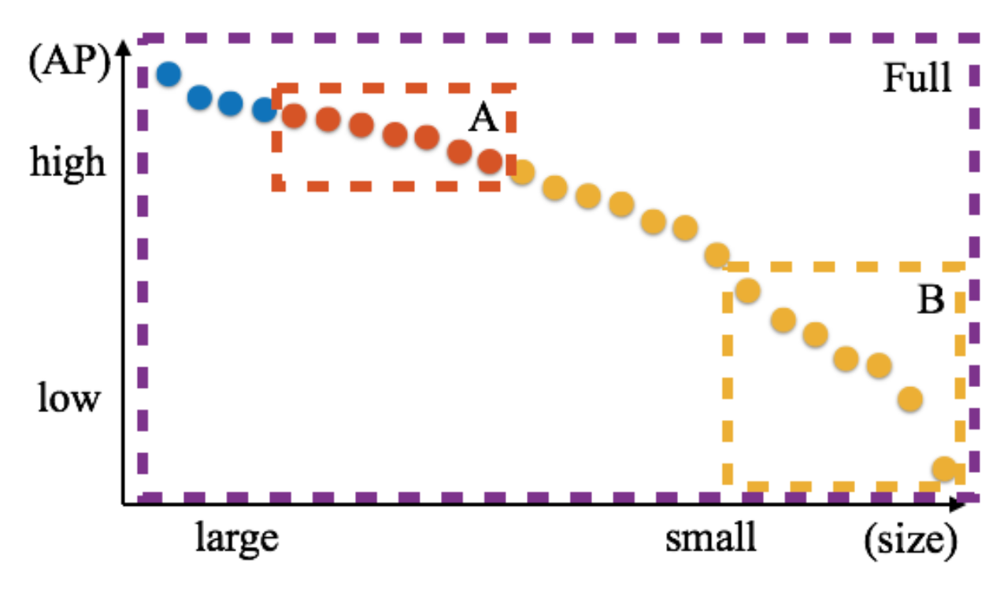

<figcaption>Template Size Pruning</figcaption>
</figure>

---

# Detector Structure

<figure>
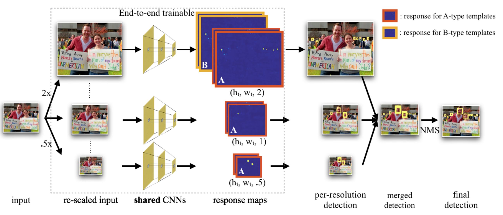
<figcaption>Detector Architecture</figcaption>
</figure>

???

- Trainable part -> Dotted region

---

# Results

- Datasets
  - WIDER FACE
  - FDDB

- Runtime for ResNet-101 based network
  - 1080p input : 1.4 fps
  - 720p input : 3.1 fps

---

# Results - Wider Face

- Performance on test set

.left-column50[
<figure>

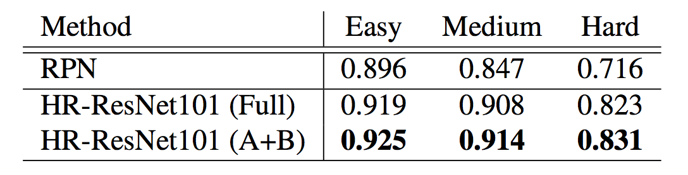
<figcaption>Pruning performance Average Precision</figcaption>
</figure>

<figure>
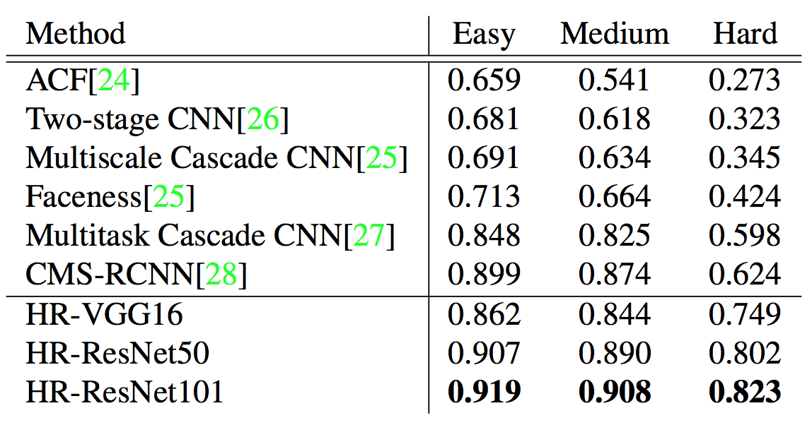
<figcaption>Average Precision compared to other detectors</figcaption>
</figure>
]

.right-column50[

<figure>
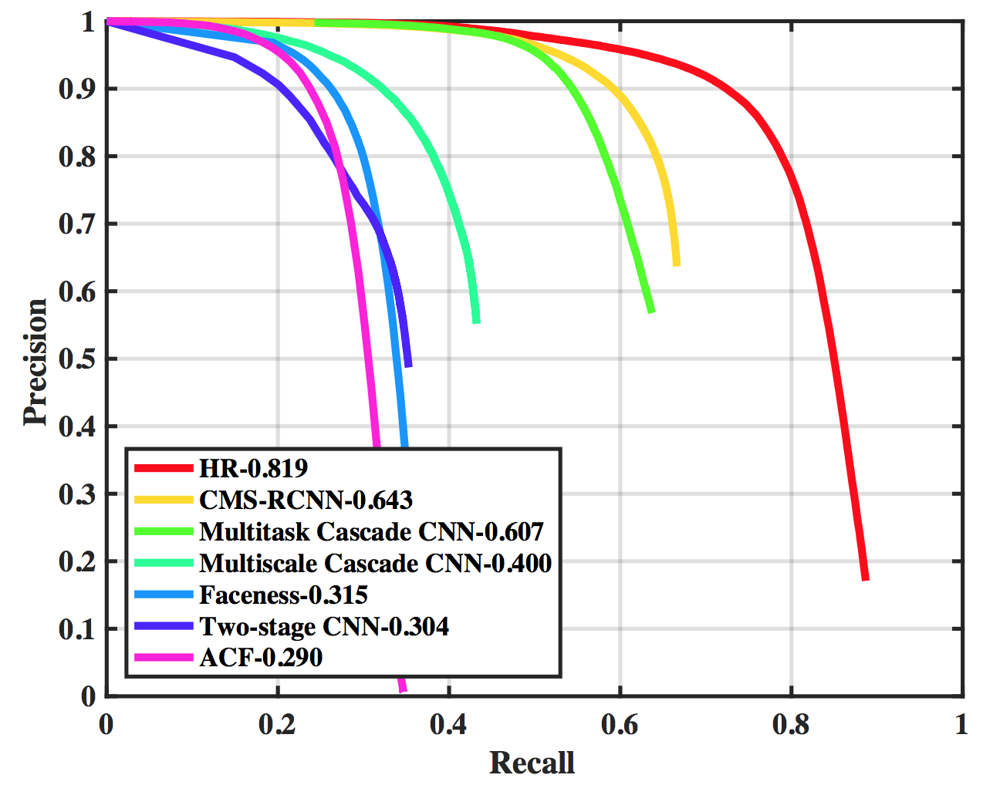
<figcaption>Precision - Recall curves</figcaption>
</figure>
]

---

# Results - FDDB

- Performance on test set

.left-column45[
<figure>

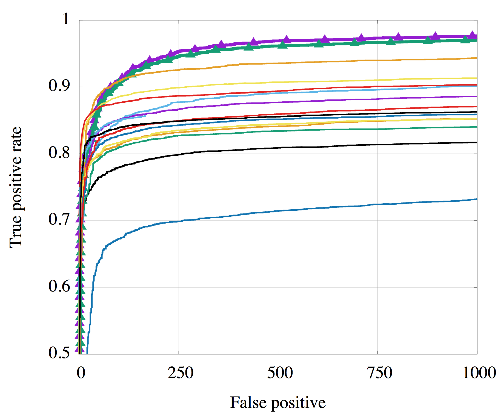
<figcaption>ROC Curves for discrete detection</figcaption>
</figure>
]

.right-column55[

<figure>
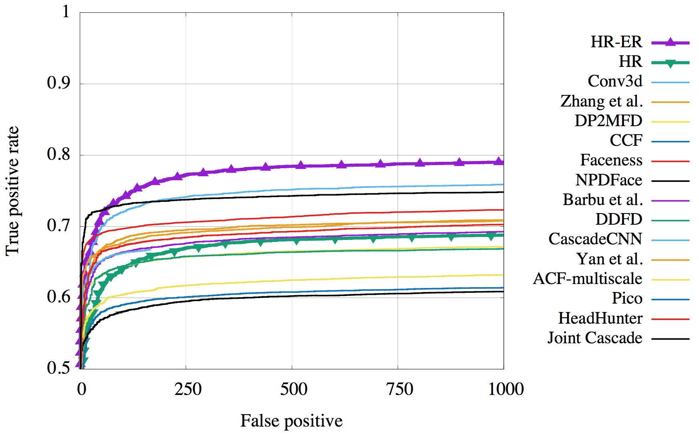
<figcaption>ROC Curves for continuous detection</figcaption>
</figure>
]

---

# Results - Sensitivity 

.left-column55[
- Impose various variation and measure their impact on detection
  - **Area** (i.e. scale)
  - Aspect Ratio
  - Occlusion
  - **Blur**
  - Expression 
  - Illumination
  - Pose

]

.right-column45[
<figure>
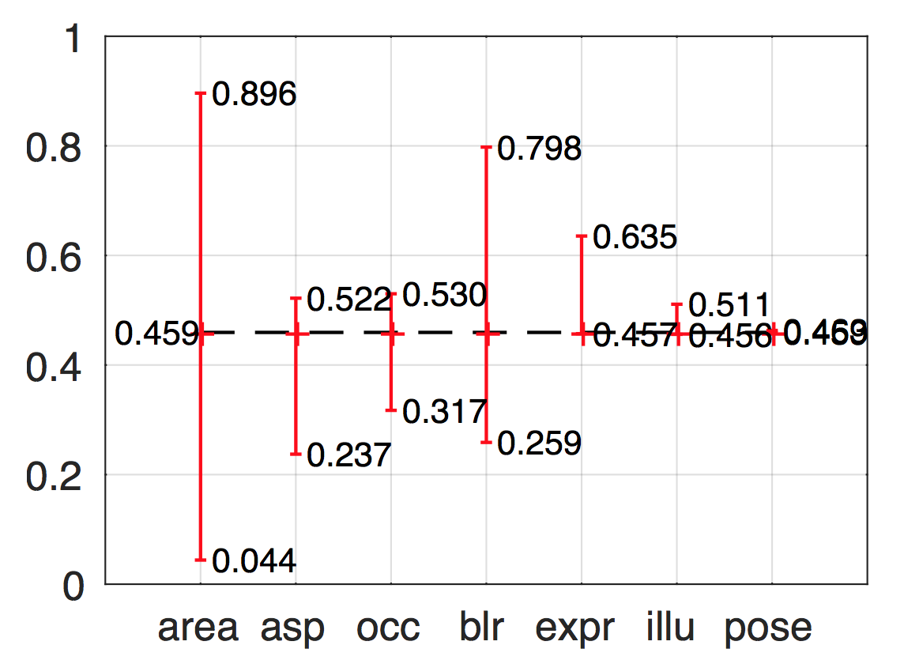
<figcaption>Normalized Average Precision variation by sources</figcaption>
</figure>
]

---

# Conclusions

- Able to detect small object, large improvement from previous state-of-the-art
- Key factors
  - Image *Context* matters for small object
  - Scale-invariant representations
  - Multi-level feature descriptors
  - Scaling with pre-trained network