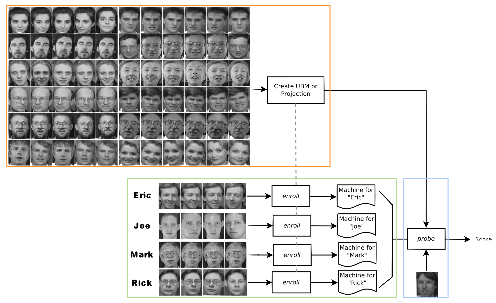
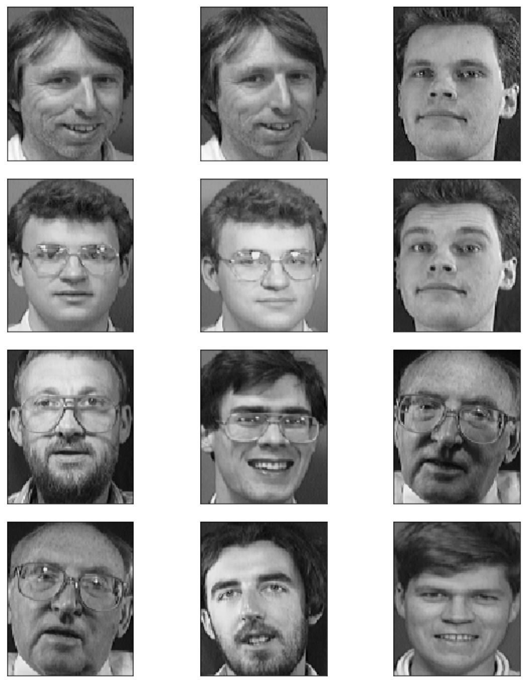
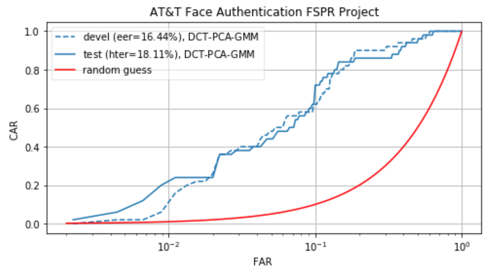
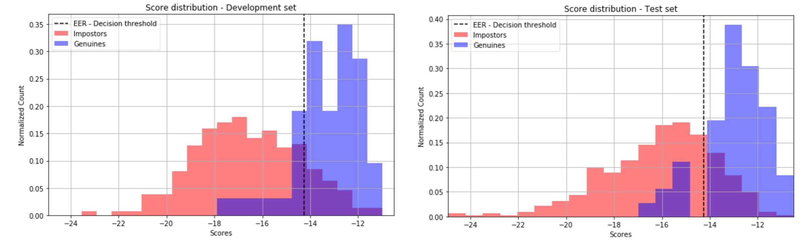
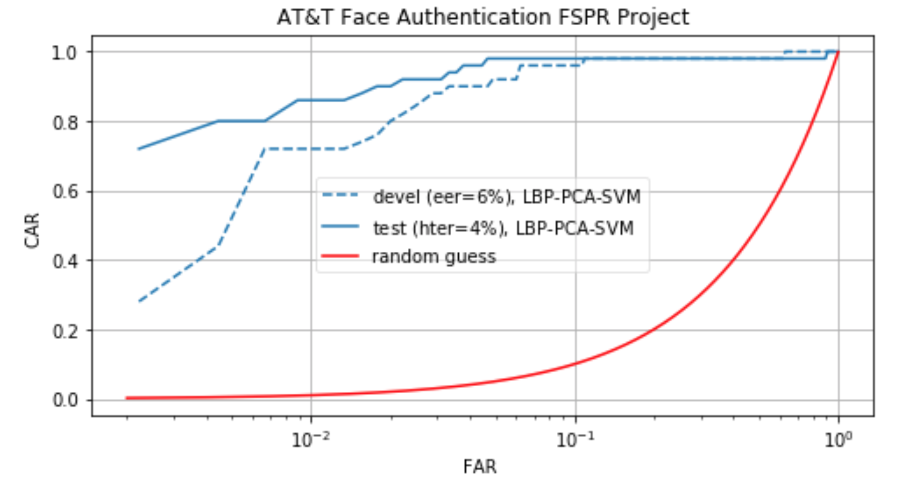
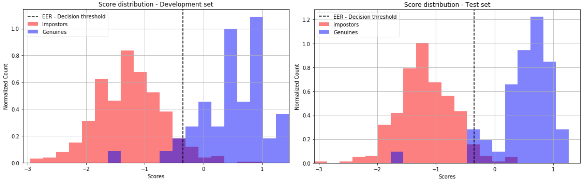
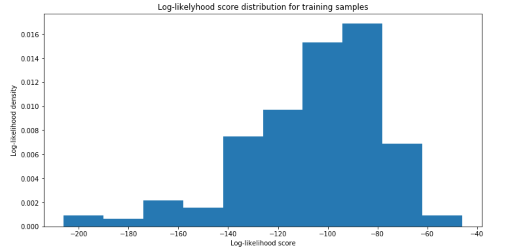

layout: true

name: lts5-canvas

 

 

---

layout: true
name: lts5-question
background-image: url(../Common/question-mark.jpg)
background-position: center
background-size: 300px

 

 

---

name: title

class: center, middle

template: lts5-canvas

# Fundamentals in Statistical Pattern Recognition - Project

Christophe Ecabert

LTS5, EPFL

June 12th, 2019

---

template: lts5-canvas

# Content

- Problem Statement
- AT&T Dataset
- Hypothesis
- Experiments
  - Generative
  - Discriminative
- Conclusions

???

What's on the agenda

---

template: lts5-canvas

# Problem Statement

???

- Whole processing splitted into 3
  - Training / Feature extraction + projection learning
  - Enrollement / Fine-tuning
  - Probing time 

---

template: lts5-canvas

# AT&T Dataset

.left-column45[

- Specifications
  - 10 images / subjects
  - Training: 20 subjects
  - Validation: 10 subjects
  - Test: 10 subjects
- Acquisition
  - Controlled environment
      - Near frontal
  - Occlusion
  - Constant face size
     - Not aligned

]

.right-column55[

]

???

- Standard dataset for face recognition / verification 
- Each subject have 10 images
  - Validation / Test: 5 enrollment + 5 probe
- Faces
  - Not aligned
  - Occlusion: Beard / Glasses
  - Facial expression
  - Standard head pose

---

template: lts5-canvas

# Hypothesis

- Images are not spatially aligned, use aggregated features

  - *Discrete Cosine Transform* 
  - Histogram of *Local Binary Pattern*

  

- Linear subspace build upon aggregated features is discriminative for face verification task.

- Two proposed approaches for the *estimator*
  - Generative: *Gaussian Mixture Model*
  - Discriminative: *Support Vector Machine*

???

- No spatial alignment uses *frequential* or *spatial aggregation* features
  - Hand-crafted features, no deep features
  - Spatial aggregation through blocks / cells + concatenation
  - *Classifier* is either **generative** or **discriminative**

---

template: lts5-canvas

# Experiments - GMM

- Hyper-parameters
  -  Block size, `$B_s = 15$`
  -  Number of coefficients, `$N_c = 4$`
  -  Number of principal component to select, `$N_f = 12$`
  -  Number of gaussian, `$N_g = 3$`
  -  Variance threshold, `$V_t = 0.28$`
  -  Relevance factor, `$\kappa = 0.89$`
- Random search for best hyper-parameters selection
- Metrics
  -  False Acceptance Rate - *FAR*
  -  False Rejection Rate - *FRR*
- Free parameters `$\quad p = N_g \left( 2 N_f + 1 \right) = 3 \left(2 \cdot 12 + 1 \right) = 75$`
- Universal Background Model
  - Train *GMM* using *Expectation Maximization* - *EM*
  - Enroll, fine tune *GMM* using *Maximum A Posterioro* - *MAP*

???

- HParams combinatorial, therefore random search
- FAR -> Negative samples accepted
- FRR -> Positive samples rejected
- Free params: 99 -> close to number of samples
- rank(`$\Sigma$`) = min(N - 1, F) = min(200 - 1, 390) = 199 -> 12 => **OK**
- **Small** kappa == **large** steps in adaptation

---

template: lts5-canvas

# Results - GMM

- Performance

???

- ROC
  - Similar performance in dev/test
  - Better than random guess
- Distribution
  - Both **positive** / **negative** are not completely separable 

---

template: lts5-canvas

# Experiments - SVM

- Hyper-parameters
  - LBP , `$P = 8, R = 1.93$`
  - Number of bins, `$N_b = 49$`
  - Number of cells, `$N_c = \left(4, 4 \right)$`
  - Variance, `$D = 97\%$`
  - SVM, `$K = \text{LIN}, C = 154.8, \gamma = 5.76$`
- Random search for best hyper-parameters selection
- Metrics
  - False Acceptance Rate - *FAR*
  - False Rejection Rate - *FRR*
- Universal Background Model
  - Train, extract Histogram of *LBP* + learn projection matrix (*i.e. PCA*)
  - Enroll, train SVM using **training** images as **negative** samples 

???

- Hyper-parameters selection, same strategy as before
- One-class SVM could have been an option here
- rank(`$\Sigma$`) = min(N - 1, F) = min(200 - 1, 784) = 199 -> 99 => **OK**

---

template: lts5-canvas

# Results - SVM

- Number of Support Vector, `$N_{sv} = \left[17, 39\right]$`
- Performance

???

- Boundary 
  - Depth test => **Foreground**
  - Opposition: One tri **facing** the camera, one tri **facing the opposite** direction (back)

---

template: lts5-canvas

# Conclusion

- Two solutions based on hand-crafted features with spatial aggregation have been successfully implemented
  - *DCT* + *PCA* + *GMM*
  - *LBPH* + *PCA* + *SVM*
  
- Complexity of both system are similar
  
  - Simple *features* due to limited amount of data and image specifications
  
- Performance
  - Both system perform better than random guess, therefore *hypothesis* are verified
  - Discriminative performs better
     - Limited amount of data, tricky to model the whole distribution 

---

template: lts5-question

exclude: false

# Questions

---
template: lts5-canvas
# Extra: GM Score Distribution - Train

