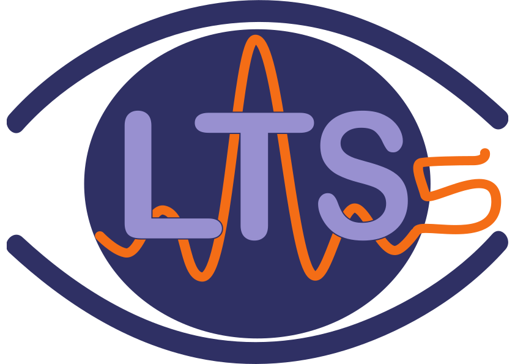

layout: true

name: lts5-canvas

 

 

---

layout: true
name: lts5-question
background-image: url(../Common/question-mark.jpg)
background-position: center
background-size: 300px

 

 

---

name: title

class: center, middle

template: lts5-canvas

# Facial Image Analysis

Christophe Ecabert

LTS5, EPFL

January 29th, 2020

---

template: lts5-canvas

# History

- Tracking
  - Anatomic landmarks detection and tracking
- Facial Expression / Action Unit detection
  - Basic facial expression detection
  - Muscle activation detection
- 3D Reconstruction
  - Reconstruct 3d face from a single image
---

template: lts5-canvas

# Tracking

- Locate face in the image
  - Haar + Cascade classifiers
  - Deep learning: ***SFD***
- Predict location of anatomical landmarks
  - Regression from appearance: ***SDM***
  - Deep learning: ***2D-Fan***

 

.left-column50[

]
.right-column50[

]

---

template: lts5-canvas

# Facial Expression / Action Unit Detection

- Analysis pipeline

- Detection

---

template: lts5-canvas

# 3D Reconstruction

- Inverse Rendering
  - Regenerate the object that create the image
- Explicit modeling
  - Face geometry
  - Face appearance
  - Global Illumination
  - Camera transform

 

---

template: lts5-canvas

# 3D Reconstruction - Results

.left-column70[

]

.right-column30[

]