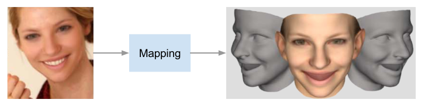
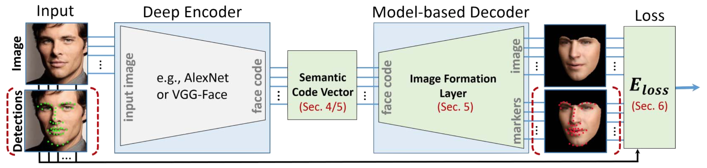
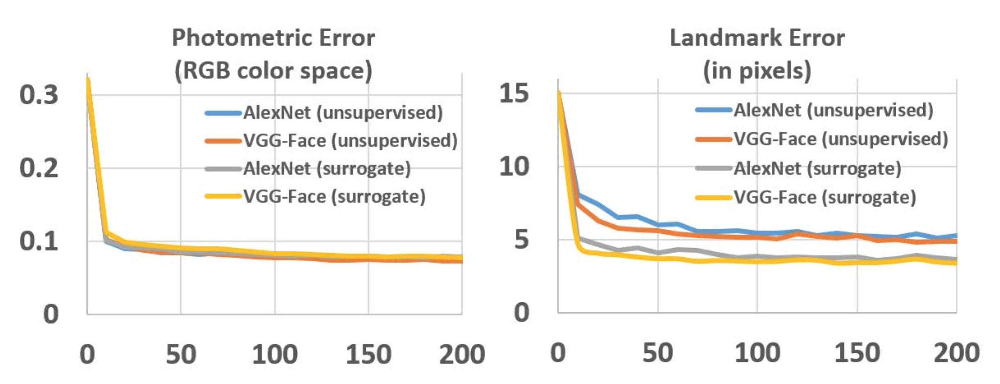
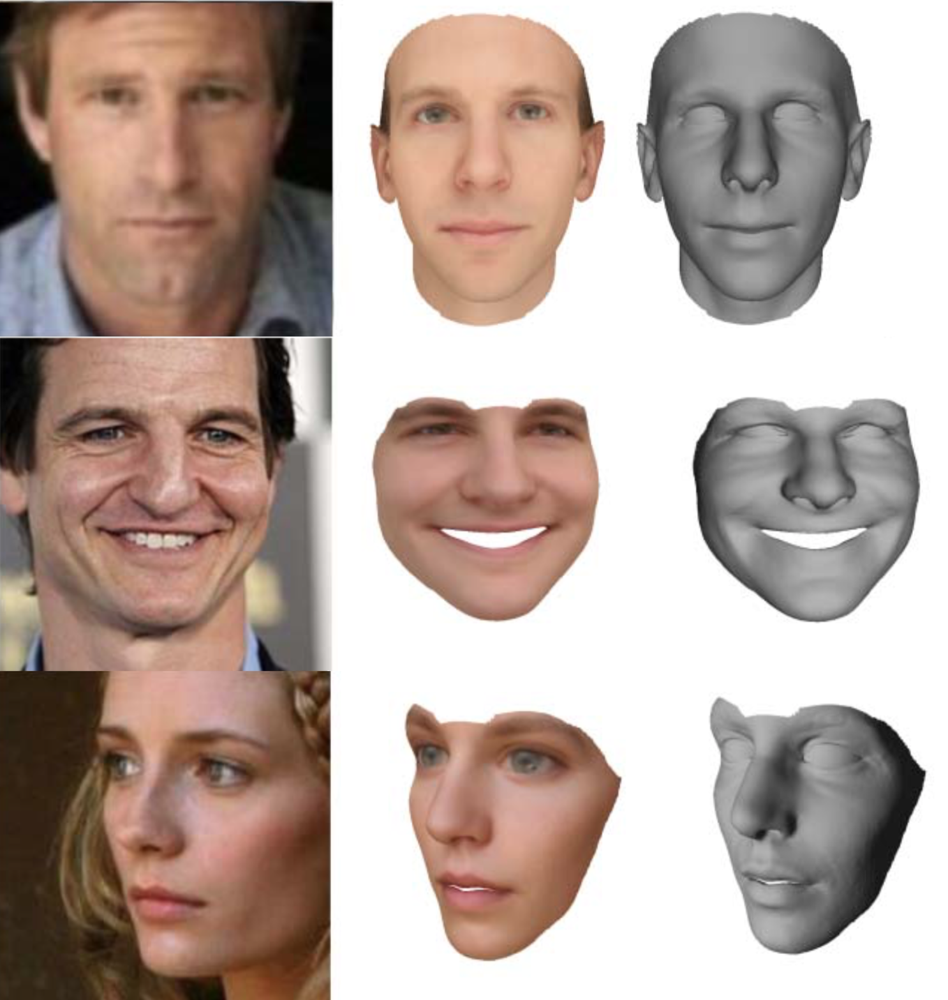
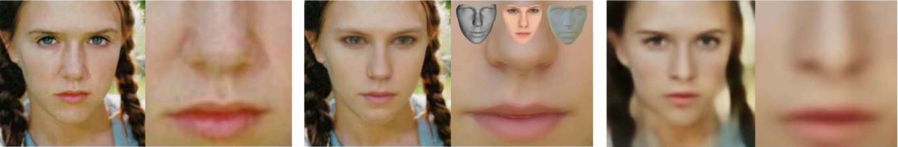
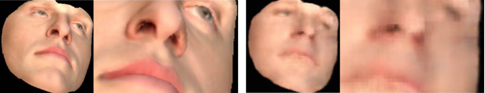

layout: true

 

 

---

name: title

class: center, middle

# MoFA: Model-based Deep Convolutional Face Autoencoder for Unsupervised Monocular Reconstruction

Christophe Ecabert

LTS5, EPFL

November 14th, 2017 

---

class: center, middle

# Reference

Tewari *et al*. ***MoFA: Model-based Deep Convolutional Face Autoencoder for Unsupervised Monocular Reconstruction***, Proceedings of the IEEE International Conference on Computer Vision 2017.

???

Unconstraint 3D reconstruction formulation

---

# Problem Statement

<figure>

<figcaption>Target </figcaption>
</figure>

- Generate 3D face from a single image
  - Estimate *Shape* and *Texture*
- Learn the mapping *image* - *3D* only using **unlabeled** data

???

- Shape in term of
  - Identity
  - Expression
- Texture
  - Reflectance (aldebo)
  - Illumination
- Unconstraint training 
  - Analysis by synthesis
  - Iterative framework as presented early -> This is more regression learning

---

# Face Model

- The surface is parameterized with affine face model
  `$$\begin{align} \boldsymbol{V}\left(\boldsymbol{\alpha}, \boldsymbol{\delta} \right) &= \boldsymbol{A}_s + \boldsymbol{E}_s \boldsymbol{\alpha} + \boldsymbol{E}_e \boldsymbol{\delta} \\ \boldsymbol{\alpha} &\in \mathbb{R}^{80} \quad \boldsymbol{E}_s \in \mathbb{R}^{3N \times 80} \\ \boldsymbol{\delta} &\in \mathbb{R}^{64} \quad \boldsymbol{E}_e \in \mathbb{R}^{3N \times 64} \\ \end{align}$$`

- Similarly for the texture 

  `$$\begin{align} \boldsymbol{T}\left(\boldsymbol{\beta} \right) &= \boldsymbol{A}_r + \boldsymbol{E}_r \boldsymbol{\beta} \\ \boldsymbol{\beta} &\in \mathbb{R}^{80} \quad \boldsymbol{E}_r \in \mathbb{R}^{3N \times 80}\end{align}$$`

- Deformation `$\boldsymbol{E}_x$` are orthogonal PCA basis scaled by the corresponding eigenvalue.

???

- Do reconstruction using Prior about shape/texture deformation
  - Statistical model -> PCA Model
  - Basel Face Model + extended using FaceWarehouse expression dataset
- Deformation: $E_x$ are orthogonal 

---

# Illumination Model

- Global illumination of the scene can be approximated by *Spherical Harmonics* assuming

  - Distant *Low Frequency* illumination
  - Pure *Lambertian* surface reflectance

- The reflectance is modified by the illumination model as follow
  `$$\begin{align} \boldsymbol{c}_i = C\left(\boldsymbol{r}_i, \boldsymbol{n}_i, \boldsymbol{\gamma} \right) &= \boldsymbol{r}_i \odot \boldsymbol{\gamma} \; \phi(\boldsymbol{n}_i) \\ \boldsymbol{\gamma} &\in \mathbb{R}^{3 \times 9} \\ \phi\left({\boldsymbol{n}}\right) &= \left[1, n_x, n_y, n_z, n_x n_y, n_x n_z, n_y n_z, n_x^2 - n_y^2, 3n_z^2 - 1\right]^{\top}\end{align}$$`

???

- Ambiant lighting model using spherical harmonics
  - Element-wise product
  - SH depends only on *surface* normal

---

# Image Formation Model

- Mapping from *3D* space into *Image* space using Pinhole camera model (*perspective*) 
  `$$ \prod : \mathbb{R}^3 \rightarrow \mathbb{R}^2 $$`

- Transformation between *Model* space and *Camera* space is defined using affine transform: *Rotation*, *Translation*
   `$$\boldsymbol{\Phi}\left( \boldsymbol{v}_i \right) = \boldsymbol{R}\boldsymbol{v}_i + \boldsymbol{t}$$`

- Complete transformation
  `$$\begin{align} \boldsymbol{u}_i &= \prod \left( \boldsymbol{\Phi}\left( \boldsymbol{v}_i \right) \right) \\ \boldsymbol{u}_i &\in \mathbb{R}^2 \end{align}$$`

---

#Network Architecture

- Free Parameters
   `$$\boldsymbol{x} = \left( \boldsymbol{\alpha}, \boldsymbol{\beta}, \boldsymbol{\delta}, \boldsymbol{R}, \boldsymbol{t}, \boldsymbol{\gamma} \right)$$`
- Based on Autoencoder structure

  - Encoder compress the information
  - Decoder ***render*** an instance 

<figure>

<figcaption>Network Architecture </figcaption>
</figure>

???

- Free parameters need to be predicted by the encoder
- Decoder
  - **FIXED**, no need to learn it -> Computer Craphics do that for us.
  - Differentiable

---

# Loss Function

- Global cost
  `$$E_{loss} \left(\boldsymbol{x} \right) = w_{land} E_{land} \left(\boldsymbol{x} \right) + w_{photo} E_{photo} \left(\boldsymbol{x} \right) + w_{reg} E_{reg} \left(\boldsymbol{x} \right)$$`
- Photometric error
   ``$$E_{photo} \left(\boldsymbol{x} \right) = \frac{1}{N} \sum_{i \in \mathcal{V}} \left|\left| \mathcal{I}\left(\boldsymbol{u}_i \left(\boldsymbol{x} \right) \right) -  \boldsymbol{c}_i \left(\boldsymbol{x} \right) \right|\right|_2$$`
- Landmark error
   `$$E_{land} \left(\boldsymbol{x} \right) = \sum_{j}^K c_i \cdot \left|\left| \boldsymbol{u}_{k_j}\left(\boldsymbol{x} \right) - \boldsymbol{s}_j \right|\right|_2^2$$`
- Regularizer
   `$$E_{reg} \left(\boldsymbol{x} \right) = \sum_k \boldsymbol{\alpha}_k^2 + w_{\beta} \sum_k \boldsymbol{\beta}_k^2 + w_{\delta} \sum_k \boldsymbol{\delta}_k^2$$`

???

- Analysis by synthesis, completely unsupervised
- Landmark term is optional 

---

# Training Set

- Trained using a corpus of images
  - CelebA
  - LFW
  - FaceWarehouse
  - 300-VW
- Architecture tested
  - AlexNet
  - VGG-16

---

# Rsults - Learning Error

<figure>

<figcaption>Learning error </figcaption>
</figure>

---

# Result - Samples

<figure>

<figcaption>Output Samples </figcaption>
</figure>

???

- Shape, color good
  - Still missing mid frequency details -> wrinkles
  - Forehead remove -> Avoid occlusions

---

# Results - Fixed Decoder

<figure>

<figcaption>Decoder comparison: Input, Fixed, Learned</figcaption>
</figure>

<figure>

<figcaption>Decoder comparison: Input, Fixed, Learned</figcaption>
</figure>

---

# Conclusions 

- Uses CNN network to extract semantically meaning full information
- Encoder + Generative model trained in an unsuppervised manner
  - Optional landmark, no necessarly required
- Reach state-of-the-art in term of quality and richness of representations
  - High texture fidelity (*close, sharp*)
  - Fixed decoder for high quality rendering

